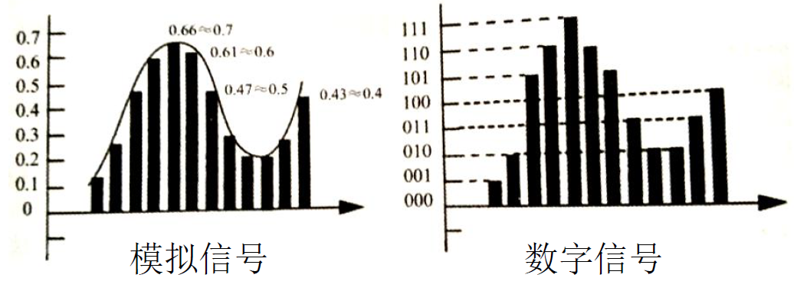
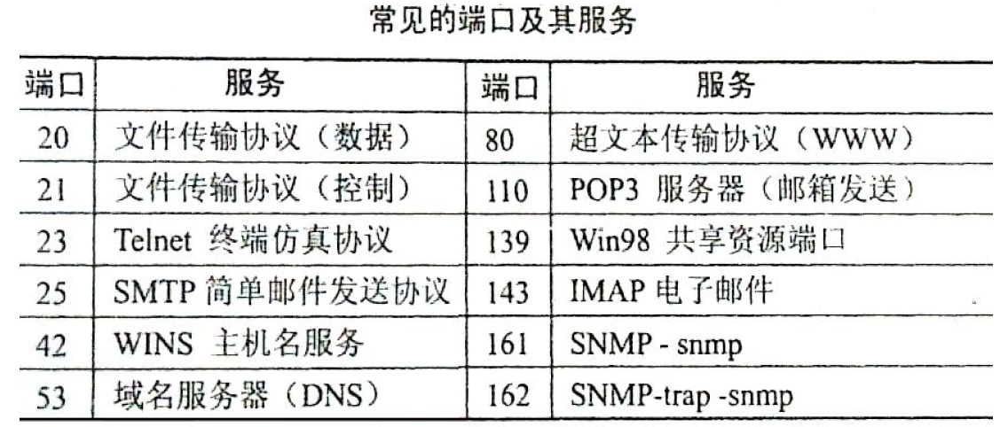
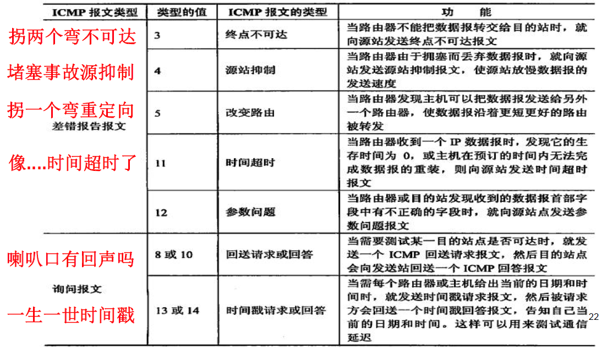

## 计算机网络概论

### 计算机网络概念

* 考点01 计算机网络是通过通信线路和通信设备连接的许多的分散独立工作的计算机系统，遵从一定的协议用软件实现资源共享的系统。
* 考点02 组成分为硬件、软件、协议三部分
* 考点03 协议分为国际标准`OSI/RM`和公认标准`TCP/IP`

### 计算机网络分类

* 考点04  
  1. 按分布范围：>局域网、城域网、广域网。
  2. 按拓扑结构：总线、星型、环型、树型等。
  3. 其他分类：
     * 公用网与专用网；
     * 通信网`ISP`与信息网`ICP`；
     * 校园网与企业网；
     * 骨干网与接入网；
     * 有线网月无限网
     * .....

### 网络体系结构OSI、TCP/IP

* 考点05  `OSI/RM`(开放系统互联 参考模型) 七层是应用层、表示层、会话层、传输层、网络层、数据链路层、物理层。
* 考点06  `TCP/IP`(因特网传输协议) 四层是应用层、传输层、网络层(互联网层)、物理层(网络接口层)。
* 考点07  七层`OSI`和四层`TCP/IP`协议对比   
* 考点08 七层协议各层实现功能如下表           

### 计算机网络传输过程

* 考点09  网络数据传输过程 -- 封包 解包

## 数据通信基础

### 数据通信基本概念

* 考点01 基本概念：信源、信道、信宿；数字信号、模拟信号；模拟通信(信道中传送)。

### 数据通信计算

* 考点02 模拟信号带宽计算：`W=f2-f1` (f1是低频，f2是高频

  

* 考点03 数字信号带宽计算：

  1. 奈奎斯特定理(无噪声): **B = 2W** (B码元速率、波特率，W为带宽)

     ​			信息量n(位)与码元种类N: **n = log2N** 

     ​			数据速率 **R = Blog2N = 2Wlog2N**

  2. 香农定理(有噪声)：**C = Wlog2(1+$\cfrac{S}{N}$) ** (C为数据速率 W为信道带宽 S为信号的平均功率 N为噪声平均功率 $\cfrac{S}{N}$为信噪比(一般用分贝dB来表示))

     ​			分贝数和信噪比关系：**dB = 10lg$\cfrac{S}{N}$**    20dB($\cfrac{S}{N}$ = 100 )   30dB($\cfrac{S}{N}$ = 1000 )

* 考点04  计算汇总：模拟带宽、数字带宽(无噪声 ：奈奎斯特定理   有噪声 ： 香农定理)

* 考点05  常用考试数据：

  * 单位换算： 通信换算进率1000，如1G = 1000M

    ​					储存换算进率1024，如1G = 1024M

  * 信道延迟：电缆信道延迟200m/us（200km/ms）

  * 卫星信道延迟：270ms

* 考点06 双绞线：分为屏蔽双绞线UTP，屏蔽双绞线STP。100米可以达到100Mb/s。

  * 交叉线和直通线适用范围（相同设备之间用交叉线【计算机可以算作路由器】不同之间用直通线）

### 通信传输介质

* 考点07 同轴电缆：分为粗同轴电缆、细同轴电缆。传送距离长，信号稳定，常用于电视、监视系统，音响设备传送音、视频信号。
* 考点08 光纤(光缆)：分为单模光纤SMF、多模光纤MMF。
* 单模光纤与多模光纤的比较 （单身美女的眼光：高贵细远）
* 考点09 无线信道：分为无线电波和红外光波
* 考点10  模拟信道调制：分为调幅ASK、调频FSK、调相PSK、正交调幅QAM。
* 考点11 数字信道编码：分为采样（2倍）、量化（等级）、编码（二进制）三个步骤。

### 数据调制与编码

* 考点12 调制技术与码元数：**n = log2N**

* 考点13 编码：单极性不归零、双极性不归零、单极性归零、双极性归零、双相（曼彻斯特码）、差分曼彻斯特码

* 考点14 各编码效率：

  ​						4B/5B效率80%，用于百兆以太网；

  ​						8B/10B效率80%，用于千兆以太网；

  ​						64B/66B效率97%，用于万兆以太网；

  ​						曼码和差分曼码效率50%，用于十兆以太网；

### 数据通信方式

* 考点15  通信方向：单工（电视）、半双工（对讲机）、全双工（手机）。
* 考点16 传输方式：异步传输、同步传输特点。                          

### 数据交换方式

* 考点17 电路交换： 
  * **优点：**独占性、实时性，适合传输大量的数据；
  * **缺点：**需要建立一条物理连接，利用率低。比如早期的电话系统。
* 考点18 报文交换：

  * **优点：**不需要专用通道，线路利用率高，存储转发节点可效验纠错。
  * **缺点：**有通信时延。（比如物流包裹。）
* 考点19 分组交换：

  * **优点：**利用率更高、可选路径、数据率转换、支持优先级。
  * **缺点：**时延、开销大。（例如邮局寄信）分为数据包和虚电路。
* 考点20  三种交换的比较
* 考点21 分组数据报：单向传送、无连接的。 分组虚电路：交互式、逻辑链接。

### 多路复用技术

* 考点22 频分复用FDM：不同的频率，子信道隔离频带防串扰（防止频率相同相互干扰）
* 考点23 时分复用TDM：不同的时间，轮流占用（如转轮手枪）。分为同步时分T1、E1（全部开放）；统计时分（只开放有用的信道）
* 考点24 波分复用WDM：不同的波长（如光纤）。

### 数字传输标准

* 考点25 T1标准：1.544Mbps、时间间隔 125us（每秒8000次）T2标准 = 4倍T1 T3 = 7T2 T4 = 6T3 ( T476踢屎去遛（美国日本) ）
* 1.544Mbps = [24 x (7 + 1) + 1] x 8000 (24个信道、每个信道7个信号1个控制位、最后一个帧同步、每秒8000次)
* 考点26 E1标准：2.048Mbps、间隔：125us E2、E3、E4（E444）（中国、欧洲）
*   2.048 = [32 x (7 + 1)] x 8000。  （CH0和CH16控制位，30个话音数据。）

### 数据检错纠错

* 考点27  SONET标准(美国)和SDH标准(国际)：用于光纤网络。155.520 （OC - 3   STM - 1)
* 考点28  检错码：奇偶校验看1的个数是奇数/偶数。（只能检错不能纠错）移动通信广泛采用。
* 考点29 海明码：在数据位m后面增加冗余校验位k，组成信息m + k，则满足**m + k<2^k^ - 1**可纠正以为错误。不但检错还能纠错。
* 码距d：也叫海明距离，两个码子之间不同的最小的位数（比特数）。
  * 可以查出错误位数：**$\leq$d-1**
  * 可以纠正错误位数：**<$\cfrac{d}{2}$**
* 考点30  CRC码：冗余循环校验码，是一种循环码，通过循环移位，实现检错，硬件容易实现，广泛用于局域网。只能检错不能纠错

## 局域网与城域网

### 局域网体系和标准

* 考点01 什么是局域网？单一机构所拥有的专用计算机网络，中等规模地理范围，实现多种设备互联、信息交换和资源共享。
* 考点02 LAN / MAN的 IEEE 802标准，重点掌握：802.3、802.11、802.16。

### 数据链路LLC和MAC

* 考点03 逻辑链路控制LLC：目的是屏蔽不同的介质访问控制方法，以向高层（网络层）提供统一的服务和接口。LLC地址是SAP。 这个保存与HDLC是兼容的，无帧校验字段，放到了MAC层。同时提供目标地址和源地址字段。

* 考点04 介质访问控制MAC：其中，长度字段表示数据实际长度，最大1500.同时还可以表示上层协议类型，1501以上的值。

  ​			 MAC地址：采用16进制数表示，共6B(48位)，有IEEE和厂家烧制到网卡上。

* 考点05  CSMA/CD协议：载波监听多路访问/冲突检测。是分布式介质访问控制方法。

* 考点06 最小帧长计算：为了检测到冲突。**L = 2R x $\cfrac{d}{v}$**（R为网络数据速率，d为最大段长，v为信号传播速度。）

  * 二进制后退指数算法：
    * 考虑网络负载变化。
    * 后退次数和负载大小有关。
    * 重发次数最大为16，然后上报搞层。

### 交换式以太网

* 考点07 以太网：早期的802.3局域网，10Mbps。
* 交换式以太网核心部件是交换机，有一个高速底板，插上一些插槽，插槽上有一些连接器，用于连接10M网卡的主机。如：E0/0,F0/1(插槽/接口)；G0/0/0(插槽/模块/接口)
  * E：以太网，F：快速以太网，G：吉比特以太网

### 高速以太网

* 考点08 快速以太网：802.3u标准，速率可到100M，采用100Base-T/F规范。
* 考点09 千兆以太网：802.3z标准，速率可到1000M（1Gbps），兼容10M/100M以太网。
* 考点10 万兆以太网：802.3ae标准，速率可达万兆（10Gbps），只支持光纤，只支持全双工，不再采用CSMA/CD,可用于城域网。

### 虚拟局域网VLAN

* 考点11 虚拟局域网VLAN概念：根据管理功能、组织机构或应用类型，对物理网络进行分段而形成的逻辑网络，与用户的物理位置无关。
* 考点12 

  * VLAN划分方式: 
    * 1.静态分配VLAN：基于端口。
    * 2.动态分配VLAN：基于MAC地址(2层)、网络层IP(3层)、规则策略(高层)等。

  * VLAN划分的好处：
    * 控制网络流量，抑制广播风暴。
    * 提高网络安全性，不同VLAN之间可做控制。
    * 网络管理灵活，用户可以随地接入网络。
  * 不同VLAN之间通信：需要路由器或三层交换机。
* 考点13 VLAN标准802.1q(dot1q)：在原来的以太帧中增加了4B的控制信息，其中包括12位VLAN标志符VID。可用4094个VLAN。
* 考点14 VLAN两种端口：接入端口Access(通过单个VLAN)和中继端口Trunk(通过多个VLAN)。

### 局域网互联

* 考点15 局域网互联设备：2层网桥(生成树、源路由)、3层交换机、路由器。网桥要求3层以上协议相同，1、2层协议不同可互联。

### 生成树网桥

* 考点16 生成树网桥：又叫透明网桥，IEEE802.1d，生成树算法。基本思想是在网桥之间传递BPDU，比较参数，根据STP打开好端口，阻塞差端口，沿着好的端口建立路径。边走边拐弯。用于以太网。

* 考点17 生成树网桥的步骤：

  * 确定根桥
  * 确定根网桥
  * 确定指定桥
  * 确定指定端口
  * 阻塞剩余端口
  * 形成无环网络

* 考点18 生成树网桥计算数据：

  * 确定根桥ID：优先级+MAC地址，都选最小。（优先级0~65535，默认32768（±4096））
  * 确定根端口：优先级+编号，都选最小的。（优先级0~255，默认128。）
  * 三小原则：优先级、MAC地址、通路费用。

* 考点19 生成树端口的四种状态：

  * Blocking（阻塞）：接受BPDU，不学习MAC地址，不转发数据帧。20s
  * Listening（侦听）：接受BPDU，不学习MAC地址，不转发数据帧，但交换机向其他交换机通告该端口，参与选举根端口或指定端口。
  * Learning（学习）：接受BPDU，学习MAC地址，不转发数据帧。
  * Forwarding（转发）：正常转发数据帧。

  > 阻塞 > 20s > 侦听 > 15s > 学习 > 15s > 转发

* 考点20 生成树种类和标准：

  * 多生成树 	      MSTP 	-IEEE 802.1s

  * 快速生成树       RSTP      -IEEE 802.1w

  * 生成树               STP        -IEEE 802.1d

  * 端口认证         基于用户 -IEEE 802.1x

  > 多快生（人）口，是我弟兄

### 源路由网桥

* 考点21 源路由网桥：IEEE802.5,基本思想是发送探测帧到目的节点，返回路径以后沿着路径再传送。发送帧在这条路径上就传送，不在这条路径上就发送广播，查询路径，选择最优路径再传送。（选好路再走）。令牌环网。

### 城域网简介

* 考点22 什么是城域网？城域网比局域网传输距离远，能够覆盖整个城市。能够提供分组传输的数据、语音和视频等多媒体业务。更大的传输容量，更高的传输效率。
* 城域以太网：以太网专用线、以太网虚拟专线、以太局域网服务（E-LAN)最看好。
  * 无限城域网标准：WiMAX(802.16d固定、802.16e移动)、，WiMAXII（802.16m 4G）。
* 考点23 Q - in - Q：运营商网桥协议（PBP）IEEE 802.1ad。MAC - in -MAC：运营商主干网桥(PBB) IEEE 802.1ah

## 无限通信网

### 无线移动通信

* 考点01 各种移动通信标准：
  * 1G：第一代模拟蜂窝：评分双工FDD。
  * 2G：第二代数字蜂窝GSM（全球移动通信）采用TDMA、CDMA（码分多址通信）。
  * 2.5G：第2.5代通用分组无线业务GPRS。
  * 2.75G：第2.75带增强型GPRS叫EDGE
  * 3G：第三代，速率可达2Mbps。
  * 4G：第四代，速率可达100Mbps。
  * 4G+、4.5G、5G 
  * 3G
    * W-CDMA,频分双工
    * CDMA-2000,频分双工
    * TD-SCDMA，时分双工，中国
    * EDGE
    * DECT
    * WIMAX,   IEEE 802.16d固定
    * （无限城域网）IEEE 8022.16e 移动
  * 4G
    * UMB，超移动宽带（不用）
    * LTE  Advanced，长期演进技术，中国
    * WiMAX II，全球微波互联接入  
    * ​                           IEEE802.16m
* 考点02  4G：至少100Mbps，下载速度1Gbps，上传500Mbps，使用正交频分多址接入OFDM和MIMO技术。包含TDD和FDD两种制式。

### 无线局域网

* 考点03 无线局域网WLAN：两大阵营：
  * IEEE 802.11面向数据无连接。
  * 欧洲邮电委HIPERLAN，面向语音有连接。
* 考点04 无线局域网WLAN：两种结构：
  * 基础设施网络
  * 特殊网络Ad Hoc。
* 考点05 无线局域网WLAN：两种AP
  * 胖AP(FAT)一般指无线路由：胖AP多用于家庭和小型网络，功能比较全，一般一台设备就能实现接入、认证、路由、VPN、地址翻译……甚至防火墙功能
  * 瘦AP(FIT)一般指无线网关或网桥：瘦AP多用于要求较高的场合，要实现认证一般需要认证服务器或者支持认证公功能的交换机配合。
* 考点06 无线局域网WLAN：
  * 三种技术：红外线、扩展频谱、窄带微波
  * 红外线分为：定向光束红外线、全向广播红外线，漫反射红外线。
  * 扩展频谱分为：频率跳动FHSS、直接序列DSSS。
  * 窄带微波分为：申请许可证RF，免许可证RF。
* 考点07 CSMA/CA：载波监听多路访问冲突避免，解决隐蔽终端问题。
  * 传数据先检测，如果探测到网络中没有数据，则等待一个IFS时间，再随机选择一个时间片段继续探测，如果无线网路中还没有活动的话，就将数据发送出去。
  * 送出数据前。先送一段小小的请求报文给目标端，收到目标端回应后，在传送大量的数据，确保不会碰撞，开销最小。
* 考点08 三种帧间隔IFS：
  * DIFS（分布式协调IFS）最长，优先级最低。
  * PIFS（点协调IFS）中等长度，优先级居中
  * SIFS（短IFS）最短，优先级最高立即响应
* 考点09 无线加密协议WEP：认证和加密，明文的。无线保护接入WPA/WPA2：802.1x认证、RC4加密和TKIP数据完整性。
* 考点10 Ad Hoc网络：节点之间对等。每个节点即是主机，又是路由器。形成自组织网络MANET。
* 考点11 MANET中的路由器协议：
  * 扁平的路由协议
    * 先验式：周期交换，开销大。
    * 反应式：按需分配，开销少。
  * 分层的路由协议（分部门，选领导）
  * 地理信息的路由协议（GPS定位）
* 考点12 DSDV路由协议：目标排序的距离矢量协议，扁平式，先验式利用序列号解决环路。
* 考点13 AODV路由协议：按需分配的距离矢量协议，扁平式
* 考点14 无线网的安全：隐藏SSID、MAC过滤、WEP/WPA/WPA2、802.11i 四个方面。

### 无线个人网

* 考点15 无线个人网（微微网）WPAN：小范围，10米左右，手持设备。IEEE 802.15.1/2/3/4标准。
* 考点16 蓝牙(Bluetooh)技术IEEE 802.15.1: 1主设备、7从设备。四个重要协议：RF无线电频率协议、链路控制协议LCP、链路管理协议LMP和链路控制自适应协议L2CAP。
* 考点17 ZigBee（蜜蜂网）技术IEEE 802.15.4：全功能设备FFD，简单功能设备RFD，RFD之间不能通信。一般用于物联网。

### 无线城域网

* 考点18 无线城域网IEEE 802.16：WiMAX:802.16d（无线固定），802.16e（无线移动）。WiMAX II：802.16m（4G)。

  ​			关键技术：正交频分多路复用OFDM、多输入多输出MIMO、频分/时分双工FDD/TDD。

## 网络互连与互联网

### 网络互连设备

* 考点01   常用网络互联设备：
  * 物理层：中继器、集线器
  * 链路层：网桥、交换机
  * 网络层：路由器、三层交换机
  * 高层：网关
* 考点02 中继器Repeater、集线器Hub（多端口中继器），传输比特0 1，放大信号，延长传输距离。
* 考点03 网桥Bridge、交换机Switch，又叫多端口网桥，传输帧，有源地址、目的地址，有自己的物理地址MAC。
* 考点04 路由器Route，选择网络路径，传输分组，有自己的逻辑地址IP地址。

### 因特网协议IP

* 考点05 TCP/IP协议簇：分为四个层次。
* 考点06 TCP/IP协议簇：主要协议。UDP的协议（STDD）。
* 考点07 TCP/IP协议簇：常用协议端口号。
* 考点08 IP协议：因特网协议，网络层最重要的协议。无连接的、不可靠的，数据包交换。
* 考点09 IP协议数据单元，几个重要字段
  * IHL：IP头长度，20字节
  * 服务类型：区分优先级
  * 总长度：包含IP头在内 
  * 头检验和：字校验IP头，不包括数据
  * 源地址：IP地址；目的地址：IP地址
  * 生存期：路由器个数+1，超过定值丢弃
  * 用户数据：MAC帧长1518，MTU1500，1518 - 14(6源地址目的地址2长度) - 4(帧校验) - 20(IP头)=1480，再 - 20(TCP头)=1460。
* 考点10 网络层IP地址：4个字节32位，采用`.`分隔，十进制表示
*  考点11 IP私有地址：不能用于公网，只能内部局域网使用，它们在Internet上也不会被路由，但可以通过NAT等技术与公网通信。下表为标准A、B、C类私有IP地址块。
* 考点12 几种IP特殊地址：具有特殊意义。
  * 0.0.0.0：不确切地址，一般设备刚启动尚无IP临时使用，表示本机。也叫默认路由地址。
  * 255.255.255.255：限制（受限）广播地址，同一广播域内的主机，表示本网络所有主机。
  * 127.0.0.1：回环(送)地址，别名Localhost，向自己发送测试数据。用于测试。
  * 169.254.x.x：自动专用地址，找不到DHCP服务器，主机给自己分配的一个IP
  * 网络地址：主机号各位全为0，表示本网络整个网络，不分配。
  * 广播地址：主机号各位全为1，发送给特定网络的所有主机，不分配。也叫直接广播地址，也叫子网广播地址，“小广播”。
  * 组播地址：224.0.0.1，从224.0.0.0到239.255.255.255，表示一个组内的主机

### 控制报文协议ICMP

* 考点13 ICMP协议：因特网控制报文协议，网络层的协议，协议号为1。传送有关通讯控制和差错报文。就像侦查员、探子。封装在IP包中，因而也不可靠。ICMP的校验和是整个ICMP，也是必需有的。
* 考点14 ICMP协议报文类型及功能。

### 子网掩码

* 考点15 子网掩码：屏蔽IP地址的网络部分的“全1”比特模式。将摸个IP地址划分成网络地址和主机地址两部分。子网掩码不能单独存在，它必须结合IP地址一起使用。
* 考点16 子网划分原理：为什么划分，借主机位。
  * 网段：是指标准子网掩码产生的一段网络IP范围。
  * 子网：借用“主机位”将网段划分更小的网络，称为子网。一般指往右“借位”VLSM。
  * 超网：借用“网络位”将网段合成更大的网络，称为超网。一般指往左“借位”CIDR。
* 考点17 划分子网步骤：三步走
  * 看段：看子网掩码在第几段变化。
  * 算块：计算块大小，就是一段范围。
  * 求数：关于子网划分一些计算秒杀

### 地址解析协议ARP 

* 考点18 地址解析协议ARP：IP查询MAC地址，询问/问答机制。ARP缓存表、ARP欺骗、ARP病毒、代理ARP、反向RARP。
* 考点19 ARP缓存表：cmd里 arp -a
* 考点20 代理ARP，有路由器充当第三方代理，进行ARP请求/回答。 
* 考点21 反向地址解析协议RARP：有MAC查找IP，常用于无盘工作站，设备没有硬盘，无法记录IP，刚启动时发送一个广播，用MAC去获取IP。需要一台RARP服务器，记录MAC与IP的对应关系
* 考点22 ARP欺骗和ARP病毒：假如向某一主机发送伪装ARP应答报文，使其发送的信息无法到达预期的主机或到达错误的主机，这就构成了一个ARP欺骗。例如：网管软件获取全网MAC地址。病毒伪装网关MAC收集信息。

### 内部路由协议RIP

* 考点23 网络层路由协议：选择转发数据路径
* 考点24 路由信息协议RIP：距离矢量算法，计算跳数，最大15跳，16跳不可达。30s更新、180s不存在、240s删除。支持等费用负债均衡和链路冗余。使用UDP的520端口。
* 考点25 两种版本：RIPV1和RIPV2的区别，适合小型网络。
* 考点26 路由信息协议RIP：防止环路的办法。
  * 最大跳数：当一个路由条目发送出去会自加1跳，跳数最大为16跳，意味着不可达。
  * 水平分割：一条路由信息不会发送给信息的来源。
  * 反向毒化的水平分割：把从邻居学习到的路由信息设为16跳，在发送给那个邻居。更安全。
  * 抑制定时器 和 触发更新也可以防止环路。

### 内部路由协议OSPF

* 考点27 开放最短路劲优先协议OSPF：链路状态算法，包括：连通、距离、时延、带宽等状态，Dijkstra的SPF算法。触发更新、分层路由。支持大型网络。
* 考点28 OSPF区域类型：主干区域（32位），Area 0.0.0.0或 Area 0来表示。
* 考点29 开放最短路劲优先协议OSPF：根据物理连接和拓扑结构，分为以下网络类型：
* 考点30 OSPF路由器分类：根据不同区域之间的功能分为：BR、IR、ABR、ASBR。
* 考点31 OSPF的五种报文类型：Hello报文默认10Fs(30s)更新一次，40s失效，目标地址是224.0.0.5所有路由器。用于发现建立邻居、还用于选出区域内的指定路由器DR和备份指定路由器BDR（DR/BDR主播地址是224.0.0.6）。

### 外部路由协议BGP

* 考点32 边界网关协议BGP：是外部网关协议，不同自治系统AS之间。寻找较好的路由策略。通过TCP的179端口建立连接。支持子网VLSM的CIDR，是一种路径矢量协议。目前最新BGP4，而BGP4+支持IPV6。
* 考点33 BGP的四种报文：Open建立邻居，Keepalive周期性探测邻居存活。每一个自治系统要选择至少一个路由器作为该自治心头的“BGP发言人”。增量更新，支持认证。可靠传输，防止环路。自治通信，策略选路。支持无类、支持聚合。

### 传输层协议TCP

* 考点34 TCP协议：传输控制协议，面向字节流顺序、连接、可靠、全双工，可变滑动窗口、缓冲累计传送。协议号6.

* 考点35 TCP协议：传输控制协议，下面是TCP段（段头），TCP头（传输头），TCP包头（报头）格式：

* 考点36 TCP协议：几个重要字段

  * 源端口、目的端口：16位，2^16（0 - 65535）
    * URG：紧急指针有效
    * ACK：应答顺序号有效
    * PSH：推进功能有效
    * RST：复位为初始状态
    * SYN：建立同步连接
    * FIN：结束释放连接
    * 校验和：包括TCP段头、数据、伪断头

* 考点37 TCP端口：连接不同的程序，常用协议端口号。更多协议端口，见网络协议图。

* 考点38 TCP三次握手：防止产生错误的连接。

* 考点39 TCP四次挥手：释放连接。

* 考点40 TCP拥塞控制：报文到达速率大于路由器的转发速率，产生拥塞。解决办法有：

  * 重传计时器
  * 慢启动
  * 拥塞避免
  * 快速重传
  * 可变滑动窗口
  * 选择重发ARQ

  > 总结差错控制、流量控制、拥塞控制

* 考点41 TCP拥塞控制：

  * 超时重传计时器，重传是保证TCP可靠的重要措施。TCP每发送一个报文段，就对这个报文段设置一次计时器。只要计时器设置的时间到了，但还没有收到确认，就重传这一报文段。

    重传时间要设置的合理，一般和往返时间、平均时延、时间偏差等有关。大多数采取观察最近一段时间的报文时延来估算往返时间。

  * 慢启动，发送方在接收到确认之前扩大窗口的大小。1、2、4、8等按指数规律，最后达到门限阈值。出现超时，将拥塞窗口回到1，再次慢启动。
  * 拥塞避免，窗口达到门限阈值以后，进入拥塞避免阶段，TCP采用线性增加方式放大窗口，按照+1递增。发生拥塞，门限阈值减半。再发生再减半。按指数规律乘倍减半。
  * 快速重传，发送端一连收到3个重复的ACK，就重传，不等计时器。

### 传输层协议UDP

* 考点42 UDP协议：用户数据报协议，无连接的、不可靠的、不保证顺序的、无差错流控机制。校验和包括：UDP头部、数据、伪头部。协议号17
* 考点43 UDP协议：UDP报文格式如下：少量传输数据，高层程序负责解决数据排序、差错控制等。开销少（头部8个字节），网络管理常使用。

### 常用应用层协议

* 考点44 电子邮件协议：
  * STMP简单邮件传输协议，负责将邮件上传到服务器，采用TCP的25端口，C/S工作。仅传送ASCII码文本。
  * S/MIME多用途互联网邮件扩展协议，负责将多媒体邮件安全上传到服务器，包含文本、图像、音频、视频以及其他应用程序专用的数据。
  * POP3邮局协议，负责将邮件下载到客户机，采用TCP的110端口，C/S工作。用户从服务器读取邮件后，服务器就删除该邮件。
  * IMAP4互联网消息访问协议，提供摘要浏览，选择下载。采用TCP的142端口，C/S工作。用户从服务器读取邮件后，服务器 仍会保存该邮件。
  * PGP电子邮件加密协议，包括加密、鉴别、签名和压缩等技术。使用IDEA（128位）加密数据，RSA加密密钥，MD5认证。
  * PEM增强保密邮件协议，使用多种加密方法提供机密性、认证和信息完整性的因特网电子邮件协议，采用每个报文一次密的方法加密。其他和PGP功能差不多。
* 考点45 文件传输协议：
  * FTP，负责文件通过服务器上下传送。采用TCP的两条连接：数据连接20端口，控制连接21端口，C/S工作。合法访问和匿名访问
    * FTP 有主动模式(PORT/Standard)和被动模式(PASV/Passive)区别是：服务器主动20传数据，被动随机端口。
* 考点46 远程登录协议：Telnet，TCP/IP终端仿真协议，登录到远程主机上操作，网络虚拟终端NVT支持异构主机，采用TCP的23端口，C/S工作。使用命令teInte 192.168.1.254。
* 考点47 超文本传输协议：HTTP，万维网WWW（Web）服务器提供全球的、分布的、动态的、多平台的、交互的、多媒体信息。TCP的80端口，B/S工作。统一资源定位器URL。

### 路由器技术NAT

* 考点48 路由器技术NAT：网络地址翻译，解决IP短缺，路由器内部和外部地址进行转换。
  * 静态地址转换：静态NAT（一对一）
    * 内外一对一转换，用于web服务器，ftp服务器等固定IP的主机服务器。
  * 动态地址转换：动态NAT（多对少）
    * 动态NAT，内外多对少转换，用于内部局域网较多用户访问外部网络。外部需要地址池（pool）
  * 网络地址端口转换：NAPT（多对一）
    * NAPT(PAT)（多对一）内外多对一转换，使用外部一个IP，多个端口号对应内部IP。也称为IP伪装，可以隐藏内部主机。

### 路由器技术VLSM和CIDR

* 考点49 路由器技术VLSM：
  * 可变长子网掩码。在有类的ip地址的基础上，从它们的主机号部分借出相应的位数来做网络号，也就是增加网络号的位数，子网划分。
    * 各类网络可以用来再划分子网的位数为：A类有24位可以借，B类有16位可以借，C类有8位可以借。
    * VLSM是把标准网络分割成更小的子网的技术，而CIDR是把几个标准网络合并成一个大网络的技术。
  * 无类域间路由，解决路由缩放问题，采用别题为，无类不区分A、B、C类，称为CIDR地址块，路由汇聚。
    * 例如下面有4个路由器条目如下，要进行汇聚
      * 172.18.129.0/24  172.18.130.0/24  172.18.132.0/24  172.18.133.0/24
      * 则能覆盖这4个路由的条目是：172.18.128.0/24

### 路由器技术QoS

* 考点50 路由器技术QoS：
  * 网络服务质量。将网络数据流分成不同等级，提供不同的服务。有集成服务（IntServ）和区分服务（DiffServ）两种标准。
    * 集成服务（IntServ）
      * 分为三种：保证质量的服务、控制负载的服务、尽力而为的服务（目前因特网提供的服务）。
      * 资源预约协议RSVP。每个业务流申请资源预留，包括缓冲区及带宽的大小，每一跳。
    
    * 区分服务（DiffServ）
      * 不再使用资源预约，而是区分不同的业务流。分为三种：尽力服务BE、优质服务AF、加速服务EF。
      * 区分服务代码点DSCP，利用IP包头的服务类型字段ToS。
      * 逐跳行为PHB：逐级跳的转发方式，每个PHB对应一种转发方式。

### 路由器技术MPLS

* 考点51 路由器技术MPLS：
  * 基本原理：标记边缘路由器LER，标记交换路由器LSR。
  * 多协议标签交换，属于2.5层，一般认为是第三层交换，硬件交换、速度快，叫一次路由，多次交换。用标签交换代替复杂的路由运算。
  * MPLS转发等价类(FEC)，把等价的通信流汇聚转发。标记具有局部性。提供QoS、粒度控制、负载均衡。

### 路由器技术组播

* 考点52 路由器技术：
  * IP组播，有一个源向一组主机发送信息，D类地址。（一个IP地址代表一个主机，称为单播地址。）
  * IP组播用途：用于视频点播、网络电视、视频会议等点到多点的业务。IP组播地址分为三类：
    * 保留组播：`224.0.0.0~224.0.0.255`用于路由协议，如`224.0.0.1`代表所有主机,`224.0.0.2`代表所有路由器。
    * 用户组播：`224.0.1.0~238.255.255.255`，全球范围分配，类似公网IP。
    * 本地组播：`239.0.0.0~239.255.255.255`本地子网分配，类似私网IP。
  * 常用IP组播地址：
    * 224.0.0.1 所有主机的地址
    * 224.0.0.2 所有组播路由器的地址
    * 224.0.0.5 所有ospf路由器
    * 224.0.0.6 ospf DR/BDR
    * 224.0.0.9 rip - 2路由器
    * 224.0.0.10 Eigrp路由器
    * 224.0.0.12 dhcp 服务器/中继代理
    * 224.0.0.13 所有pim路由器
  * IP组播地址与MAC地址：01-00-5e-xx-xx-xx。
* 考点53  IP组播协议：IGMP因特网组管理协议，管理主机加入或离开组播组。IGMP封装在IP中，协议号2。IGMPv3报文：分为三种
  * 成员资格询问报文：组播路由器发出，询问是否有主机加入组播。
  * 成员资格报告报文：主机加入祝博主。
  * 组记录报文：记录组播的状态和信息。
* 考点54  IP组播路由协议：用来建立组播树，是实现组播传输的关键技术。源分发树和共享分发树。
  * 组播路由协议
    * 组播外部网关协议（MEGP）（还在研究）
    * 组播内部网关协议（MIGP）
      * 密集模式
        * DVMRP（距离矢量组播路由协议）
        * MOSPF（组播开放式最短路劲优先）
        * PIM-DM（密集模式PIM（协议无关组播））
          * 用于组播成员集中，且较多，如局域网。
          * 采用“防洪扩散-修剪丢弃”维护组播分发树。是用“推”的机制（先给你，可以不要）
          * 关键技术是利用反向通路，使自己找回来的路径
          * 使用源分发树，：以组播源为根节点构造到所有组播组成员的生成树，通常也称为最短路劲树（SPT）。
      * 稀疏模式
        * CBT（基于核心的树）
        * PIM-SM（稀疏模式的PIM）
          * 用于组播成员较少，且稀疏分布，如广域网。
          * 采用选择性的建立和维护分布树。只有发送请求的才会收到数据。使用“拉”的机制。
          * 使用共享分发树：确定一个汇聚点。先发给汇聚点，再有汇聚点发给其他路由器。

## 下一代互联网

### IPV6基础知识

* 考点01 IPV6概念：下一代互联网NGI，目前主要是IPV6。IPV6分组格式如下：
* 考点02 IPV6各个字段的解释含义：
  * 版本0110，代表IPV6
  * 通信类型：8位，IP分组优先级，同服务类型。
  * 流标记：20位，标记特殊处理的分组
  * 负载长度：16位，除了固定，扩展和负载
  * 下一头部：8位，指明下一头部的类型。
  * 跳数限制：检测路由循环
  * 源地址：128位，发送端地址。
  * 目标地址：128位，接收端的地址
* 考点03 IPV6分组封装：
  * IPV6头部
  * 逐跳选项头
  * 目标选项头（第一个目标节点要处理的信息）
  * 路由选择头
  * 分段头
  * 认证头
  * 封装安全负荷头
  * 目标选项头（最后的目标节点要处理的信息）
  * 上层协议头部
* 考点04 IPV6地址：128位，冒分十六进制。8000:0000:0000:0000:0123:4567:89AB:CDEF（8段，每4位二进制，写成十六进制）
  * IPV6地址简化书写：
    * 前面的0可以省，后面的不可以省。
    * 多个0可以用冒号，但只能一次。
    * 多个0可以压缩为一个0。
    * IPV4写法 ::192.168.1.10
  * IPV6格式前缀：12AB00000000CD3/60简写 12AB::CD30:0:0:0:0/60、12AB:0:0CD30::/60
* 考点05 IPV6地址分类：单播地址、任意地址、组（多）播地址。分配到接口，一个接口可以被赋予任何类型的多个地址或地址范围。
  * 任意播：不能作源，只能作目标。不能给主机，只能给路由器。
  * 组（多）播 ：一组接口。没有广播，格式前缀 1111 1111.
  * 单播：可聚合全球单播。 链路本地地址。  站点本地地址。  特殊单播地址。
* 考点06 IPV6单播地址分类。
  * 可聚合全球单播（相当于公网IP）：格式前缀001.
  * 链路本地地址（相当于自动专用IP）：前缀 1111 1110 10.
  * 站点本地地址（相当于私有IP）：前缀 1111 1110 11
  * 特殊单播地址：不确定地址0:0:0:0:0:0:0:0,不分配，初始用，能作源，不能目。回环0:0:0:0:0:0:0:1，发给自己，可作源和目
* 考点07 IPV6和IPV4的地址比较，如下表。

### 移动IP和IPV6

* 考点08 移动IP的概念：移动主机在移动的同时，能够在任何地方使用她的家乡地址进行联网。
* 考点09 移动IP的原理：移动主机分配一个家乡地址作为永久标识。如果到外地赋予一个转交地址，家乡地址会获得外地的转交地址。

### IPV6过渡技术

* 考点10 IPV6过渡技术：
  * 隧道技术：用于解决IPV6节点之间通过IPV4网络进行通信的问题（通过隧道）
  * 协议翻译技术：使得纯IPV6节点之间和纯IPV4节点之间可以通信（英翻译汉）
  * 双协议栈技术：使得IPV4和IPV6共存于同一个设备和同一网络中（英汉互译)

### IPV6路由协议

* 考点11 IPV6路由协议：定义了物种协议
  * RIPng：RIPv2的扩展，UDP 521端口。
  * OSPFv3：OSPFv2的扩展，做了较大改进。
  * GP4+：BGP4的扩展，用来支持IPV6。
  * ICMPv6：ICMP的扩展，集成了ARP功能。
  * IS -IS：中间系统到中间系统，IS - IS属于内部网关路由协议。IS - IS是一种链路状态协议，与TCP/IP网络中的OSPF协议非常相似，使用最短路优先算法进行路由计算。

## 网络安全与应用

### 网络安全基础

* 考点01 网络安全威胁和漏洞类型：
  * 窃听 病毒 假冒 木马 重放 诽谤 流量分析 非授权访问 破坏完整 拒绝服务
* 考点02 网络安全信息数据五大特征：
  * 完整性：信息数据完整不破坏。
  * 保密性：信息数据需授权不泄露。
  * 可用性：信息数据攻击后迅速恢复可用。
  * 不可否认性：信息数据参与者补课否认不可抵赖，身份真实有效。
  * 可控性：信息数据可以管控传播范围。
* 考点03 网络安全基本技术：
  * 数据加密：数据按照规则打乱，重新组合。
  * 数字签名：证明发送者签发，也可完整性。
  * 身份认证：用户合法性，身份真实没假冒。
  * 防火墙：控制内外数据进出，阻挡病毒木马。
  * 入侵检测：采用异常检测特征保护网络。
  * 网络隔离：内外网隔离分开使用，如网闸。

### 信息加密技术

* 考点04 现代信息加密技术：对称和非对称。

  * 对称加密:DES(数据加密标准）、3DES（三重DES加密）、IDEA（国际数据加密算法）、AES（高级加密标准）、RC4（流加密算法第四版）等
  * 非对称加密：RSA（基于大素数分解3人）ECC（椭圆曲线密码编码学）Elgamal（基于离散对数1人）

* 考点05  现代信息加密技术对称密钥总结表：

* 考点06 公钥加密RSA：加密体系：公钥加密，私钥解密。（签名体系：私钥加密，公钥解密）

  * 选两个大素数p和q
  * 令n = q *q, z = (p-1)(q-1)
  * 符合公司e * d = 1（mod Z），e为公钥，d为私钥

  > mod为模运算，也就是取余数计算，例如：e * d = 1（mod Z） 可变为（e * d）/ z余数为1。

### 数字签名技术

* 考点07 数字签名技术： 数字签名用于确认发送者身份和消息完整性。满足三个条件
  * 接受者能够核实发送者
  * 发送者事后不能抵赖
  * 接受者不能伪造签名

### 密钥管理技术

* 考点08 密钥管理体系： 
  * KMI：密钥管理基础结构，第三方KDC，秘密物理通道，适用于封闭的内网使用。
  * PKI：公钥基础结构，不依赖秘密物理通道。适用于开放的外网。
  * SPK：适用于规模化专用网。

### 虚拟专用网

* 考点09 VPN技术：虚拟专用网
  * 建立在公网上
  * 虚拟性，没有专用物理连接
  * 专用性，非VPN用户无法访问
  * VPN四个关键技术：隧道技术、加解密技术、密钥管理技术、身份认证技术
* 考点10 VPN三种应用解决方案：
  * 内联网VPN（intranet VPN）：企业内部用于连通总部和分布各个LAN。
  * 外联网VPN（Extranet VPN）：企业外部用于实现企业与客户、银行、供应商互通。
  * 远程接入VPN（Access VPN）：解决远程用户出差访问企业内部网络。
* 考点11 VPN在七成协议中使用的技术汇总：
  * 二层：PPP(点对点协议)、PPTP（点对点隧道协议）、L2TP(第二层隧道协议)
  * 三层：IPSec(IP安全性)、GRE(通用路由封装协议)
  * 四层：SSL/TLS(安全套接层)
* 考点12 PPP、PPTP、L2TP技术对比汇总：
  * PPP：
    * LCP:链路控制协议（2层）
    * NCP：网络控制协议(3层)
    * PAP：口令认证协议（明文）
    * CHAP: 挑战握手协议（密文）
  * PPTP：
    * PAC：PPTP接入集中器
    * PNS：PPTP网络服务器
  * L2TP：
    * LAC: L2TP访问集中器
    * LNS: L2TP网络服务器
* 考点13 PPTP与L2TP的区别比较：
  * PPTP要求IP网络，L2TP适用各种网络。
  * PPTP只能建立1条隧道，L2TP建立多条。
  * PPTP包头占用6字节，L2TP占用4字节。
  * PPTP不支持隧道验证，L2TP支持。
* 考点14 IPSec： IP安全性，在IP层通过加密与数据源验证，来保证数据包传输安全。
  * 认证头AH，用于数据完整和数据源认证、防重放。
  * 封装安全负荷ESP，提供数据保密、数据完整、辅助防重放。
  * 密钥交换协议IKE，生成分发密钥
  * 两种模式：传输模式和隧道模式
* 考点15 SSL安全套接层：和TLS(传输层安全标准)是双胞胎。在传输层上4.5层套接安全协议。SSL/TLS被称为HTTPS，工作在传输层，对传输层、应用层都可以控制。
* 考点16 SSL和IPSec的区别：
  * IPSec在网络层建立隧道，适用于固定的VPN。SSL是通过应用层的web连接建立的，适合移动用户远程访问公司的VPN。
  * IPSec工作在网络层，灵活性小。SSL工作在传输层，灵活性大。

### 应用层安全协议

* 考点17 应用层安全协议SHTTP和HTTPS：
  * SHTTP: Sec HTTP，安全超文本传输协议，是HTTP扩展，使用TCP的80端口 
  * HTTPS: HTTP+SSL,使用TCP的443端口。大部分web应用采用这个。
  * SET: 安全的电子交易，主要应用电子商务。
* 考点18 应用层安全协议Kerberos：是一项认证服务，3A(AAA)认证有验证、授权和记账。防重放、保护数据完整性。AS认证服务器，TGS票据授予服务器，V应用服务器。
* 考点19 病毒：一段可执行的程序代码，通过其他课执行程序启动和感染病毒，可自我复制，难以清除，破坏性强。
  * 木马 ： 一种潜伏在计算机里并且秘密开放一个甚至多个数据传输通道的远程控制程序。C/S结构，客户端也称为控制端，偷偷盗取账号、秘密信息等。
  * 恶意代码：又称恶意软件。也称为广告软件、间谍软件，没有作用却会带来危险。
* 考点20 常见病毒木马的特征分类：
  * 文件宏病毒：感染office文件，前缀Macro或者word/excel等。
  * 蠕虫病毒：前缀Worm通过系统漏洞传播。
  * 木马病毒：前缀Trojan，黑客病毒前缀Hack，往往成对出现。
  * 系统病毒：前缀Win32、PE、Win95等。
  * 脚本病毒：前缀Script，脚本语言编写的，通过网页传播。
* 考点21 黑客与骇客：黑客技术高超，帮助测试建设网络。骇客专门搞破坏或恶作剧。
  * 黑客攻击：拒绝服务攻击、缓冲区溢出攻击、漏洞攻击、欺骗攻击。
  * 攻击预防：安装杀毒软件和防火墙，合理设置安全策略。

### 防火墙技术

* 考点22 防火墙的定义：来源于建筑物“防火墙”一词，位于两个或多个网络之间，执行访问控制策略，过滤进出数据包的一种软件或硬件设备。
  * 防火墙的要求： 
    * 所有进出网络的通信流量都必须经过防火墙
    * 只有内部访问策略授权的通信才能允许通过
    * 防火墙本身具有很强的高可靠性。
  * 防火墙的主要功能：
    * 访问控制功能
    * 内容控制功能
    * 全面的日志功能
    * 集中管理功能
    * 自身的安全功能
  * 防火墙的附加功能：
    * 流量控制
    * 网络地址转换NAT
    * 虚拟专用网VPN
  * 防火墙的局限性
    * 关闭限制了一些服务带来不便
    * 对内部的攻击无能为力
    * 带来传输延迟单点失效等
    * 等等
* 考点23 防火墙的体系结构：
  * 双宿机模式：防火墙具有两个网卡接口，通过包过滤代理访问网络。这是比较简单的一种结构。一般可以根据IP地质和端口号进行过滤。
  * 屏蔽子网模式：又叫过滤子网模式，两个包过滤路由器中间建立一个隔离的子网，定义为DMZ网络，也称为非军事话区域。这是目前防火墙最常用的一种模式。可以有更高级的功能。
* 考点24 防火墙PIX的配置简介：Cisco的硬件防火墙，典型的设备是PIX525.
  * 三种接口
    * 内部接口（inside）：连接内网和内网服务器。
    * 外部接口（outside）：连接外部公共网络。
    * 中间接口（DMZ）：连接对外开放服务器，
  * 常用命令有： nameif、interface、ip address、nat、global、route、static、conduit、fixup、telnet等。
* 考点25 防火墙访问规则：
  * inside可以访问任何outside换个dmz区域
  * dmz可以访问outside区域
  * outside访问dmz需配合static（静态地址转换）
  * inside访问dmz需要配合acl（访问控制列表）

### IDS和IPS

* 考点26 入侵检测系统IDS：位于防火墙之后的第二道安全屏障，是防火墙的头里补充。通过对网络关键点收集信息并对其分析，检测到违反安全策略的行为和入侵迹象，做出自动反应，在系统损坏或数据丢失之前组织入侵者的进一步行动。
* 考点27 入侵检测系统IDS：安装部署位置通常是：
  * 服务器区域的交换机上。
  * Interner接入路由器之后的第一台交换机上。
  * 其他终点保护网段的交换机上
  * 通常是并联、不断网
* 考点28 入侵防御系统IPS：位于防火墙之后的第二道安全屏障，是防火墙的有利补充。通过对网络关键点，手机信息并对其分析，检测到攻击企图，就会自动减攻击包丢掉或采取措施阻挡攻击源，切断网络。    通常是串联、会断网
* 考点29 IPS/IDS和防火墙区别：防火墙一般只检测网络层和传输层的数据报，不能检测应用层的内容。IPS/IDS可以检测直接内容。
  * IPS和IDS的去呗：IPS是串接在网络中，会切断网络。IDS是旁路式并联在网络上，不切断网络。
  * IDS/IPS：连接在需要把交换机端口配置成镜像端口上，可以检测到全网流量。

## 网络应用服务器

### 网络服务器简介

* 考点01 网络操作系统：用统一的方法管理各主机之间的通信和资源的共享。
  * 主要功能：网络通信、共享资源、网络管理、网络服务、互操作、网络接口。
  * 四大特征：并发、资源共享、虚拟、异步性。
  * 安全性：用户账号、时间限制、地点限制、磁盘空间限制、传输介质、加密审计等。
* 考点02 网络服务器Windows Server 2008：微软基于Windows XP/NT5.1 开发的服务器操作系统，与2008年发布，原定2018结束支持，后延期至2026年。企业版、标准版、Web版数据中心版等8个版本。
  * 专为下一代网络、应用程序和Web服务设计，R2升级版提升了虚拟机、系统管理、信息安全，仅支持64位，服务于大、中、小企业。
  * 新增功能：网站IIS7.0、虚拟机化Hyper-V、可靠可扩展、管理中心增强。
* 考点03 网络服务器Red Hat Enterprise Linux 7.0： 红帽子，是开放源代码的产品，是Linux 7.0：红帽子，是开放源代码的产品，是Linux操作系统的一种。因为它具备最好的图形界面，无论是安装、配置还是使用都十分方便，而且运行稳定，适合做服务器。
  * 在第九个版本之后，Red Hat公式不再发行Red Hat Linux，而开始发行Fedora。同时将其商业化的努力全部转向了Red Hat Enterprise Linux系列，目前最新版是 RHEL 8.0。

### Win 2008基础

* 考点04 win 2008 本地用户与组：
  * 用户：就是包含用户名、密码、权限以及说明。
  * 用户组：具有相同性质的用户归结在一起，统一授权，组成用户组。
  * 用户组分类：全剧组、本地组、特殊组。
  * 创建用户和组：计算机 - 右键 - 管理 - 配置 - 本地用户和组
* 考点05 常见用户和组的权限，列表如下：
* 考点06 Win 2008 活动目录：是指网络资源信息的目录，是一个数据库，如用户、计算机、进程、服务、应用程序等。有了活动目录，才能登录域，才能访问网络资源。
* 考点07 活动目录结构：组织单元OU、域domain、域树tree、域林forest等构成。
* 考点08 活动目录中的工作组：
  * 全剧组：来自本域用于全林。
  * 通用组：来自全林用于全林。
  * 域本地组：来自全林用于本域。
  * 活动目录的安装和配置：
    * 需要NTFS分区
    * 需要安装DNS服务器。（开始 - 运行 - 执行dcpromo.exe，启动域控服务器安装向导。
* 考点09 Win 2008 R2 远程桌面服务：为了满足同时多个用户同时远程一台服务器，就需要开区多个Win远程桌面连接才能满足自己的需求
  * 有6个组件：
    * 远程桌面会话主机，RD（远程桌面）的服务端。
    * 远程桌面Web访问，提供通过Web浏览器或APP访问。
    * 远程桌面授权，给RD客户端颁发许可证。
    * 远程桌面网关，可以给RD客户机通过外网连接网。
    * 远程桌面连接代理，支持连接APP程序或虚拟机。
    * 远程桌面虚拟化主机，集成了Hyper - V。
  * RD服务器配置方法： 开始 - 管理工具 - 远程桌面服务 - 远程桌面会话主机配置 - 右击RDP-TCP - 属性
* 考点10 远程桌面连接：提供一种连接远程工作站桌面的一种远程管理工具
  * 计算机 - 属性 -远程设置 - 远程 - 远程桌面连接 （勾选允许）
  * 防火墙放行
  * 设置系统密码
  * 开始 - 所有程序 - 附件 - 远程桌面连接，或者开始 - 运行 - 输入 mstsc.exe - 输入IP地址 
* 考点11 微软管理控制台MMC：它本身不执行管理功能，但可以集成许多管理工具以方便管理 
  * 开始  - 运行 - MMC，打开控制台 - 文件 - 添加删除....

### Linux 7.0基础

* 考点12 Linux用户和组：Linux是一个多用户、多任务的分时操作系统。每个文件和程序必须属于某一个用户，每个用户对应个账号。其中最重要的一个超级用户root。

  * 超级用户roor 承担了系统管理的一切任务，可以控制所有的程序，访问所有文件，使用系统中的所有功能和资源。
  * 其他用户和组都是有root来创建的。
  * 3个重要配置文件
    * /etc/passwd：用户文件，储存用户和密码的信息，对所有用户可读。
    * /etc/shadow：用户文件，也是存储用户和密码等信息，只有root可读。目前一般采用这个，保密性好。
    * /etc/group：用户组文件。使用组同时赋予多个用户相同的文件访问权限。一个用户可以同时属于多个组。
  * 4个重要管理命令：
    * useradd：新增用户，暂时锁定，是因为没有初始密码。
    * passswd：配置密码，包括设置、修改、锁定密码等。
    * userdel：删除用户，必要时删除用户的主目录。
    * su：切换用户（例：su root）

* 考点13 Linux文件目录管理：文件格式有EXT2、EXT3、EXT5等。采用树形根目录结构，用`/`表示。其他所有目录都是从根目录出发生成的。将所有的硬件、软件都作为文件来管理。

  * /bin 存放系统命令
  * /dev 所支持全部的设备文件。
  * /etc 系统管理配置文件。
  * /lib 函数库数据库命令
  * /mnt 空目录，安装拆卸文件硬件等。
  * /tmp 存放临时文件。
  * /usr 程序存放主目录
  * /home ，默认用户主目录。
  * /proc 内存虚拟目录

* 考点14 Linux 文件权限：五种类型、四种权限、三个分组。

* 考点15 Linux文件和目录操作命令：

  | cat   | 滚动显示 | cd    | 改变目录     |
  | ----- | -------- | ----- | ------------ |
  | more  | 分屏显示 | pwd   | 当前目录     |
  | less  | 按页显示 | ls    | 列出目录     |
  | cp    | 文件复制 | chmod | 改变权限     |
  | mv    | 文件移动 | ln    | 文件链接     |
  | rm    | 文件删除 | touch | 改变文件时间 |
  | mkdir | 创建目录 | find  | 查找文件     |
  | rmdir | 删除目录 | grep  | 表达式查找   |

* 考点16 Linux网络配置文件：

  * /etc/sysconifg/network  服务器上网络配置
  * /etc/hostname 主机名和完整域名
  * /etc/hosts IP和主机名映射，别名
  * /etc/host.conf 和主机名解析顺序
  * /etc/resolv.conf DNS客户机配置
  * /etc/services  服务名和端口号之间的映射
  * /etc/rc.d/init.d/network 网络配置脚本，开机通过脚本文件来读取相应的初始配置

* 考点17 Linux网络配置命令：

  * ifconifg，网络接口命令
  * route 配置路由命令
  * ping 网络测试命令
  * netstat 网络查询命令     

### VM10虚拟机安装配置

* 考点18 
* 考点18 虚拟机VM简介
  * Virtual Machine ware，虚拟机软件，可以使你在一台机器上同时运行两个或更多系统，没个操作系统你都可以进行虚拟的分区、配置而不影响真实硬盘的数据，比较适合学习和测试。
  * 在使用上，这台虚拟机和真正的物理主机没有太大的区别。
  * 几个注意事项：
    * CPU要支持虚拟化。
    * 安装VMWare Tools工具：可以实现虚拟机和真机之间的复制粘贴。
    * win 2008 R2只支持64位的主机。需要主机BIOS中CPU支持64为并开启虚拟化。
* 考点19 电脑主机BIOS中的CPU开启虚拟化支持的方法。
  * 进入BIOS
  * Configuration选项，Intel Virtual Technology并回车，将光标移至Enabled，然后再回车，最后按F10保存并且退出。

### WEB服务器安装配置

* 考点20 WEB服务器安装配置Win 2008 R2 IIS服务简介：
  * Internet Information Services，互联网信息服务。微软Windows平台下的一种Web服务组件，其中包括Web服务器、FTP服务器、管理工具等。
  * IIS安装过程：开始 - 管理工具 - 服务器管理 - 角色 - 添加角色 - 勾选Web服务器IIS - 下一步 - 勾选“Web服务器IIS“、”管理工具“、”FTP服务器“ - 下一步开始安装
* 考点21 WEB 服务器网站配置：
  * 基本配置：网站名称、物理路径（主目录）
  * 文档配置：默认文档，也可添加、删除等。
  * 身份验证配置：属于安全配置。一般设为匿名身份验证。
  * IP限制配置：属于安全配置。允许或拒绝，一个IP或IP范围。

### FTP服务器安装配置

* 考点22 FTP服务器选项设置：
  * 添加FTP站点：开始 - 管理工具 - IIS服务器 -  网站右键 - 添加FTP站点
  * 设置站点名称和物理路径（主目录）
  * 绑定IP和SSL设置
  * 配置身份验证和授权
  * 配置IP地址限制
  * FTP软件： Server - U、FlashFXP、CuteFTP
* 考点23 隔离的FTP服务器安装设置：
  * 首先需要在FTP服务器中创建多个账户名
  * 服务器文件格式要为NTFS，且要建一个主目录，比如文件夹C:/dtwlxy。
  * 在主目录下建一个LocalUser的子文件夹，比如：C:/dtwlxy/LocalUser
  * 在LoaclUser文件夹下载创建与账户名字一致的对应的文件夹，如果匿名，则创建Public。

### Apache 服务器简介

* 考点24 Apache服务器：跨平台，也是Linux下最流行的WEB服务器。

  * 在RHEL服务器中，Apache服务器可采用RPM和源码编译两种方式进行安装，守护进程是httpd。

  * Apache服务器的主配置文件是httpd.conf，用于对Apache服务器进行功能和性能的配置管理

  * 下面是Apache服务器常用文件目录

    | 目录或文件                 | 描述                        |
    | -------------------------- | --------------------------- |
    | /etc/httpd/                | Apache服务器的根目录        |
    | /etc/httpd/conf/httpd.conf | 主配置文件                  |
    | /var/www/html/             | 文档根目录                  |
    | /etc/init.d/httpd          | 启动脚本文件                |
    | /var/log/httpd/access_log  | 访问日志文件                |
    | /var/log/httpd/error_log   | 错误日志文件                |
    | *.htaccess                 | 权限控制文件                |
    | /etc/init.d/httpd start    | 启动Apache（restart、stop） |

* 考点25 httpd.conf主配置文件部分内容：

  | 设置项         | 说明                   |
  | -------------- | ---------------------- |
  | ServerRoot     | 设置根（Root）目录     |
  | ServerAdmin    | 设置管理员的E-mail地址 |
  | ServerName     | 主机名                 |
  | DocumentRoot   | 网页（文档）根目录     |
  | Listen         | 监听的网络端口号       |
  | DirectoryIndex | 默认的索引页文件       |

* 考点26 虚拟主机：在一台物理机器上提供多个WEB网站。有基于IP和基于域名的两种。

  * 多种方法：多IP、多端口、多主机头（虚拟目录【Alisa】）
  * Apache服务器访问控制：*.htaccess文件
    * Allow（deny） from all       允许（拒绝）所有主机的访问
    * Allow（Deny） from x.x.x.x  x.x.x.x    允许（拒绝）来自指定IP地址主机的访问

### DNS服务器安装配置

* 考点27 DNS协议：域名解析协议，用于把主机域名解析为对应的IP地址。是一个分布式数据库，C/S工作方式。主要基于UDP协议，少数使用TCP，端口号都是63.常用域名如下

  | 域名名称 | 作用                           | 域名名称  | 作用             |
  | -------- | ------------------------------ | --------- | ---------------- |
  | .com     | 商业机构                       | .biz      | 商业             |
  | .edu     | 教育机构                       | .info     | 网络信息服务组织 |
  | .gov     | 政府部门                       | .pro      | 会计、律师和医生 |
  | .int     | 国际组织                       | .name     | 个人             |
  | .mil     | 美国军事部门                   | .coop     | 商业合作团体     |
  | .net     | 网络组织，现在任何人都可以注册 | .aero     | 航空工业         |
  | .org     | 非盈利组织                     | .国家代码 | 国家（如.cn）    |

* 考点28 DNS协议：DNS服务器，专门用来域名解析，采用C/S结构，域名和IP一一对应。分层式命名空间，例如：www.edu.asd.com

  * 按域名空间层次划分的服务器

    | 名称           | 定义                                                         | 作用                                                         |
    | -------------- | ------------------------------------------------------------ | ------------------------------------------------------------ |
    | 根域名服务器   | 最高层次域名服务器，该服务器保存了全球所有顶级域名服务器的IP地址和域名 | 本地域名无法解析域名时，直接向根域名服务器请求               |
    | 顶级域名服务器 | 管理本级域名（如.cn）上注册的所有二级域名                    | 可以解析本级域名下的二级域名的IP地址；提交下一步所寻域名服务器地址 |
    | 权限域名服务器 | 一个域可以分为多个区，每一个区都设置服务器，即权限服务器     | 该区域管理主机的域名和IP地址的映射、解析                     |
    | 本地域名服务器 | 主机发出的DNS查询报文最初送到的服务器                        | 查询本地域名和IP地址的映射、解析。向上级域名服务器进行域名查询 |

* 考点29 DNS协议：DNS服务器，分类二

  | 名称           | 定义                                                         | 作用                                                         |
  | -------------- | :----------------------------------------------------------- | ------------------------------------------------------------ |
  | 主域名服务器   | 维护本区所有域名信息，信息存于磁盘文件和数据库中             | 提供本区域名解析，区内域名信息的权威。*具有域名数据库。一个域有且只有一个主域名服务器* |
  | 辅域名服务器   | 主域名服务器的备份服务器提供域名解析服务，信息存于磁盘文件和数据库中 | 主域名服务器备份，可进行域名解析的负债均衡。*具有域名数据库* |
  | 缓存域名服务器 | 向其他域名服务器进行域名查询，将查询结果保存在缓存中的域名服务器 | 改善网络中DNS服务器的性能，减少反复查询相同域名的时间，提高解析速度，节约出口带宽。*获取解析结果耗时最短，没有域名数据库* |
  | 转发域名服务器 | 负责*非本地和缓存中*无法查到的域名。接受域名查询请求，首先查询自身缓存，如果找不到对应的，则转发到指定的域名服务器 | 负责域名转发，由于转发域名服务器同样可以有缓存，因此可以减少流量和查询次数。*具有域名数据库* |

* 考点30 DNS协议：解析顺序工作原理

  * 查本地缓存，有两种来源：本地hosts文件和以前本机进行的DNS查询记录。
  * 查本地首选DNS服务器和备用DNS服务器。
  * 如果找不到就请求远方的DNS服务器（转发或根DNS）
  * 根DNS指定一个顶级DNS，下一级DNS，本地DNS，返回客户端。
  * 转发至上一级DNS服务器，如果不能解析，找根DNS重复上一步

* 考点31 

* 考点32 DNS协议：区域文件由资源记录组成的文本文件，保存在主、辅服务器。类型有

  | 记录类型         | 说明                                                         | 示例                                                       |
  | ---------------- | ------------------------------------------------------------ | ---------------------------------------------------------- |
  | 开始授权（SOA）  | 指明区域主服务器（primary nameserver） 指明区域管理员的邮件地址及区域复制信息 | 区域 `microsof.com` 的主服务器为`ns1.microsof.com`    |
  | 地址（A）        | 最常用的资源记录 把主机名解析为IP地址                   | `compuerl.microsof.com` 被解析为10.1.1.4              |
  | 指针（PTR)       | 用于反向查询的资源记录 把IP地址解析为主机名             | 10.1.1.4 被解析为 `compuerl.microsof.com`        |
  | 名字服务器（NS） | 为一个域指定了授权服务器 该域的所有子域也被委派给这个服务器 | 域`microsof.com`的授权服务器为 `ns2.microsof.com`     |
  | 邮件服务器（MX） | 指明区域的SMTP服务器                                         | 区域`microsof.com`的邮件服务器为 `mail.microsof.com`  |
  | 别名（CNAME）    | 指定主机的别名 把主机名解析为另一个主机名               | `www.microsof.com`的别名为 `webserver12.microsof.com` |

* 考点33 DNS协议：

  * DNS查询方向：正向查询A，反向查询PTR。
  * DNS区域复制：主辅：完全复制，渐增复制。
  * DNS通知：推进（主→辅）、安全机制（通知）。

* 考点34 DNS服务器安装：

  * 首先给服务器设置一个固定IP，方可安装。
  * 服务器端安装： 开始 - 管理工具 - 服务器管理 - 角色 - 添加角色 - 服务器角色 - DNS服务器 - 下一步 - 安装完成。
  * PC客户端设置：首选DNS服务器 - 输入DNS服务器IP。

* 考点35 DNS服务器配置：主要配置DNS解析区域，实现域名和IP的解析功能。

  * 开始 - 管理工具 - 服务器管理器 - 角色 - DNS服务器 - 依次展开 - 正向查找区域……
  * 开始 - 管理工具 - DNS - 正向查找区域 - 新建区域 - 主要区域 - 输入区域名称 - 区域文件 - 下一步 - 完成
  * 创建域名 - 区域名称  -  新建主机 - 名称输入www - IP地址输入Web服务器的IP - 添加主机 - 创建成功 - 完成。 

* 考点36 DNS服务器安全：

  * 转发器、高级选项卡等。
  * 禁用递归、启用循环、启用网络掩码排序、保存缓存防止污染。
  * 新建主机、新建别名等。
  * 验证DNS服务
    * Linux客户端验：host
    * Win客户端：你是lookup

  

* 考点37 Linux DNS服务器BIND：

  * DNS服务器配置文件和正反向区域文件路径：

    | 路径                      | 作用           |
    | ------------------------- | -------------- |
    | /etc/named.conf           | 主配置文件     |
    | /var/named/wl.com.bd      | 正向区域文件   |
    | /var/named/192.168.100.bd | 方向区域文件   |
    | /etc/resolve.conf         | 客户端配置文件 |

  * DNS服务启动（重启、停止）方法：service named start（restart、stop）

### DHCP服务器安装配置

* 考点38 DHCP协议：动态主机配置协议，可以自动为局域网内的主机分配一个IP地址。

  * DHCP的好处：
    * 管理员可以迅速的验证IP地址和其他配置参数，而不用检查每个主机。
    * DHCP不会从一个范围里同时租借相同的IP地址给两台主机。
    * 可以为每个DHCP范围（或者说所有的范围）设置若干选项（例如默认网关、DNS和WINS服务器的地址）
    * 如果主机物理上被移动到了不同的子网上，该子网上的DHCP服务器将会自动用配置该主机

* 考点39 DHCP协议工作原理和过程：

  * 当DHCP客户端首次启动时，客户端向DHCP服务器发送一个Dhcpdiscover数据包，该数据表达了客户的IP租用请求。
  * 当DHCP服务器接收到Dhcpdiscover数据包后，该服务器从地址范围中向那台主机提供（dhcpoffer）一个还没有被分配的有效的IP地址。当你的网络中包含不止一个DHCP服务器时，主机可能收到好几个dhcpoffer，在大多数情况下，主机或客户端接收到第一个dhcpoffer。
  * 该DHCP服务器向客户端发送一个确认（dhcpack）。该确认里面已经包括了最初发送的IP地址和该地址的一个稳定期间的租约（默认情况是8天）
  * 当租约期过了一半时（50%即是4天），客户端将和设置它的TCP/IP配置的DHCO服务器更新租约。当租期过了87.5%时，如果客户端仍然无法与当初的DHCP服务器联系上，他将与其他DHCP服务器通信，如果还没有任何的DHCP服务器，该客户端必须停止使用该IP。

* 考点40 DHCP服务器安装设置：

  * 首先给服务器设置一个固定IP，方可安装。
  * 服务器安装：开始 - 管理工具 - 角色 - 添加角色 - 服务器角色 - DHCP服务器 - 完成。
  * 客户端设置：网络连接 - 自动获得IP地址
  * 打开： 开始 - 管理工具 - DHCP -DHCP控制台

* 考点41 创建DHCP作用域：

  * 开始 - 管理工具 -  DHCP - DHCP控制台 - IPV4 - 新建作用域 - 名称和描述 - IP地址范围 - 添加排除 - 租约 - 是 - 下一步 - 是 - 完成。
  * 作用域：常规等选项卡。
  * 作用域选项：配置选项（DNS、网关）
  * 地址池：新建排除范围（分发中不包括）
  * 保留：新建保留（分发但会绑定）
  * 服务器：备份、还原
  * 筛选器：指定接受的DHCP

* 考点42 Linux DHCP服务器配置：

  * DHCP服务器主配置文件路径 ：/etc/dhcpd.conf。
  * DHCP服务启动（重启、停止）    service dhcpd start（restart、stop）
  * DHCP主配置文件片段：
    * subnet 192.168.100.0 netmask 255.255.255.0
    * option routers 192.168.100.1；    网关
    * option subnet-mask 255.255.255.0      子网掩码
    * option domain-name-server 192.168.100.2
    * range ...     192.168.100.100  192.168.100.250
    * default-lease-time 21600； 默认租约时间
    * max-lease-time 432100； 最大租约时间
  * 客户端验证DHCP服务的功能：
    * ipconfig /all      自动获得IP地址
    * IPconfig /release   释放IP地址
    * ipconfig /renew    重新得到新的IP地址

* 考点43 实现MAC - IP地址的绑定：

  * host ns {hardware ethernet 0:50:56:C0:00:01;fixed-address 192.168.100.100；}

    | 选项               | 解释                                           |
    | ------------------ | ---------------------------------------------- |
    | subnet - mask      | 为客户端设定子网掩码                           |
    | domain-name        | 为客户端指明DNS名字                            |
    | domain-name-server | 为客户端指明DNS服务器的IP地址                  |
    | host-name          | 为客户端指定主机的名称                         |
    | routers            | 为客户端设定默认网关                           |
    | broadcast-address  | 为客户端设定广播地址                           |
    | ntp-server         | 为客户端设定网络时间服务器IP地址               |
    | time-offset        | 为客户端设定和格林威治时间的偏移时间，单位是秒 |

* 考点44 none：不支持DNS动态更新

  * interim：DNS互动更新模式

  * ad-hoc：特殊DNS更新模式

    | 参数               | 含义                                                    |
    | ------------------ | ------------------------------------------------------- |
    | ddns-update-style  | 配置DHCP-DNS更新模式。更新模式包括none、interim和ad-hoc |
    | default-lease-time | 指定默认的IP地址租凭时间，单位是秒                      |
    | max-lease-time     | 指定最大租凭时间长度，单位是秒                          |
    | hardware           | 指定网卡接口类型和MAC地址                               |
    | server-name        | DHCP服务器名称                                          |
    | subnet             | 描述一个IP地址是否属于该子网                            |
    | range              | 提供动态分配IP的范围                                    |
    | host               | 用于定义保留主机                                        |

### Linux Samba服务简介

* 考点45 Samba服务器：Samba是Linux上实现和Windows系统局域网上共享文件和打印机的一种通信协议，由服务器及客户端程序构成。支持SMB/CIFS协议，实现共享资源。
  * 最主要的一个配置文件smb.conf，可以使vim修改守护进程：smbd。启动samba服务 service smb start（restart、stop）。启动脚本/etc/rc.d/init.d/smb start(restart)
* 考点46 配置文件smb.conf三个主要部分：全局设置global、共享目录设置homes、共享打印机设置printers
  * [global]全局文件设置
    * workgroup = hackase //设置工作组名
    * netbios name = wsljhost //设置网上邻居显示名
    * server string = bzserver //服务器名备注信息
    * hosts allow = 192.168.1.  127.   //限制可访问此服务的IP范围
    * interfaces = 192.168.12.2/24 192.168.13.2/24    //监听某个IP或网段，多网段要在这里列出
    * log file =/var/log/samba/m.log     //为登陆服务器用户建立不同日志文件
    * max log size = 0  //日志文件的大小，“0”表示无限制，单位KB。
    * security = share //安全性级别共四种（share无序用户名密码、user需用户名密码、server其他服务器验证、domain域服务器验证）
* 考点47 配置文件smb.conf三个主要部分：全局设置global、共享目录设置homes、共享打印机设置printers。
  * [homes]共享目录设置
    * comment  = zhushi   //对共享注释说明
    * browseable = no  //设定目录是否浏览
    * writeable = yes //用户是否写入权限
    * path = /home/shar //共享目录路径
    * guest  ok  = yes   //是否允许guest账户
  * [printers]共享打印机设置
    * path = /var/spool/samba    //打印目录位置
    * browseable  =  no     //设定目录是否浏览
    * writeable = no //必须设为no
    * guest ok = yes //是否允许guest账户

### WIN 2008安全策略

* 考点48 安全策略的概念：实现定义好的一系列应用计算机的行为准则。保护网络上的数据资源、本地策略用于单个计算机，组策略用于域范围内。
  * 开始 - 管理工具 - 本地安全 - 策略 - 打开设置
* 考点49 账户策略配置：
  * 密码策略   开始 -管理工具 - 本地安全策略 - 账户策略 - 密码策略
    * 密码复杂度：至少6位，不含用户名或连续2个字符。符合下面4选3。大写、小写、数字、字符。
    * 密码长度最小值： 1 -14位，0空密码。
    * 密码最长使用期限：1-999天，0永不过期。
    * 密码最短使用期限：1-998天，0立即更改。
    * 强制密码历史：0-24（保留密码历史个数）
    * 加密储存密码
  * 账户锁定策略。账户锁定时间：0永远锁定，直接到管理员解锁。
    * 账户锁定阈值：在1-999之间，0永不锁定
    * 重制账户锁定计数器：小于等于账户锁定时间。
* 考点50 IPSec策略设置：用于两个网络NetA和NetB之间建立安全的通信传输。通过设置筛选器实现对进入外出的数据报进行IP、端口、协议方面的过滤控制。
  * 创建IPSec策略
  * 创建筛选器列表
  * 配置隧道规则
  * 指派
* 考点51 安全Wec站点配置：HTTPS在HTTP的基础上加入了SSL协议，即数字证书验证。
  * 安装证书服务。开始 - 管理工具 - 服务器管理器 - 角色 - 添加角色 - AD证书服务 - 证书颁发机构 - 独立 - 根 - 新建私钥 - 直到完成安装 。
  * 配置CA证书： 创建申请文件、申请证书、颁发证书、下载证书、保存证书
  * 配置HTTPS：绑定CA证书、启用SSL、实现安全访问

### 华为模拟器eNSP安全调试

* 考点52 华为模拟器：eNSP。是网络工程师经常使用的网络实验模拟软件，它可以很快捷到模拟网络中的各种设备（交换机、路由器、台式电脑、笔记本电脑、服务器、网络云），搭建各种网络环境，模拟网络拓扑结构等。

## 组网技术

### 交换路由基础知识

* 考点01 交换机简介和分类：交换机意为“开关”是一种用于电（光）信号转发的网络设备。它可以为接入交换机的任意两个网络节点提供独享的电信号通路。工作于第2层或3层。最经常见的交换机是以太网交换机。

* 考点02 交换机分类：有多种分类方法如下

  | 划分方式 | 交换划分 | 特点                   |
  | -------- | -------- | ---------------------- |
  | 交换方式 | 储存转发 | 储存、校验、延时大     |
  |          | 直通式   | 直接、不校验、速度快   |
  |          | 碎片过滤 | 64字节，小的丢弃       |
  | 协议层次 | 二层交换 | MAC地址交换            |
  |          | 三层交换 | IP地址交换             |
  |          | 多层交换 | 端口号、协议交换       |
  | 交换结构 | 固定式   | 固定数量端口、如24口   |
  |          | 模块式   | 预留插槽、插入模块扩展 |
  | 配置方式 | 堆叠式   | 堆叠口、4到9层、统一   |
  |          | 非堆叠   | 级联、不超4层          |
  | 管理类型 | 网管型   | 支持SNMP和MIB网管协议  |
  |          | 非网管   | 傻瓜交换机、无需配置   |
  |          | 智能型   | 支持WEB配置和SNMP、MIB |
  | 适用范围 | 接入层   | 用户接入，多端口       |
  |          | 汇聚层   | 策略控制ACL、VLAN、Qos |
  |          | 核心层   | 高速转发、冗余、均衡   |

* 考点03 交换机堆叠和级联：形如并联、串联

* 考点04 交换机典型三级：接入层交换机，如S2700；汇聚层交换机，S3700；核心层交换机，如S5700；

* 考点05 交换机性能参数和计算公式：

  * 包转发率：端口吞吐率，64直接数据包转发能力，单位1pps（包/秒）。
    * 计算公式：包转发率 = 千兆端口数 x 1.488Mpps + 百兆端口数 x 0.1488Mpps + 其余端口 x 相应包转发pps 
  * 背板带宽：端口处理器和数据总线之间单位时间内传输的最大数据量。单位Gvps（吉比特/秒）。计算公式如下
    * 总宽带 = 端口数 x 端口速率 x 2（全双工）

* 考点06 路由器简介和分类：路由器（Router）用来连接不同的局域网，路由器可以学习和传播各种路由信息，并根据路由信息将网络中的分组转发到正确的网络中。路由器工作在第三层网络层，具有局域网和广域网两种接口。通过路由表为进入路由器的数据分组选择最佳的路径，并将分组传输到适当的端口。

* 考点07 路由器根据功能、性能、应用分为：

  * 骨干路由器：主干网络互连，模块化、热备份、双电源等冗余技术。如国家级、省级骨干网互连。如NE40E以上系列。
  * 企业级路由器：用于一个企业出入口，提供多种功能，完成企业组网。可实现数据、语言、视频等应用。如AR3600系列。
  * 接入级路由器：边缘路由器，小型企业，或者部门组网。如AR2200系列。

* 考点08 路由器上的一些常见端口：

  * Serial端口：高速同步串口，与广域网连接，可连接DDN、帧中继、X.25、PSTN等网络。
  * Console端口：初次配置控制台端口，利用终端仿真程序，如超级终端、SecureCRT对路由器进行本地配置。
  * RJ-45端口：以太网口，通过双绞线连接局域网，有的标识ETH，有的标识为10/10 b TX
  * AUX端口：远程配置路由器，连接Modem。

* 考点09 交换路由器的操作系统VPR：是华为公司为其网路设备开发的操作维护系统。用户通过运行命令行CLI，对网络设备进行功能设置。

* 考点10 访问交换机和路由器的几种方法：Console口，初次配置；AUX口远程拨号；Telnet带外远程。；Web浏览器输入IP；网管软件

* 考点11 交换和路由中的广播域和冲突域：

  * 冲突域：在同一个冲突域中的每一个节点都能收到所有被发送的帧。简单的说就是同一时间内只能有一台设备发送信息的范围。**交换机能分隔冲突域。一个端口一个冲突域**
  * 广播域：网络中能接收任一设备发出的广播帧的所有设备的集合。简单的说如果站点发出一个广播信号，所有能接收收到这个信号的设备范围称为一个广播域。**路由器能分隔广播域。一个端口一个广播域**

### 组网基础

* 基础组网实验机GVRP：VLAN注册协议，在VLAN增加、删除、调整时，自动发广播，保持全网所有的交换机VLAN信息是一致的。
  * GVRP把交换机分为3种注册模式：
    * Normal模式：VLAN增删改，广播保持一致。
    * Fixed模式：只传播手动配置的VLAN信息。
    * Forbidden模式：只传播VLAN1不传播其他VLAN
  * 交换机默认：透明模式，VLAN1，所有端口

* 考点13 BFD：双向转发检测，可以提供毫秒级的检测，可以实现链路的快速检测，BFD通过与上层路由协议联动。当主链路发生故障时，业务流量会快速切换到另一条路径进行传输

* 考点14 OSPF：开放最短路径用协议，链路状态。路由器之间通过网络接口状态LSA来建立链路状态数据库（邻居表），使用迪杰斯特拉Dijkstara算法，来计算最短路径（拓扑表），每个路由器使用这些最短路径构造。
  * 简化原理：发Hello报文建立邻接关系（邻居表）- 形成链路状态数据库（拓扑表） - SPF算法形成路由表。
  * OSPF采用触发更新，和30分钟周期更新。支持不连续子网和CIDR。管理距离：10、150.
* 考点15 BGP：边界网关协议，在自制系统AS之间选择最佳路由，距离矢量。支持多出口大型网络。路由采用增量更新。除了下一条还有经过的AS列表通过信息。允许CIDR和VLSM，支持鉴别、验证等。分为EBGP(外部)和IBGP（内部）

## 网络管理

* 考点01 网络管理模型：包括网络监测和网络控制两部分。以下是一个网络管理模型。分为管理站，被管理代理、管理信息库MIB三部。MIB采用管理信息结构SMI（ASN.1国际标准的子集）。
* 考点02 两种管理结构：
  * 集中式：集中控制整个网络。平衡优化网络。适用小网络。
  * 分布式：灵活性和伸缩性，适用中、大型网络。
* 考点03 两种通信机制：
  * 轮询：是一种请求 - 响应式的交互方式。管理站向代理发出请求，代理做出响应，从信息管理库取出信息，返回给管理站。类似领导安排工作。
  * 事件报告：代理根据管理站的要求，向管理站主动发送状态报告。类似员工汇报工作。
* 考点04 网络管理中的五大管理功能：
  * 计费管理：计算收取用户使用网络服务费用。
  * 安全管理：提供信息的保密、认证和完整性。
  * 性能管理：性能检测、性能分析、性能管理。
  * 配置管理：监测和控制网络的状态以及配置。
  * 故障管理：发现和纠正网络故障，维护网络的正常运行。包括报警、检测、定位、测试、恢复以及日志记录等。
* 考点05 网络管理协议物种标准：
  * ISO制定：CMIS/CMIP公共管理信息服务规范。
  * 基于TCP/IP：简单网络管理协议SNM V1、SNMP V2、SNMP V3三种版本
  * 基于局域网：远程监控网络RMON，RMON-1、RMON-2两个版本。
  * IEEEE制定：基于物理层和数据链路层CMOL。
  * ITU-T：电信网络管理标准TMN。

### 简单网管协议SNMP

* 考点06 SNMP：简单网络管理协议：应用层协议，采用UDP，不会增加网络负担，效率高。UDP161（代理）、UDP162（管理站）。
* 考点07 SNMP V1：四种报文：GetRequest、GetNextRequest、SetRequest、Trap、GetResponse
  * Trap用于事件报告
  * GetResponse用于代理站 采用团体明文认证。
* 考点08 SNMP V2：又叫SNMP V2c、，支持集中，也支持分布式管理
  * 增强改进3方面：
    * 管理里信息结构的扩充。
    * 管理站之间的通信能力
    * 新的协议操作。Get BulkRequest快操作、informRequest通信请求。
* 考点09 SNMv3：吧管理和代理统一叫做实体（包括引擎和应用），并提供认证和加密。基于用户的安全模型，吧安全威胁分为主要的和次要的。基于视图的访问控制模型，划分安全级别。

### 管理信息库MIB

* 考点10 管理信息库MIB-2树形结构：                                           
* 考点11 管理信息库MIB-2的10个功能组：
  * system：关于系统的总体信息
  * interfaces：系统到子网接口的信息。
  * at（address translation）：描述Internet到子网的地址映射。
  * ip：关于系统中IP的实现和运行信息。
  * icmp：关于系统中ICMP的实现和运行信息。
  * tcp：关于系统中TCP的实现和运行信息。
  * udp：关于系统中UDP的实现和运行信息。
  * egp：关于系统中EGP的实现和运行信息。
  * dot3（transmission）：有关每个系统接口的传输模式和访问协议的信息。
  * snmp：关于系统中SNMP的实现和运行信息。
* 考点12 远程网络监控RMON的管理信息库：
  * 先事件组再报警组
  * 先主机组再N太主机组
  * 先过滤组再捕获组                                             
* 考点13 网络管理常考零部件可靠性计算：                             

### 网络管理工具和命令

* 考点14 网络管理命令：

  * ipconfig，通winipcfg用来查看网络配置信息，如IP地址、子网掩码、网关IP、DNS、DHCP等。

    | 选项        | 描述                                                         |
    | ----------- | ------------------------------------------------------------ |
    | /all        | 显示所有适配器的完整 TCP/IP 配置信息。在没有改参数的情况下，只显示IP地址、子网掩码和各个适配器的默认网关值 |
    | /renew      | 更新所有适配器或特定适配器的DHCP配置。仅在具有配置为自动获取IP地址的网卡计算机上可用 |
    | /release    | 发送 DHCPRELEASE 消息到 DHCP服务器，以释放所有适配器或特定适配器的当前 DHCP 配置并丢弃 IP 地址配置。同样仅在具有配置为自动获取 IP 地址的网卡的计算机上可用 |
    | /flushdns   | 清理并重设 DNS 客户解析器缓存的内容                          |
    | /displaydns | 显示 DNS 客户解析器缓存的内容，包括从本地主机文件预装载的记录以及由计算机解析的名称查询而最近获得的任何资源记录。 |

  * ping：利用ICMP报文来测设网络的连通性、是否丢包、名称解析等。

    | 选项     | 描述                                                         |
    | -------- | ------------------------------------------------------------ |
    | -t       | 中断前持续发送回响请求信息到目的地，按Ctrl+Break组合键中断并显示统计信息，按Ctrl+C组合键中断并退出 |
    | -a       | 对目的IP地址进行反向名称解析，若解析成功，将显示相应的主机名 |
    | -n Count | 自动发送回响请求消息的次数。默认值为4                        |
    | -l Size  | 指定发送消息中“数据”字段长度。默认值为32B，最大值是 65527B   |
    | -f       | 指定发送的回响请求消息带有“不要拆分”标志，用于检测并解决“路径最大传输单位（PMTU）”的故障 |

  * arp：用于显示和修改ARP缓存中的表项。-s参数可以绑定IP和MAC以防止ARP病毒，如arp -s 192.168.1.1 AA-00-4F-2A-9C。但重启后会丢失，如果写入注册表是个永久的办法

    | 选项 | 描述                        |
    | ---- | --------------------------- |
    | -a   | 显示所有接口的当前ARP缓存表 |
    | -d   | 删除ARP缓存表项             |
    | -s   | 绑定ARP表项，如IP和MAC绑定  |

  * netstat：用来显示网络活动状态，如TCP/UDP的IP、端口号，统计信息等。一些参数可结合使用

    | 选项        | 描述                                                    |
    | ----------- | ------------------------------------------------------- |
    | -a          | 显示所有活动的TCP链接以及计算机侦听的TCP和UDP端口       |
    | -e          | 显示以太网统计信息，如发送和接收的字节数、数据包数。    |
    | -n          | 显示活动的TCP连接，不过，只以数字形式表现地址和端口号。 |
    | -o          | 显示活动的TCP连接并包括每个连接的进程 ID(PID)           |
    | -p protocol | 显示protocol所指定的协议的连接。                        |
    | -s          | 按协议显示统计信息。默认显示 TCP、UDP、ICMP 和 IP       |
    | -r          | 显示 IP 路由表的内容。该参数与 route print 命令等价     |

  * tracert：利用ICMP报文，来探测到达目标的路径。通常配合-d。

  * pathping：把ping和tracert结合起来，探测路径、延迟、丢包率等。

  * nbtstat：用来显示NetBIOS的名称缓存。

  * route：显示修改本地 IP 路由表。add添加、delete删除、change修改、print显示路由表（同netstart -r）

  * netsh：命令行脚本程序，可修改计算机的网络配置。

  * net：管理网络服务

  * nslookup：用来测试DNS服务器域名解析的。交互式和非交互式。

* 考点15 网络管理工具：网络嗅探器sniffer、 HP Open View、IBM Tivoili、Cisco Works。

  * 混杂模式：需要通过sniffer软件设置网卡为混杂模式，接受全网流量，进行抓包分析，网络监测和控制。
  * 镜像端口：通过在交换机或路由器上，建一个或多个源端口的数据流量转发到某一个指定端口来实现对网络的监听，称之为“镜像端口”。

### 网络存储技术简介

* 考点16 网络储存技术：RAID，廉价磁盘冗余阵列。RAIS0 ~ RAID50多种。RAID卡。
  * 直连式储存DAS                                               
  * NAS网络接入储存。将储存设备连接到现有的网络上来提供数据存储和文件访问服务的设备。NAS服务器是在专用主机上安装简化了的瘦操作系统（只具有访问权限控制、数据保护和恢复等功能）的文件服务器。NAS服务器内置了与网络连接所需要的协议，可直接联网。
  * SAN存储区域网络。是一种连接储存设备和储存管理子系统的专用网络，专门提供数据储存和管理功能。SAN可以被看作是负责数据传输的后端网络，而前端网络这负责正常的 TCP/IP传输。用户也可以吧SAN看作是通过特定的互连方式连接的若干台存储服务器组成。分为2种结构：IPSAN与FCSAN

## 网络规划与设计

### 网络设计基础

* 考点01 网络系统生命周期：从构思到淘汰。
  * 四阶段周期（重叠）：能够快速适用新的需求变化，成本低，灵活性好，适用网络规模较小，需求较为明确，网络结构简单的工程项目。                       
  * 五阶段周期（瀑布）：比较死板，不灵活，较为严谨，适用于网络规模大，需求较为明确，需求变更较小的网络工程。常用此模型。
  * 六阶段周期（测试）：偏重于测试和优化，适合大型网络，适合经常变更。
* 考点02 网络开发过程：其中，通信规范分析又叫现有网络体系分析。以便在升级时尽量保护已有的投资。

### 通信流量分析

* 考点03 通信流量模式分析：对等模式、C/S模式、B/S模式。
  * 对等模式：双向对等，如QQ、BT、P2P等。
  * C/S模式：S→C流量大，如VOD、Web服务器、ERP。C→S流量大，如SNMP。双向流量大，如FTP、邮件服务器、数据库服务器。
  * B/S模式：S→B流量大，而web服务器与数据库则属于双向流量大。
* 考点04 通信流量分析方法：80/20、20/80规则。
* 考点05 通信流量计算公式：分为两种，如下
  * 某个业务应用网络流量的计算公式为：
    * 应用的数据传输速率 = 平均事务量大小 x 每字节位数 x 每个会话事务数 x 平均用户数/平均会话长度。
  * 考虑峰值用户数和应用增长率等因素后公式为：
    * 应用的数据传输速率 = 平均事务量大小 x 每字节位数 x 每个会话事务数 x 峰值用户数 x （1 + 增长率）/平均会话长度

### 逻辑网络设计

* 考点06 逻辑网络设计工作主要内容：
  * 网络结构的设计
  * 物理层技术的选择
  * 局域网技术的选择与应用
  * 广域网技术的选择与应用
  * 地址设计和命名模型
  * 路由选择协议
  * 网络管理
  * 网络安全
  * 逻辑网络设计文档
* 考点07 局域网结构设计：
  * 单核心局域网结构
    * 单核心简单、投资少、地理范围小、适合小型网络。
    * 缺点是单点故障，导致全网失效。扩展能力有限。
    * 桌面用户不应与核心连接。
  * 双核心局域网结构
    * 可做负载均衡热备，如HSRP、VRERP、GLBP。可靠性高、可热切换、接入方便、服务器直连核心，高数访问。
    * 投资高、维护技术高。
  * 三层次局域网结构
    * 核心层：高速转发
    * 汇聚层：策略控制
    * 接入层：用户接入
  * 线缆调制解调器接入网，广电网络属于这种，借助CATV有线电视实现。
    * 局端设备为CMTS， 客户Cable modem
    * 下行50Mbps，上行3Mbps。
    * 采用HFC技术，光纤/铜缆混合传输。
  * 数字用户环路远程接入网xDSL，电信网络属于这种，借助电话线实现。
    * 局端DSLAM，客户端 ADSL Modem。
    * ADSL：下行8Mbps
    * SDSL：下1.544M
    * HDSL：下2.048M
    * VDSL：下行50Mbps
  * 同步数字体系接入网SDH
    * STM-1:155.520M
    * IP over SDH
    * PDH兼容：63个2M。
* 考点08 MPLS VPN接入网：利用MPLS实现。
  * P设备：核心高速转发
  * PE设备：边缘路由标签
  * CE设备：连客户端

### 物理网络设计

* 考点09 建筑物综合布线系统PDS：
  * 工作区子系统
  * 水平布线子系统（90m+10m）
  * 干线子系统
  * 设备间子系统（机房，楼层中间）
  * 管理子系统（楼层配线间）
  * 建筑群子系统
* 考点10 综合布线性能参数：双绞线、光纤。
  * 衰减值：由于绝缘损耗、连接电阻等因素，造成信号沿链路传输损失。
  * 近端串扰：当信号在一个线对上传输时，会同时将一小部分信号感应到其他线对上，这种感应信号成为串扰。
  * 光纤：包括连通性、输入/输出功率、衰减/损耗，一般应在20db以内，超过25db不通

​                  

