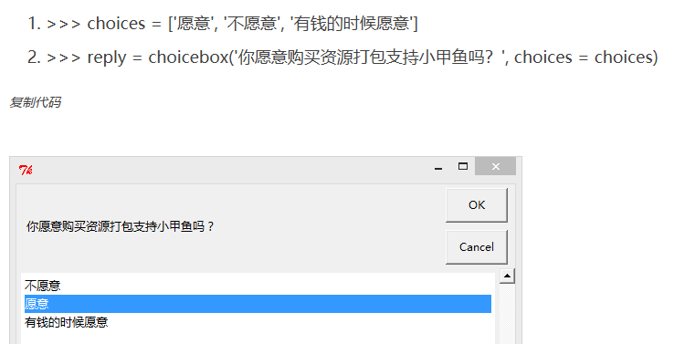

# 基础

建议配合《零基础入门学习python（第2版）》--小甲鱼

## 常用函数

| `print("str")` | 打印str 可使用转义字符 |
| -------------- | ---------------------- |
| `input("str")` | 输入数据   且可打印str |
| `int`          | 整形                   |
| `float`        | 浮点型                 |
| `double`       | 双精度浮点型           |
| `hex(a)`       | 将a转为16进制同理      |
| `del`          | 删除                   |

## 运算符

### 算术运算符

简洁用法  a = a+1 -> a += 1

| 符号 | 作用               |
| ---- | ------------------ |
| `+`  | 加                 |
| `-`  | 减                 |
| `*`  | 乘                 |
| `/`  | 除以               |
| `**` | 次方               |
| `//` | 地板除    商为整数 |
| `%`  | 求余               |

### 比较运算符 

| 符号 | 作用     |
| ---- | -------- |
| `<`  | 小于     |
| `<=` | 小于等于 |
| `>`  | 大于     |
| `>=` | 大于等于 |
| `==` | 相等     |
| `!=` | 不相等   |

### 逻辑操作符

| 符号  | 作用                     |
| ----- | ------------------------ |
| `and` | 左右都为True 结果为True  |
| `or`  | 其中一个为Ture结果为True |
| `not` | 结果与之前相反           |

### 各符号优先级


### 位运算

| 符号 | 作用                                                         |
| ---- | ------------------------------------------------------------ |
| &    | 按位与运算符：参与运算的两个值,如果两个相应位都为1,则该位的结果为1,否则为0 |
| \|   | 按位或运算符：只要对应的二个二进位有一个为1时，结果位就为1。 |
| ^    | 按位异或运算符：当两对应的二进位相异时，结果为1              |
| ~    | 按位取反运算符：对数据的每个二进制位取反,即把1变为0,把0变为1 。~x 类似于 -x-1 |
| <<   | 左移动运算符：运算数的各二进位全部左移若干位，由 << 右边的数字指定了移动的位数，高位丢弃，低位补0。 x<<1 类似于x`*`2 x<<2 类似于 x`*`4 |
| >>   | 右移动运算符：把">>"左边的运算数的各二进位全部右移若干位，>> 右边的数字指定了移动的位数 |


## 分支和循环

| `for 变量 in 可迭代对象:` | 迭代循环                              |
| ------------------------- | ------------------------------------- |
| `range(a,b,c)`            | 依次赋值a到b-1的数c为间隔数           |
| `random.randint(a,b)`     | 伪随机出现a到b的数     需要random模块 |
| `if(条件) : b  else:c`    | 如果条件为真则执行b否则执行c          |
| `while条件:循环体`        | 直到条件为真否则一直循环循环体        |
| `break`                   | 跳出当前循环                          |
| `continue`                | 是跳出本轮循环并开始下一轮循环        |

### else的用法

```python
while 条件:
    循环体
else:
    条件不成立时执行的内容
    
for 变量 in 可迭代对象:
    循环体
else:
    条件不成立时执行的内容
```

## 列表 元组 字符串 序列

### 列表

| `变量名 = [ ]`                    | 列表                                                         |
| --------------------------------- | :----------------------------------------------------------- |
| `变量[X]`                         | 打印出第x个字符串                                            |
| `变量3=变量2 + 变量1`             | 将变量1拼接到变量2后面生成一个新的变量3                      |
| `变量*X`                          | 将变量赋值X次                                                |
| `str in 变量`                     | 查看str是否在列表里                                          |
| `变量.count(str)`                 | 查看str在列表里出现了几次                                    |
| `变量.index(str,a,b)`             | 在a到b中str第一次出现的位置                                  |
| `变量.append( )`                  | 添加一个值添加进列表尾                                       |
| `变量.extend([ , ])`              | 添加一至多个至列表尾     事实上是使用一个列表来扩充另一个列表 |
| `变量.insert(a,b)`                | 将b插入列表第a个位置                                         |
| `变量.remove(a)`                  | 将列表指定数据a删除                                          |
| `变量.pop(X)`                     | 将列表第X个(默认最后一个)数据删除(本质是弹出)                |
| `变量.clear()`                    | 将列表全部清空                                               |
| `变量.sort()`                     | 将列表从小到大排序   括号内加上reverse=True 变为从大到小     |
| `变量.reverse()`                  | 将列表反过来                                                 |
| `变量.copy（）  /copy.copy(变量)` | 浅拷贝                                                       |
| `变量 is 变量`                    | 查看是否指向同一个地址                                       |
| `copy.deepcopy(变量)`             | 深拷贝                                                       |
| `变量.casefold()`                 | 将字符串中所有的英文字母修改为小写                           |
| `'N'.join(变量)`                  | 用于拼接字符串 用N作为拼接符号                               |
| `变量.split('N',n)`               | 将符号N的左右两边拆分开 n为分隔次数                          |

|                    | 列表切片                                        |
| ------------------ | ----------------------------------------------- |
| `变量.[ a:b[:c] ]` | 切成第a个到第b个值(默认为0) 相隔c个值 (默认为1) |

### 元组

元组和列表的最大区别是：元组只可读，不可写。
也就是说，可以任意修改（插入／删除）列表中的元素，而对于元组来说这些操作是不行的，元组只可以被访问，不能被修改。

| `变量名 = ( , )`   | 创建元组   可以不要括号                                      |
| ------------------ | ------------------------------------------------------------ |
| `变量.[ a:b[:c] ]` | 切成第a个到第b个值(默认为0) 相隔c个值 (默认为1)  复制一个元组通常用切片来实现 变量2=变量1[:] |

### 字符串

| `变量名=“ ”`       | 创建一个字符串                                  |
| ------------------ | ----------------------------------------------- |
| `变量.[ a:b[:c] ]` | 切成第a个到第b个值(默认为0) 相隔c个值 (默认为1) |

### 序列

| `list()`       | 用于把一个可迭代对象转换为列表                          |
| -------------- | ------------------------------------------------------- |
| `tuple()`      | 用于把一个可迭代对象转换为元组                          |
| `len(X)`       | 用于返回X的长度                                         |
| `max(X)`       | 用于返回该序列或多个参数中的最大值                      |
| `min(X)`       | 与max一样 且都要保证序列或参数数据类型统一              |
| `sum(X,a)`     | 返回序列X的和  最后结果加上a(默认为0)                   |
| `sorted(X)`    | 重小到大进行排序   括号内加上,reverse=True 变为从大到小 |
| `enumerate(X)` | 生成二元组                                              |

#### 二元组

```python
>>> str1 = "love"
>>> for i in enumerate(str1):
    print(i)

(0,'l')
(1,'o')
(2,'v')
(3,'e')
```

## 函数

| `def 函数名(X):`    | 创建一个函数 X为传入的参数  可以设置默认参数X=`***`当使用的函数时如果没有传入实参 则默认X=`***`(默认参数必须放后面) |
| ------------------- | ------------------------------------------------------------ |
| `return n`          | n为结束此函数时返回的值                                      |
| `def 函数名(`*`X)`  | 收集函数  如果传入的实参的个数不确定可以加个`*`  函数内使用方法和元组一样（如果收集函数后面还有函数 则必须要用关键参数指定） |
| `def 函数名(`**`X)` | 收集函数  收集成字典                                         |
| `global X`          | global使函数内的变量变为全局变量                             |

### 闭包

就是在嵌套函数的环境下，内部函数引用了外部函数的局部变量
因为闭包的概念是由内部函数而来，所以不能在外部函数以外的地方对内部函数进行调用
在内部函数中，只能对外部函数的局部变量进行访问，但不能进行修改
可以通过以下方法进行修改

```python
>>>	def funX():
        x = [5]
    def funY():
            x[0] = x[0] + 1
            return x[0]
        return funY
    
>>>	temp = funX()
>>> temp()
6
```

也可以使用`nonlocal`关键字告诉Python这不是一个局部变量

```python
>>>	def funX():
        x = 5
    def funY():
            nonlocal x
            x = x + 1
            return x
        return funY
>>>temp = funX()
>>>temp()
6
```

### 语法糖

语法糖让程序更加简洁，有更高的可读性。

```python
def log(func):
    def wrapper(*params):
        print("开始调用")
        func(*params)
        print("结束调用")
   	return wrapper

@log
def eat():
    print("调用成功")
  
>>>eat()
开始调用
调用成功
结束调用
```

```python
@buffer
@performance
@log
def eat():
```

相当于调用`buffer(performance(log(eat)))`

### 函数式编程

#### lambda

使用lambda关键字来创建匿名函数
冒号（:）分隔函数的参数及返回值：冒号的左边放置函数的参数，如果有多个参数，使用逗号（,）分隔即可；冒号右边是函数的返回值。

普通函数:

```python
>>>	def add(x,y):
    return x + y

>>>	add(3,4)
7
```

转化为lambad形式:

```python
>>>	add = lambda x,y : x + y
>>>	add(3,4)
7
```

#### filter

`filter()`这个内置函数有两个参数：
第一个参数可以是一个函数也可以是None，如果是一个函数的话，则将第二个可迭代对象里的每一个元素作为函数的参数进行计算，把返回True的值筛选出来；
如果第一个参数为None，则直接将第二个参数中为True的值筛选出来。
例如:

```python
>>> temp = filter(None,[1,0,False,True])
>>>	list (temp)
[1,true]
```

用`filter()`写一个筛选奇数的过滤器

```python
>>> def odd(x):
    return x % 2

>>> temp = filter(odd,range(10))
>>> list(temp)
[1, 3, 5, 7, 9]
```

结合前面学到的 [lambda](#lambda) 表达式，就可以使用函数式编程来实现:

```python
>>> list(filter(lambda x : x % 2,range(10)))
[1, 3, 5, 7, 9]
```

#### map()

仍然是一个函数和一个可迭代对象，将可迭代对象的每一个元素作为函数的参数进行运算加工，直到可迭代序列每个元素都加工完毕。

```python
>>> list(map(lambda x : x * 2, range(10)))
[0, 2, 4, 6, 8, 10, 12, 14, 16, 18]
```

`map()`的第二个参数是收集参数，支持多个可迭代对象。map()会从所有可迭代对象中依次取一个元素组成一个元组，然后将元组传递给`func`。
注意：如果可迭代对象的长度不一致，则以较短的迭代结束为止。

```python
>>> list(map(lambda x, y : x + y, [1, 3, 5], [10, 30, 50, 66, 88]))
[11, 33, 55]
```

### 递归

普通程序员用迭代，天才程序员用递归

例如 [斐波那契数列](./源码/python.md#兔子问题（斐波那契数列）)

## 字典

### 创建和访问字典

字典定义：由`键`和`值`共同构成，每一对键值组合称为`项`。
字典的键必须独一无二，但值则不必。值可以取任何数据类型，但必须是不可变的，如字符串、数或元组。
有别于序列，字典是不支持拼接和重复操作的

| `变量名 = {a:b,c:d}`       | 创建字典                                                     |
| -------------------------- | ------------------------------------------------------------ |
| `变量名 = dict (l=1,o=21)` | 用内置函数创建字典                                           |
| `变量['a']`                | 查看的键a的值为多少 如果不存在则抛出KeyError                 |
| `变量['a']=b`              | 如果键已存在，则改写键对应的值；如果键不存在，则创建一个新的键并赋值 |
| `变量.keys()`              | 用于返回字典中的键                                           |
| `变量.values()`            | 用于返回字典中所有的值                                       |
| `变量.items()`             | 用于返回字典中所有的键值对(项)                               |
| `变量.clear()`             | 清空此字典                                                   |
| `变量.copy`                | 浅拷贝                                                       |
| `变量.pop()`               | 给定键弹出对应的值                                           |
| `变量.popitem()`           | 弹出一个项                                                   |
| `变量.setdefault()`        | 查找键方法和[get()](#get)方法有点相似，但是  找不到相应的键时会自动添加 |
| `变量.update(a=b)`         | 可以利用它来更新字典                                         |

下面列举的五种方法都是创建同样的字典:

```python
>>> a = dict(one=1, two=2, three=3)
>>> b = {'one': 1, 'two': 2, 'three': 3}
>>> c = dict(zip(['one', 'two', 'three'], [1, 2, 3]))
>>> d = dict([('two', 2), ('one', 1), ('three', 3)])
>>> e = dict({'three': 3, 'one': 1, 'two': 2})
>>> a == b == c == d == e
True
```

### 各种内置方法

#### 1.fromkeys(seq[, value])

第一个参数是字典的键；第二个参数是可选的，是传入键对应的值，如果不提供，那么默认是None。

```python
>>> dict1 = {}
>>> dict1.fromkeys((1, 2, 3))
{1: None, 2: None, 3: None}
>>> dict2.fromkeys((1, 2, 3), "a")
{1: 'a', 2: 'a', 3: 'a'}
>>> dict1.fromkeys((1, 2, 3), ("a","b","c"))
{1: ('a', 'b', 'c'), 2: ('a', 'b', 'c'), 3: ('a', 'b', 'c')}
```

#### <a name='get'>2.get(key[, default])</a>>

`get()`方法提供了更宽松的方式去访问字典项，当键不存在的时候，`get()`方法并不会报错，只是默默地返回了一个None，表示啥都没找到：

```python
>>> dict1.get(31)
'赞'
>>> dict1.get(32)
>>>
```

如果希望找不到数据时返回指定的值，那么可以在第二个参数设置对应的默认返回值：

```python
>>> dict1.get(32, "木有")
'木有'
```

 如果不知道一个键是否在字典中，那么可以使用成员资格操作符（in或not in）来判断：

```python
>>> 31 in dict1
True
>>> 32 in dict2
False
```

## 集合

集合是无序的

| `变量名 = { }`          | 创建集合                 |
| ----------------------- | ------------------------ |
| `变量名 = set([])`      | 用内置函数创建集合       |
| `变量.remove()`         | 可以删除集合中已知的元素 |
| `变量名=frozenset({ })` | 不可变集合               |

可以使用in和not in判断一个元素是否在集合中已经存在

## 文件

| 打开模式 | 执行操作                                          |
| :------: | :------------------------------------------------ |
|   `r`    | 已只读方式打开文件(默认)                          |
|   `w`    | 已写入的方式打开文件 (之前的文件内容会被全部删除) |
|   `x`    | 如果文件已经存在，使用此模式打开将引发异常        |
|   `a`    | 已写入的方式打开，如果文件存在，则在末尾追加写入  |
|   `b`    | 已二进制模式打开文件                              |
|   `t`    | 已文本模式打开(默认)                              |
|   `+`    | 可读写模式(可添加到其他模式中使用)                |
|   `U`    | 通用换行符支持                                    |

| `f = open(文件名)`    | 打开文件并返回文件对象 <br />加上“”打开此路劲下的文件 若没有则创建  如果不带路劲则在当前文件夹中寻找该文件<br />可选择打开模式 ’ab‘默认 r t |
| --------------------- | ------------------------------------------------------------ |
| `f.close()`           | 关闭文件                                                     |
| `f.read( size = -1 )` | 从文件读取size个字符，当为给定size或给定负值的时候，读取剩余的所有字符，然后作文字符串返回 |
| `f.readline()`        | 从文件中读取一整行字符串  （从文件指针的位置向后读取）       |
| `f.write(str)`        | 将字符串str写入文件                                          |
| `f.writelines(seq)`   | 向文件写入字符串序列seq，seq应该是一个返回字符串的可迭代对象 |
| `seek(offset,from)`   | 在文件中移动文件指针，从from(0代表文件起始位置，1代表当前位置，2代表文件末尾)偏移offset个字节 |
| `tell()`              | 返回当前文件中的位置（告诉你当前文件指针的位置）             |

## 异常处理

| `出现异常`          | 异常原因                     |
| ------------------- | ---------------------------- |
| `AssertionError`    | 断言语句（assert）失败       |
| `AttributeError`    | 尝试访问未知的对象属性       |
| `IndexError`        | 索引超出序列的范围           |
| `KeyError`          | 字典中查找一个不存在的关键字 |
| `NameError`         | 尝试访问一个不存在的变量     |
| `OSError`           | 操作系统产生的异常           |
| `SyntaxError`       | Python的语法错误             |
| `TypeError`         | 不同类型间的无效操作         |
| `ZeroDivisionError` | 除数为零                     |

### try-except语句

#### try-except语句的语法结构如下:

```python
try:
    检测范围
except Exception[as reason]:
    出现异常(Exception)后的处理代码
```

#### 针对不同异常设置多个except

```python
try:
    sum = 1 + '1'
    f = open('我是一个不存在的文档,txt')
    print(f.read())
    f.close()
except OSError as reason:
    print('文件出错，错误原因是:'+str(reason))
except TypeError as reason:
    print('类型出错，错误原因是:'+str(reason))
```

#### 对多个异常统一处理

```python
try:
    int('abc')
    sum = 1 + '1'
    f = open('我是一个不存在的文档.txt')
    print(f.read())
    f.close()
except (OSError, TypeError):
    print('出错啦T_T\n错误原因是：' + str(reason))
```

#### 捕获所有异常

​	如果无法确定要对哪一类异常进行处理，只是希望在try语句块里一旦出现任何异常，可以给用户一个“看得懂”的提醒，那么可以这么做：

```python
try:
    f = open('我是一个不存在的文档.txt')
print(f.read())
    sum = 1 + '1'
    f.close()
except:
    print('出错啦')
```

​	不过通常不建议这么做，因为它会隐藏所有程序员未想到并且未做好处理准备的错误，例如，当用户通过Ctrl+C快捷键强制终止程序，却会被解释为KeyboardInterrupt异常。另外要注意的是，try语句检测范围内一旦出现异常，剩下的语句将不会被执行。

### try-finally语句  无论如何都将被执行

​	为了实现像“就算出现异常，但也不得不执行的收尾工作（如在程序崩溃前保存用户文档）”，
引入了finally来扩展try：

```python
try:
    f = open('我是一个不存在的文档.txt')
print(f.read())
    sum = 1 + '1'
except:
    print('出错啦')
finally:
    f.close()
```

​	如果try语句块中没有出现任何运行时错误，会跳过except语句块执行finally语句块的内容。如果出现异常，则会先执行except语句块的内容再执行finally语句块的内容。
​	总之，finally语句块中的内容就是确保无论如何都将被执行的内容。

### raise语句  抛出一个异常

​	代码能不能自己抛出一个异常呢？答案是可以的，可以使用raise语句抛出一个异常：

```python
>>> raise ZeroDivisionError
Traceback (most recent call last):
  File "<pyshell#1>", line 1, in <module>
    raise ZeroDivisionError
ZeroDivisionError
```

​	抛出的异常还可以带参数，表示异常的解释：

```python
>>> raise ZeroDivisionError('除数不能为零！')
Traceback (most recent call last):
  File "<pyshell#2>", line 1, in <module>
    raise ZeroDivisionError('除数不能为零！')
ZeroDivisionError: 除数不能为零！
```

### 简洁的with语句  with会自动帮助关闭文件

​		有读者可能觉得，即要打开文件又要关闭文件，还要关注异常处理，有点烦琐，所以Python提供了一个`with`语句，利用这个语句抽象出文件操作中频繁使用的`try/except/finally`相关的细节。对文件操作使用with语句，将大大减少代码量，而且再也不用担心出现文件打开了忘记关闭的问题了（with会自动帮 助关闭文件）。
​		举个例子：

```python
try:
    f = open('data.txt', 'w')
    for each_line in f:
        print(each_line)
except OSError as reason:
    print('出错了' + str(reason))
finally:
    f.close()
```

​		使用with语句，可以改成这样：

```python
# p9_11.py
try:
    with open('data.txt', 'w') as f:
        for each_line in f:
            print(each_line)
except OSError as reason:
	print('出错了' + str(reason))
```

## 类和对象

​	面向过程就是分析出解决问题所需要的步骤，然后用函数把这些步骤一步一步实现，使用的时候一个一个依次调用就可以了；面向对象是把构成问题事务分解成各个对象，建立对象的目的不是为了完成一个步骤，而是为了描叙某个事物在整个解决问题的步骤中的行为。

### self是什么

​	由同一个类可以生成无数对象，当一个对象的方法被调用的时候，对象会将自身的引用作为第一个参数传给该方法，那么Python就知道需要操作哪个对象的方法了。

### __ init __

​	通常称为构造方法,要实例化一个对象，这个方法就会在对象被创建时自动调用
​	其实，实例化对象时是可以传入参数的，这些参数会自动传入__ init __()方法中，可以通过重写这个方法来自定义对象的初始化操作。
​	举个例子：

```python
>>> class Potato:
	def __init__(self,name):
		self.name = name
	def kick(self):
		print('我叫%s，很高兴认识你。' % self.name)

		
>>> p = Potato("土豆")
>>> p.kick()
我叫土豆，很高兴认识你。
```

### 公有和私有

​		默认对象的属性和方法都是公开的，可以直接通过点操作符（.）进行访问：

```python
>>> class Person:
	name = '小土豆'

	
>>> p = Person()
>>> p.name
'小土豆'
```

​		为了实现类似私有变量的特征，Python内部采用了一种叫`NameMangling`（名字改编）的技术，在Python中定义私有变量只需要在变量
名或函数名前加上`__`两个下画线，那么这个函数或变量就会成为私有的了：

```python
>>> class Person:
	__name = '小土豆'

>>> p = Person()
>>> p.__name
Traceback (most recent call last):
  File "<pyshell#14>", line 1, in <module>
    p.__name
AttributeError: 'Person' object has no attribute '__name'
```

​		但是认真琢磨一下这个技术的名字：name mangling（名字改编），那就不难发现其实Python只是动了一下手脚，把两个下画线开头的变量进行了改名而已。实际上在外部使用“_ 类名 _ _变量名”即可访问两个下画线开头的私有变量了：		

```python
>>> p._Person__name
'小土豆'
```

>Python目前的私有机制其实是伪私有，Python的类是没有权限控制的，所有变量都是可以被外部调用的。

### 继承

​		类继承的语法很简单：

```python
class 类名(被继承的类):
    ...
```

​		被继承的类称为基类、父类或超类；继承者称为子类，一个子类可以继承它的父类的任何属性和方法。		
​		例如：

```python
>>> class Parent:
	def hello(self):
		print("正在调用父类的方法…")

>>> class Child(Parent):
	pass

>>> p = Parent()
>>> p.hello()
正在调用父类的方法…
>>> c = Child()
>>> c.hello()
正在调用父类的方法…
```

​		需要注意的是，如果子类中定义与父类同名的方法或属性，则会自动覆盖父类对应的方法或属性：

```python
>>> class Child(Parent):
	def hello(self):
		print("正在调用子类的方法")

		
>>> c = Child()
>>> c.hello()
正在调用子类的方法
```

​		调用未绑定的父类方法

```python
class 子类名(父类名) :
    def __init__(self):
        父类名.__init__(self)#调用未绑定的父类的方法，可以通过父类.方法名调用，并且此时的self是子类的属性  
        super().__init__()#也可以通过super()函数调用，推荐使用self()函数，可以自动找到父类的属性，我们可以不用手动传参
```

### 多重继承

​		除此之外，Python还支持多继承，就是可以同时继承多个父类的属性和方法。多重继承的语法如下：

```python
class 类名(父类1，父类2，父类3，…):
    ……
```

​		例如:

```python
>>> class Base1:
	def foo1(self):
		print("我是foo1,我在Base1中…")

>>> class Base2:
	def foo2(self):
		print("我是foo2,我在Base2中…")

>>> class C(Base1,Base2):
	pass

>>> c = C()
>>> c.foo1()
我是fool,我在Base1中…
>>> c.foo2()
我是foo2,我在Base2中…
```

​		但多重继承很容易导致代码混乱，所以当不确定是否必须使用多重继承的时候，请尽量避免使用它，因为有些时候会出现不可预见的BUG。

### 组合

​		直接把需要的类放进去实例化就可以了，这就叫组合：

```python
# p11_3.py
class Turtle:
    def __init__(self, x):
        self.num = x

class Fish:
    def __init__(self, x):
        self.num = x

class Pool:
    def __init__(self, x, y):
        self.turtle = Turtle(x)
        self.fish = Fish(y)
     
    def print_num(self):
        print("水池里总共有乌龟 %d 只，小鱼 %d 条！" % (self.turtle.num, self.fish.num))
```

### 一些相关的BIF

#### issubclass(class, classinfo)

​		如果第一个参数（class）是第二个参数（classinfo）的一个子类，则返回True，否则返回False。

1. 一个类被认为是其自身的子类。
2. classinfo可以是类对象组成的元组，只要class是其中任何一个候选类的子类，则返回True。
3. 在其他情况下，会抛出一个TypeError异常。

```python
>>> class A:
	pass

>>> class B(A):
	pass

>>> issubclass(B,A)
True
>>> issubclass(B,B)
True
>>> issubclass(B,object) # object是所有类的基类
True
>>> class C:
	pass

>>> issubclass(B,C)
False
```

#### isinstance(object, classinfo)

​		如果第一个参数（object）是第二个参数（classinfo）的实例对象，则返回True，否则返回False。

1. 如果object是classinfo的子类的一个实例，也符合条件。
2. 如果第一个参数不是对象，则永远返回False。
3. classinfo可以是类对象组成的元组，只要object是其中任何一个候选类的子类，则返回True。
4. 如果第二个参数不是类或者由类对象组成的元组，会抛出一个TypeError异常。

```python
>>> issubclass(B, C)
False
>>> b1 = B()
>>> isinstance(b1, B)
True
>>> isinstance(b1, C)
False
>>> isinstance(b1, A)
True
>>> isinstance(b1, (A, B, C))
True
```

#### hasattr(object, name)

​		测试一个对象里是否有指定的属性。第一个参数（object）是对象，第二个参数（name）是属性名（属性的字符串名字）
​		举个例子：

```python
>>> class C:
	def __init__(self,x = 0):
		self.x = x

>>> c1 = C()
>>> hasattr(c1,'x') # 注意，属性名要用引号括起来
True
```

#### getattr(object, name[, default])

​		返回对象指定的属性值，如果指定的属性不存在，则返回default（可选参数）的值；若没有设置default参数，则抛出ArttributeError异常。

```python
>>> getattr(c1,'x')
0
>>> getattr(c1,'y')
Traceback (most recent call last):
  File "<pyshell#31>", line 1, in <module>
    getattr(c1,'y')
AttributeError: 'C' object has no attribute 'y'
>>> getattr(c1,'y','你访问的属性不存在…')
'你访问的属性不存在…'
```

#### setattr(object, name, value)

​		与getattr()对应，setattr()可以设置对象中指定属性的值，如果指定的属性不存在，则会新建属性并赋值。

```python
>>> setattr(c1,'y','love')
>>> getattr(c1,'y')
'love'
```

#### delattr(object, name)

​		与setattr()相反，delattr()用于删除对象中指定的属性，如果属性不存在，则抛出AttributeError异常。

---

#### property

​		property(fget=None, fset=None, fdel=None, doc=None) 它的作用是通过属性来设置属性。
​		例如:

```python
class C:
    def __init__(self, size=10):
        self.size = size

    def getSize(self):
        return self.size

    def setSize(self, value):
        self.size = value

    def delSize(self):
        del self.size

    x = property(getSize, setSize, delSize)
```

​		程序实现如下：

```python
>>> c = C()
>>> c.x
10
>>> c.x = 12
>>> c.x
12
>>> c.size
12
>>> del c.x
>>> c.size
Traceback (most recent call last):
  File "<pyshell#6>", line 1, in <module>
    c.size
AttributeError: 'C' object has no attribute 'size'
```

​		`property()`返回一个可以设置属性的属性，当然如何设置属性还是需要人为来写代码。第一个参数是获得属性的方法名（例子中是getSize），第二个参数是设置属性的方法名（例子中是setSize），第三个参数是删除属性的方法名（例子中是delSize）。

​		`property()`有什么作用呢？举个例子，在上面的例子中，为用户提供`setSize`方法名来设置`size`属性，并提供`getSize`方法名来获取属性。但是有一天你心血来潮，突然想对程序进行大改，就可能需要把`setSize`和`getSize`修改为`setXSize`和`getXSize`，那就不得不修改用户调用的接口，这样的体验非常不好。

​		有了`property()`，所有问题就迎刃而解了，因为像上面例子中一样，为用户访问`size`属性只提供了`x`属性。无论内部怎么改动，只需要相应地修改`property()`的参数，用户仍然只需要去操作`x`属性即可，没有任何影响。

## 魔法方法

### 什么是魔法方法

* 　魔法方法总是被左右各两个下画线包围，例如`__init__`()。
* 　魔法方法是面向对象的Python的一切，如果不知道魔法方法，说明你还没能意识到面向对象的Python的强大。
* 　魔法方法的“魔力”体现在它们总能够在适当的时候助你一臂之力。


### 构造和析构

#### `__init __`(self[, ...])

​		只有在需要进行初始化的时候才重写`__init __()`方法，并不是实例化对象时第一个被调用的魔法方法。
​		返回值一定是None，不能是其他

----

#### `__ new__`(cls[, ...])

​		事实上，`__new__()`才是在一个对象实例化的时候调用的第一个方法。它与其他魔法方法不同，它的第一个参数不是self而是这个类
(cls)，而其他的参数会直接传递给 ` __init__()`方法。

​		需要返回一个实例对象，通常是cls这个类实例化的对象，当然也可以返回其他对象。

​		平时很少去重写它，一般让Python用默认的方案执行就可以了。但是有一种情况需要重写这个魔法方法，就是当继承一个
不可变的类型的时候，它的特性就显得尤为重要了

---

#### `__del__(self)`

​		如果说`__init __()`和`__new__()`方法是对象的构造器的话，那么Python也提供了一个析构器，称为`__del__()`方法。当对象将要被销毁的时候，这个方法就会被调用。但一定要注意的是，并非del x就相当于自动调用`x.__del__()`， `__del__()`方法是当垃圾回收机制回收这个对象的时候调用的。
​		举个例子：

``` python
>>>	class C:
	def __init__(self):
		print("我是__init__方法,我被调用了...")
	def __del__(self):
		print("我是__del__方法,我被调用了...")
        
>>>	c1 = C()
我是 __init__方法,我被调用了...
>>>	c2 = c1
>>>	c3 = c2
>>> de1 c1
>>> de1 c2
>>> de1 c3
>>>	我是__de1__方法,我被调用了...
```


### 算术运算

#### 常见的算术运算

| 魔法方法                    | 含义                                 |
| --------------------------- | ------------------------------------ |
| `__add__(self, other)`      | 定义加法的行为:+                     |
| `__sub__(self, other)`      | 定义减法的行为:-                     |
| `__mul__(self, other)`      | 定义乘法的行为:*                     |
| `__truediv__(self, other)`  | 定义真除法的行为:/                   |
| `__floordiv__(self, other)` | 定义整数除法的行为://                |
| `__mod__(self, other)`      | 定义取余的行为:                      |
| `__pow__(self, other)`      | 定义当被 power()调用或**运算时的行为 |
| `__divmod__(self, other)`   | 定义当被 diiodo()调用时的行为        |
| `__lshift__(self, other)`   | 定义按位左移位的行为:<<              |
| `__rshift__(self, other)`   | 定义按位右移位的行为:>>              |
| `__and__(self, other)`      | 定义按位与操作的行为:&               |
| `__xor__(self, other)`      | 定义按位异或操作的行为:^             |
| `__or__(self, other)`       | 定义按位或操作的行为: \|             |

​		举个例子，下面定义一个比较特立独行的类：

```python
>>> class New_int(int):
		def __add__ (self, other):
			return int.__sub__(self, other)
		def __sub__ (self, other):
			return int.__add__(self, other)
>>>	a = New int (3)
>>>	b = New int (5)
>>>	a+b
-2
>>>	a-b
8
```

#### 反运算

​		这里的反运算相关的魔法方法与上一节介绍的算术运算相关的魔法方法保持一一对应的关系，不同之处就是反运算的魔法方法多了一个`r`，例如，`__add__()`就对应`__radd__()`
​		当左操作数不支持相应的操作时被调用

```python
>>>	class Nint(int)
		def __radd__ (self, other):
			return int.__sub__ (other, self)
>>>	a = Nint(5)
>>>	b = Nint(3)
>>>	a+b
8
# 由于a对象默认有add()方法,所以b的radd()没有执行
# 这样就有了:
>>> 1+b
-2
```

#### 一元操作符

​		Python支持的一元操作符：`__neg__()`表示正号行为；`__pos__()`表示定义负号行为；而`__abs__ ()`表示定义`abs()`函数（取绝对值）被调用时的行为；`__invert__()`表示定义按位取反的行为。


### 属性访问

| 魔法方法                      | 含义                                       |
| ----------------------------- | ------------------------------------------ |
| `__ getattr__(self,name)`     | 定义当用户试图获取一个不存在的属性时的行为 |
| `__getattribute__(self,name)` | 定义当该类的属性被访问时的行为             |
| `__setattr__(self,name)`      | 定义当一个属性被设置时的行为               |
| `__delattr__(self,name)`      | 定义当一个属性被删除时的行为               |


### 描述符（property的原理）

​		用一句话来解释，描述符就是将某种特殊类型的类的实例指派给另一个类的属性。那什么是特殊类型的类呢？就是至少要在这个类里边定义__get__()、`__set__()`或` __delete__()`三个特殊方法中的任意一个。

| 魔法方法                         | 含义                                  |
| -------------------------------- | ------------------------------------- |
| `__get__(self, instance, owner)` | 用于访问属性,它返回属性的值           |
| `__set__(self, instance, value)` | 将在属性分配操作中调用,不返回任何内容 |
| `__delete__(self, instance）`    | 控制删除操作,不返回任何内容           |


### 定制容器

​		在Python中，像序列类型（如列表、元组、字符串）或映射类型（如字典）都属于容器类型。

* 如果希望定制的容器不可变，则只需要定义`__len__()`和`__getitem__()`方法。
* 如果希望定制的容器是可变的，除了`__len__()`和`__getitem__()`方法，还需要定义`__setitem__()`和`__delitem__()`两个方法。

| 魔法方法                        | 含义                                                  |
| ------------------------------- | ----------------------------------------------------- |
| `__len__(self)`                 | 定义当被len()函数调用时的行为(返回容器中元素的个数)   |
| `__getitem__(self,key)`         | 定义获取容器中指定元素的行为,相当于 self[key]         |
| `__setitem__(self, key, value)` | 定义设置容器中指定元泰的行为,相当于 self[key] = value |
| `__delitem__(self,key)`         | 定义删除容器中指定元素的行为,相当于 del self[key]     |
| `__iter__(self)`                | 定义当迭代容器中的元素的行为                          |
| `__reversed__(self)`            | 定义当被 reversed()函数调用时的行为                   |
| `__contains__(self, item)`      | 定义当使用成员测试运算符(in或 not in)时的行为         |


### 迭代器

​		关于迭代，Python提供了两个BIF：iter()和next()
​		对一个容器对象调用iter()就得到它的迭代器，调用next()迭代器就会返回下一个值，然后怎么样结束呢？如果迭代器没有值可以返回了，Python会抛出一个名为StopIteration的异常：

```python
>>> a = 'love'
>>> b = iter(a)
>>> while True:
	try:
		each = next(b)
	except StopIteration:
		break
	print(each)

	
l
o
v
e
```


----

​		关于实现迭代器的魔法方法有两个：`__iter__()`和`__next__()`
​		一个容器如果是迭代器，那就必须实现_ _iter_ _()魔法方法，这个方法实际上就是返回迭代器本身。
​		例如：<a name='斐波那契数列'>斐波那契数列</a>

```python
>>> class Fibs:
	def __init__(self):
		self.a = 0
		self.b = 1
	def __iter__(self):
		return self
	def __next__(self):
		self.a, self.b = self.b, self.a + self.b
		return self.a
	
>>> fibs = Fibs()
>>> for each in fibs:
	if each < 20:
		print(each)
	else:
		break
	
1
1
2
3
5
8
13
```


### 生成器

​		生成器其实是迭代器的一种实现”，生成器的发明一方面是为了使得Python更为简洁，因为，迭代器需要我们去定义一个类和实现相关的方法，而生成器则只需要在普通的函数中加上一个yield语句即可。
​		另一个更重要的方面，生成器的发明使得Python模仿协同程序的概念得以实现。所谓协同程序，就是可以运行的独立函数调用，函数可以暂停或者挂起，并在需要的时候从程序离开的地方继续或者重新开始。
​		例如：

```python
>>> def myGen():
	print("生成器被执行！")
	yield 1
	yield 2
	
>>> myG = myGen()
>>> next(myG)
生成器被执行！
1
>>> next(myG)
2
>>> next(myG)
Traceback (most recent call last):
  File "<pyshell#194>", line 1, in <module>
    next(myG)
StopIteration
```

​		当函数结束时，一个StopIteration异常就会被抛出。由于Python的for循环会自动调用next()方法和处理StopIteration异常，所以for循环当然也是可以对生成器产生作用的：

```python
>>> for i in myGen():
	print(i)
	
生成器被执行！
1
2
```

​		上面的[斐波那契数列](#斐波那契数列)也可以简化：

```python
>>> def fibs():
	a = 0
	b = 1
	while True:
		a, b = b, a + b
		yield a
		
>>> for each in fibs():
	if each > 20:
		break
	print(each)
	
1
1
2
3
5
8
13
```


### 生成器表达式

#### 推导式

​		普通代码：

```python
list1 = []
for i in range(10)
	list1.append(i*i)
```

​		使用列表推导式后：

```python
>>> [i*i for i in range(10)]
[0, 1, 4, 9, 16, 25, 36, 49, 64, 81]
```

---

​		除了有列表推导式之外，还有字典推导式（dictionarycomprehension）：

```python
>>> {i:i % 2 == 0 for i in range(10)}
{0: True, 1: False, 2: True, 3: False, 4: True, 5: False, 6: True, 7: False,8: True, 9: False}
```

---

​		还有集合推导式（set comprehension）：

```python
>>> {i for i in [1, 1, 2, 3, 3, 4, 5, 5, 5, 6, 7, 7, 8]}
{1, 2, 3, 4, 5, 6, 7, 8}
```

---

​		但是没有 ==字符串推导式==与 ==元组推导式==

---

​		还有一个特性更“牛”，如果将生成器表达式作为函数的参数使用的话，可以直接写推导式，而不必加小括号：

```python
>>> sum(i for i in range(100) if i % 2)
2500
```


## 正则表达式

### [re模块](#re)

### 常用符号

| `.`                                 | 默认匹配除\n之外的任意一个字符，若指定flag DOTALL,则匹配任意字符，包括\n |
| ----------------------------------- | ------------------------------------------------------------ |
| `^`                                 | 匹配字符开头                                                 |
| `$`                                 | 匹配字符结尾                                                 |
| `{m}`                               | 匹配前一个字符m次                                            |
| `{n,m}`                             | 匹配前一个字符 n到m次                                        |
| `*`                                 | 匹配*号前的字符0次或多次 相当于{0,}                          |
| `+`                                 | 匹配前一个字符1次或多次 相当于{1,}                           |
| `?`                                 | 匹配前一个字符0次或1次 相当于{0,1}                           |
|                                     | 如果要启用非贪婪模式 则在表示重复的元字符后面加上一个`?`即可 |
| `|`                                 | 匹配符号两边的任意一个，相当于或                             |
| `(...)`                             | 分组匹配                                                     |
| `\A`                                | 只从字符开头匹配，比如re.search("\Aabc","gggggabc") 是匹配不到的 默认情况下和`^`一样 |
| `\b`                                | 匹配一个单词的边界  单词被定义为:Unidcode的字母数字或下画线字符 |
| `\B`                                | 匹配非单词边界                                               |
| `\Z`                                | 匹配字符结尾，默认情况下和`$`一样                            |
| `\d`                                | 匹配数字0-9                                                  |
| `\D`                                | 匹配非数字                                                   |
| `\w`                                | 匹配[A-Za-z0-9]                                              |
| `\W`                                | 匹配非[A-Za-z0-9]                                            |
| `\s`                                | 匹配空白字符例如，`\t`表示tab键(制表键)，`\n`表示换行符，`\r`表示回车，`\f`表示换页符，`\v`则表示垂直的tab键（`\t`是水平制表键）。 |
| `\S`                                | 匹配非空白字符                                               |
| \                                   | 如果是数字1~99 表示引用序号对应的子组所匹配的字符串<br />如果跟着的数字是以0开头或者是三位数字，那么她是一个八进制数，表示的是这个八进制数对应的ASCII字符 |
| [ ]                                 | 匹配到括号内的任意字符  除了 ^ - \ <br />被它包围在里边的元字符都失去了特殊的功能，就像反斜杠加上元字符的作用是一样的<br /> 例如[abc]d 可以匹配 ad、bd、cd |
| [a-b]                               | 表示a到b的范围                                               |
| `[\]`                               | 这里用于字符串转义，例如\n表示匹配换行符                     |
| [^]                                 | 用于表示取反的意思                                           |
| (?aiLmasux)                         | (?后可以紧跟`a,i,L,m,s,u,x`中的一个或多个字符,只能在正则表达式的开头使用<br />每一个字符对应一种匹配标志:re-A(只匹配ASCII字符),re-I(忽略大小写), re-L(区域设置),re-M(多行模式),re-S(.匹配任何符号),re-X(详细表达式),包含这些字符将会影响整个正则表达式的规则.<br/>当不想通过`re.compile()`设置正则表达式标志时,这种方法就非常有用了<br />注:由于(?x)决定正则表达式如何被解析,所以它应该总是被放在最前面(最多允许前面有空白符).如果(?x)的前面是非空白字符,那么(?x)就发挥不了作用了 |
| (?:...)                             | 非捕获组，即该子组匹配的字符串无法从后面获取                 |
| `(?P<name>...)`                     | 命名组，通过组的名字(name)即可访问到子组匹配的字符串         |
| (?P=name)                           | 反向引用一个命名组，它匹配指定命名组匹配的任何内容           |
| (?#...)                             | 注释，括号中的内容将被忽略                                   |
| (?=...)                             | 前向肯定断言。如果当前包含的正则表达式（这里以...表示）在当前位置成功匹配，则代表成功，否则失败。一旦该部分正则表达式被匹配引擎尝试过，就不会继续进行匹配：剩下的模式在此断言开始的地方继续尝试<br />例如：`love(?=U)`只匹配后面紧跟`U`的字符串`love` |
| (?!...)                             | 前向否定断言<br />例如:`love(?!U)`只匹配后面不是`U`的字符串`love` |
| (?<=...)                            | 后向肯定断言<br />例如: `(?<=love)U`只匹配前面紧跟着`love`的字符串`U` |
| (?<!...)                            | 后向否定断言                                                 |
| (?(id/name)yes-pattern\|no-pattern) | 如果子组的序号或名字存在，则尝试`yes-pattern`的匹配模式；否则尝试`no-pattern`匹配模式。`no-pattern`是可选的；<br />例如: |


# 实用函数

## round() 精度控制

```python
>>> round(2.5)
2
>>> round(2.4)
2
>>> round(3.1415,2)
3.14
```


## split() 拆分

str.split(str="",num=string.count(str))[n]

参数说明：
`str`:表示为分隔符，默认为空格，但是不能为空('')。若字符串中没有分隔符，则把整个字符串作为列表的一个元素
`num`:表示分割次数。如果存在参数`num`，则仅分隔成 `num+1` 个子字符串，并且每一个子字符串可以赋给新的变量
`[n]`:表示选取第n个分片

> 注意：当使用空格作为分隔符时，对于中间为空的项会自动忽略

## strip() 去除字符串空格

str.strip() ： 去除字符串两边的空格
 str.lstrip() ： 去除字符串左边的空格
 str.rstrip() ： 去除字符串右边的空格

> 注：此处的空格包含’\n’, ‘\r’, ‘\t’, ’

## join() 生成一个新的字符串
 将序列中的元素以指定的字符连接生成一个新的字符串。

语法： ‘delimiter’.join(seq)
 delimiter：分隔符。可以为空
 delimiter：要连接的元素序列、字符串、元组、字典

返回通过指定字符连接序列中元素后生成的新字符串。


##  upper() 全部大写

capitalize() 首字母*大写*，其余全部小写 　upper() 全转换成*大写* 　lower() 全转换成小写 　title() 标题首字*大写*


## **set()** 创建一个无序不重复元素集

可进行关系测试，删除重复数据，还可以计算交集、差集、并集等。


## replace（）方法把字符串中的 old（旧字符串） 替换成 new(新字符串)，如果指定第三个参数max，则替换不超过 max 次

```python
str.replace(old, new[, max])
```

- old -- 将被替换的子字符串。
- new  -- 新字符串，用于替换old子字符串。
- max -- 可选字符串, 替换不超过 max 次


# 爬虫

## 入门

​		URL的一般格式为（带方括号[]的为可选项）：

```bash
protocol :// hostname[:port] / path / [;parameters][?query]#fragment
```

### 一些模块

[urllib (使用requests更简洁)](#urllib (使用requests更简洁))

[requests 获取网页](#requests 获取网页)
		`requests`简化了`urllib`的诸多冗杂且无意义的操作，并提供了更强大的功能。事实证明，`requests`是Python所有模块中最受欢迎的一个，全世界最优秀的程序员都在使用它。

[Beautiful Soup 4.2.0 解析网页](#Beautiful Soup 4.2.0 解析网页)


## 常见错误码

### 418

​	被网站的反爬程序返回的

解决方法：

​	添加请求头headers信息

例如：

```python
headers = {
    # 伪装成谷歌浏览器
    'User-Agent': 'Mozilla/5.0 (Linux; Android 6.0; Nexus 5 Build/MRA58N) AppleWebKit/537.36 (KHTML, like Gecko) Chrome/69.0.3497.12 Mobile Safari/537.36',
}
```

# 模块

## 基础

### 模块就是程序

​		模块就是平时写的任何代码，保存的每一个.py结尾的文件，都是一个独立的模块。

>注意：为了让默认的IDLE可以找到这个模块，需要把文件放在Python的安装路径下

---

### 命名空间

​		什么是命名空间呢？命名空间（namespace）表示标识符（identifier）的可见范围。一个标识符可在多个命名空间中定义，它在
不同命名空间中的含义是互不相干的。
​		例如: 你们班里有个叫小花的同学，隔壁班也恰好有个叫小花的同学，由于她们在两个不同的班级，所以老师上课点名直接叫小花是没有问题的。但如果是期末统考，那么整个年级的成绩排名就分不清到底是哪个班的小花排在前面了。那怎么办呢？解决的方法很简单，就是在名字的前面写上相应的班级就可以了。在这个例子中，班级就是命名空间。

---

### 导入模块

​		下面介绍三种导入模块的方法。

#### 第一种：import模块名

#### 第二种：from 模块名 import 函数名

​		这种导入方法会直接将模块的命名空间覆盖进来，所以调用的时候也就不需要再加上命名空间了
​		这里还可以使用通配符星号（*）来导入模块中所有的命名空间

>最好不要使用这种方法，因为这样做会使得命名空间的优势荡然无存，一不小心还会陷入名字混乱的局面

#### 第三种：import模块名as新名字

​		使用这种方法可以给导入的命名空间起一个新的名字

---

### `__name__='__main__'`

​		让Python知道该模块是作为程序运行还是导入到其他模块中。为了实现这一点，需要使用模块的`__name__`属性：
 在作为程序运行的时候，`__name__`属性的值是`'__main__'`；而作为模块导入的时候，这个值就是该模块的名字了。
​		例如：

```python
def c2f(cel):
    fah = cel * 1.8 + 32
    return fah
    
def f2c(fah):
    cel = (fah - 32) / 1.8
    return cel

def test():
    print("测试，0摄氏度 = %.2f华氏度" % c2f(0))
    print("测试，0华氏度 = %.2f摄氏度" % f2c(0))

if __name__ == '__main__':
    test()
```

> 上面的代码确保只有单独运行p13_7.py时才会执行test()函数。

---

### 搜索路径

​		现在遇到一个问题，写好的模块应该放在哪里？
​		Python模块的导入需要一个路径搜索的过程。例如导入一个名为`hello`的模块，Python会在预定义好的搜索路径中寻找一个名为`hello.py`的模块文件：如果有，则导入；如果没有，则导入失败。
​		可以通过`sys`模块中的`path`变量显示出来

```python
>>> import sys
>>>	sys.path
```

​	知道原理后可以把模块所在的位置添加到搜索路径中：

```python
>>>	sys.path.append("你要添加的路径")
```

---

### 包

​		在实际开发中，一个大型的系统有成千上万的Python模块是很正常的事情。单单用模块来定义Python的功能显然还不够，如果都放在一起显然不好管理并且有命名冲突的可能，因此Python中也出现了包的概念。
​		创建一个包的具体操作如下：

1. 创建一个文件夹用于存放相关的模块，文件夹的名字即包的名字。
2. 在文件夹中创建一个`__init__.py`的模块文件，内容可以为空
3. 将相关的模块放入文件夹中。

>注意：
>		在第（2）步中，必须在每一个包目录下建立一个`__init__.py`模块，可以是一个空文件，也可以写一些初始化代码。这是Python的规定，用来告诉Python将该目录当成一个包来处理。

导入的方法为:

```python
import 包名.模块名
```

### 如何查看模块信息

​		对于Python来说，学习资料其实一直都在手边。当遇到不了解的模块时，首先要找的是Python的官方文档，打开IDLE，选择`Help→PythonDocs（F1）`。

​		有个名为`__doc__`的属性可以查看模块信息快速掌握模块用法

```python
>>>	import timeit
>>>	timeit.__doc__
#返回模块简介
```

​		还有一个名为`__file__`的属性，这个属性指明了该模块的源代码位置：

```python
>>>	import timeit
>>>	timeit.__file__
#返回代码位置
```

​		使用dir()函数可以查询到该模块定义了哪些变量、函数和类		

---

​		但并不是所有这些名字对我们都有用，所以要过滤掉一些不需要的东西。你可能留意到这里有个`__all__`属性，事实是它就是帮助我们完成这个过滤的操作

> 第一，不是所有的模块都有`__all__`属性；
> 第二，如果一个模块设置了 `__all__ `属性，那么使用“from timeit import*”这样的形式导入命名空间，就只有 `__all__`属性这个列表里的名字才会被导入，其他名字不受影响

---

​		help()函数也可以查看其它函数的用法

> 比官方文档简单 比doc文档复杂些


## format

### 通过关键字

```bash
print('{name}在{option}'.format(name="谢某人"，option="写代码"))
```

结果：谢某人在写代码 

------

### 通过位置
```bash
print('name={} path={}'.format('zhangsan', '/')
```

结果：name=zhangsan path=/

```bash
print('{1}在{0}'.format('写代码','谢某人'))
```

```bash
print('{0}在{1}'.format('谢某人','写代码'))
```

结果：谢某人在写代码

------

###　填充和对齐

^<>分别表示居中、左对齐、右对齐，后面带宽度

```
print('{:^30}'.format("zhangsan")) # 居中
print('{:>30}'.format("zhangsan")) # 右对齐
print('{:<30}'.format("zhangsan")) # 左对齐
30：字段长度（最左到最右之间的长度）
```

### 精度控制     .nf

```python
print('{:.2f}'.format(3.14159))
```

结果：3.14
保留两位小数，两位后四舍五入

```python
print('{:.5f}'.format(3.14))
```
结果：3.14000
保留5位小数，不足补0

---

#### 进制转化，b o d x 分别表示二、八、十、十六进制

```python
print('{:b}'.format(20))
print('{:o}'.format(20))
print('{:d}'.format(20))
print('{:x}'.format(20))
```

结果：
	10100
 	24
 	20
 	14 

------

### 千位分隔符 	:,

```bash
print('{:,}'.format(100000000))
print('{:,}'.format(123456.123456))
```

结果：
	100,000,000
	123,456.123456


## easygui 图形界面

让g代替easygui 接下来都用g代替easygui

### g.msgbox（ ） 图形输出


当然你也可以指定标题参数和消息参数，例如：


### ccbox( )  提供选择

```python
if g.ccbox():
	pass     # 用户选择 continue
else:
	pass    # 用户选择 cancel
```


### choices( ) 

**选择的内容（默认 continue与cancel）**

在各类按钮组件里，默认的消息是"Shall I continue?"，所以你可以不带任何参数地去调用它们。


### buttonbox()

**buttonbox(msg='', title=' ', choices=('Button1', 'Button2', 'Button3'), image=None, root=None)**

可以使用 `buttonbox()` 定义自己的一组按钮，`buttonbox() `会显示一组你定义好的按钮。当用户点击任意一个按钮的时候，`buttonbox() `返回按钮的文本内容。
如果用户取消取消或者关闭窗口，那么会返回默认选项（第一个选项）


### indexbox()

基本跟上面一样，区别就是当用户选择第一个按钮的时候返回序列号0，选择第二个按钮时候返回序列号1

---

### boolbox()

**boolbox(msg='Shall I continue?', title=' ', choices=('Yes', 'No'), image=None)** 
如果第一个按钮被选中则返回 1，否则返回 0

---

### 在 buttonbox 里边显示图片

当你调用一个 `buttonbox` 函数（例如 `msgbox()`, `ynbox()`, `indexbox()` 等等）的时候，你还可以为关键字参数 `image` 赋值，这是设置一个 `.gif` 格式的图像（注意仅支持 GIF 格式哦）

---

### choicebox()

按钮组件方便提供用户一个简单的按钮选项，但如果有很多选项，或者选项的内容特别长的话，更好的策略是为它们提供一个可选择的列表。`choicebox() `为用户提供了一个可选择的列表，使用序列（元祖或列表）作为选项，这些选项显示前会按照不区分大小写的方法排好序。  另外还可以使用键盘来选择其中一个选项（比较纠结，但一点儿都不重要）：  

 - 例如当按下键盘上的"g"键，将会选中的第一个以"g"开头的选项。

  - 再次按下"g"键，则会选中下一个以"g"开头的选项。

  - 在选中最后一个以"g"开头的选项的时候，再次按下"g"键将重新回到在列表的开头的第一个以"g"开头的选项。

  - 如果选项中没有以"g"开头的，则会选中字符排序在"g"之前（"f"）的那个字符开头的选项。

  - 如果选项中没有字符的排序在"g"之前的，那么在列表中第一个元素将会被选中。

---

### multchoicebox()

与上一个相比可以选择多个选项

---

### integerbox()

**integerbox(msg='', title=' ', default='', lowerbound=0, upperbound=99, image=None, root=None, \**invalidKeywordArguments)**
`integerbox()` 为用户提供一个简单的输入框，用户只能输入范围内（`lowerbound`参数设置最小值，`upperbound`参数设置最大值）的整型数值，否则会要求用户重新输入。


---

### enterbox()

**enterbox(msg='Enter something.', title=' ', default='', strip=True, image=None, root=None)**
`enterbox()` 为用户提供一个最简单的输入框，返回值为用户输入的字符串。默认返回的值会自动去除首尾的空格，如果需要保留首尾空格的话请设置参数 strip=False。

---

###　multenterbox()

**multenterbox(msg='Fill in values for the fields.', title=' ', fields=(), values=())**
`multenterbox() `为用户提供多个简单的输入框，要注意以下几点：

- 如果用户输入的值比选项少的话，则返回列表中的值用空字符串填充用户为输入的选项。
- 如果用户输入的值比选项多的话，则返回的列表中的值将截断为选项的数量。
- 如果用户取消操作，则返回域中的列表的值或者None值
  

---

### **passwordbox()**

**passwordbox(msg='Enter your password.', title=' ', default='', image=None, root=None)**
`passwordbox() `跟 `enterbox()` 样式一样，不同的是用户输入的内容用"*"显示出来，返回用户输入的字符串：

---

###　**multpasswordbox()**

**multpasswordbox(msg='Fill in values for the fields.', title=' ', fields=(), values=())**
`multpasswordbox()` 跟 `multenterbox() `使用相同的接口，但当它显示的时候，最后一个输入框显示为密码的形式（"*"）：

---

### **textbox()**

**textbox(msg='', title=' ', text='', codebox=0)** 
`textbox() `函数默认会以比例字体（参数 codebox=1 设置为等宽字体）来显示文本内容（会自动换行哦），这个函数适合用于显示一般的书面文字。 
注：text 参数（第三个参数）可以是字符串类型，列表类型，或者元祖类型。
例：g.textbox(text= open('E:\\新建文本文档.txt','r'))

----

###　diropenbox()

**diropenbox(msg=None, title=None, default=None)**
`diropenbox()` 函数用于提供一个对话框，返回用户选择的目录名（带完整路径哦），如果用户选择"Cancel"则返回 None。
default 参数用于设置默认的打开目录（请确保设置的目录已存在）。

---

### **fileopenbox()**

**fileopenbox(msg=None, title=None, default='\*', filetypes=None)**
`fileopenbox() `函数用于提供一个对话框，返回用户选择的文件名（带完整路径哦），如果用户选择"Cancel"则返回 None。
关于 default 参数的设置方法：

* default      参数指定一个默认路径，通常包含一个或多个通配符。

* 如果设置了 default 参数，fileopenbox()      显示默认的文件路径和格式。

* default 默认的参数是'*'，即匹配所有格式的文件。

> 例如
>
> - default="c:/fishc/*.py"      即显示 C:\fishc 文件夹下所有的 Python 文件。

关于 <a name="filetypes">filetypes</a> 参数的设置方法：
* 可以是包含文件掩码的字符串列表，
>例如：filetypes =  ["*.txt"] 
* 可以是字符串列表，列表的最后一项字符串是文件类型的描述，
> 例如：filetypes = ["*.css", ["*.htm", "*.html", "HTML files"]]

---

### filesavebox()

**filesavebox(msg=None, title=None, default='', filetypes=None)**
`filesavebox() `函数提供一个对话框，让用于选择文件需要保存的路径（带完整路径哦），如果用户选择"Cancel"则返回 None。
`default` 参数应该包含一个文件名（例如当前需要保存的文件名），当然你也可以设置为空的，或者包含一个文件格式掩码的通配符。
`filetypes `参数的设置方法请参考上边[点击跳转](#filetypes)。

---

### **exceptionbox()**

**捕获异常**


## Tkinter


## OS

| `getwd()`           | 返回当前工作目录                                             |
| ------------------- | ------------------------------------------------------------ |
| `chdin(path)`       | 改变工作目录                                                 |
| `listdir(path='.')` | 列举指定目录中的文件名(‘.’表示当前目录，‘..’表示上一级)      |
| `mkdir(path)`       | 创建单层目录，如果目录已存在抛出异常                         |
| `makedirs(path)`    | 递归创建多层目录，如果目录已经存在抛出异常                   |
| `remove(path)`      | 删除文件                                                     |
| `rmdir(path)`       | 删除单层目录，如果目录非空抛出异常                           |
| `removedirs(path)`  | 递归删除目录，从子目录到父目录逐层尝试删除，遇到目录非空则抛出异常 |
| `rename(old,new)`   | 将文件old重命名为new                                         |
| `system(command)`   | 运行系统的shell命令                                          |
| `walk(top)`         | top参数指定路径下的所有子目录，并将结果返回一个三元组        |
| 支持所有平台        | 以下是支持路径操作中常用的一些定义                           |
| `os.curdir`         | 指代当前目录                                                 |
| `os.pardir`         | 指代上一级目录                                               |
| `os.sep`            | 出书操作系统特定的路径分隔符（win为 '\\' linux为 '/' ）      |
| `os.linesep`        | 当前平台使用的行终止符(win为'\r\n' linux为'\n')              |
| `os.name`           | 指代当前使用的操作系统                                       |


## OS.path

| `basename(path)`           | 去掉目录路径，单独返回文件名                                 |
| -------------------------- | ------------------------------------------------------------ |
| `dirname(path)`            | 去掉文件名，单独返回目录路径                                 |
| `join(path[,path[,....]])` | 将path1，path2各部分组合成一个路径名                         |
| `split(path)`              | 分割文件名与路劲，返回(f_path，f_name)元组。如果完全使用目录，它也会将最后一个目录作为文件名分离，且不会判断文件或目录是否存在 |
| `splitext(path)`           | 分离文件名与扩展名，返回(f_name，f_extension)元组。          |
| `getsize(file)`            | 返回指定文件的尺寸，单位是字节                               |
| `getatime(file)`           | 返回指定文件最近的访问时间(浮点型秒速，可用time模块的gmtime()或localtime()函数换算) |
| `getctime(file)`           | 返回指定文件的创建时间(浮点型秒速，可用time模块的gmtime()或localtime()函数换算) |
| `getmtime(file)`           | 返回指定文件的最新修改时间(浮点型秒速，可用time模块的gmtime()或localtime()函数换算) |
|                            | 以下返回Tue或False                                           |
| `exists(path)`             | 判断指定路径（目录或文件）是否存在                           |
| `isabs(path)`              | 判断指定路径是否为绝对路径                                   |
| `isdir(path)`              | 判断指定路径是否存在且是一个目录                             |
| `isfile(path)`             | 判断指定路径是否存在且是一个文件                             |
| `islink(path)`             | 判断指定路径是否存在且是一个符号链接                         |
| `ismount(path)`            | 判断指定路径是否存在且是一个挂载点                           |
| `samefile(path1,path2)`    | 判断 path1 和 path2 两个路径是否指向同一个文件               |


## re

### 常用方法：

配合[正则表达式](#正则表达式)使用

| 函数                    | 用法                                                         |
| ----------------------- | ------------------------------------------------------------ |
| match()：               | 从头匹配                                                     |
| search()：              | 从整个文本搜索 找到第一个符合的                              |
| findall()：             | 找到所有符合的<br />如果给出的正则表达式包含了一个或者多个子组，就会返回子组中匹配的内容。<br />如果存在多个子组，那么它还会将匹配的内容组合成元组的形式再返回。 |
| finditer()：            | 将结果返回一个迭代器                                         |
| split()：               | 分割                                                         |
| sub()：                 | 替换                                                         |
| group()：               | 结果转化为内容                                               |
| groupdict()：           | 结果转化为字典                                               |
| start()、end()、start() | 分别返回匹配的开始位置、结束位置和匹配的范围                 |


### 编译标志

| 标志                       | 含义                                                         |
| -------------------------- | ------------------------------------------------------------ |
| ASCII,A                    | 使得转义字符（如`\w` `\b` `\s` 和`\d`）只能匹配ASCII字符     |
| DOTALL,S                   | 使得`.`匹配任何符号，包括换行符                              |
| IGNORECASE,I               | 匹配的时候不区分大小写                                       |
| LOCALE,L                   | 支持当前的语言(区域)设置，而不是Unicode数据库                |
| MULTILINE,M                | 多行匹配，影响`^`和`$`<br />`^`不仅匹配字符串的开头，还匹配每一行的行首；`$`不仅匹配字符串的结尾，还匹配每一行的行尾。 |
| VERBOSE,X（for'extended'） | 启用详细的正则表达式                                         |


## pickle 泡菜模块

以二进制形式储存

| `dump(name,X)` | 将X的数据保存在name中 |
| -------------- | --------------------- |
| `load()`       | 读取                  |


## time  -- 时间获取和转换（建议用timeit）

​		`time` 模块提供各种时间相关的功能在 Python 中，与时间处理有关的模块包括：`time`，`datetime` 以及 `calendar`

### 必要说明：

- 虽然这个模块总是可用，但并非所有的功能都适用于各个平台。
- 该模块中定义的大部分函数是调用 C 平台上的同名函数实现，所以各个平台上实现可能略有不同。

---

### 一些术语和约定的解释：

- 时间戳（timestamp）的方式：通常来说，时间戳表示的是从 1970 年 1 月 1 日 00:00:00  开始按秒计算的偏移量（time.gmtime(0)）此模块中的函数无法处理1970 纪元年以前的日期和时间或太遥远的未来（处理极限取决于 C  函数库，对于 32 位系统来说，是 2038 年）
- UTC（Coordinated Universal Time，世界协调时）也叫格林威治天文时间，是世界标准时间。在中国为 UTC+8
- DST（Daylight Saving Time）即夏令时的意思
- 一些实时函数的计算精度可能低于它们建议的值或参数，例如在大部分 Unix 系统，时钟一秒钟“滴答”50~100 次

---

### 时间元祖（time.struct_time）：

​		`gmtime()`，`localtime()` 和 `strptime()` 以时间元祖`（struct_time）`的形式返回。

| **索引值（Index）** | **属性（Attribute）**     | **值（Values）**            |
| ------------------- | ------------------------- | --------------------------- |
| `0`                 | tm_year（年）             | （例如：2015）              |
| `1`                 | tm_mon（月）              | 1 ~ 12                      |
| `2`                 | tm_mday（日）             | 1 ~ 31                      |
| `3`                 | tm_hour（时）             | 0 ~ 23                      |
| `4`                 | tm_min（分）              | 0 ~ 59                      |
| `5`                 | tm_sec（秒）              | 0 ~ 61[^0~61]               |
| `6`                 | tm_wday（星期几）         | 0 ~ 6（0 表示星期一）       |
| `7`                 | tm_yday（一年中的第几天） | 1 ~ 366                     |
| `8`                 | tm_isdst（是否为夏令时）  | 0， 1， -1（-1 代表夏令时） |

[^0~61]:范围真的是 0 ~ 61（你没有看错哦）；60 代表闰秒，61 是基于历史原因保留。

---

### time.altzone

​		返回格林威治西部的夏令时地区的偏移秒数；如果该地区在格林威治东部会返回负值（如西欧，包括英国）；对夏令时启用地区才能使用。

---

### time.asctime([t])

​		接受时间元组并返回一个可读的形式为"Tue Dec 11 18:07:14 2015"（2015年12月11日 周二 18时07分14秒）的 24 个字符的字符串。

---

### time.clock()

​		用以浮点数计算的秒数返回当前的 CPU 时间。用来衡量不同程序的耗时，比` time.time()` 更有用。

> *Python 3.3 以后不被推荐，由于该方法依赖操作系统，建议使用 `perf_counter()` 或 `process_time()` 代替（一个返回系统运行时间，一个返回进程运行时间，请按照实际需求选择）*

---

### time.ctime([secs]) 

​		作用相当于` asctime(localtime(secs))`，未给参数相当于` asctime()`

---

### time.gmtime([secs])

​		接收时间辍（1970 纪元年后经过的浮点秒数）并返回格林威治天文时间下的时间元组 t（注：t.tm_isdst 始终为 0）

---

### time.daylight

​		如果夏令时被定义，则该值为非零。

---

### time.localtime([secs])

​		接收时间辍（1970 纪元年后经过的浮点秒数）并返回当地时间下的时间元组 t（t.tm_isdst 可取 0 或 1，取决于当地当时是不是夏令时）

---

### time.mktime(t)

​		接受时间元组并返回时间辍（1970纪元后经过的浮点秒数）

---

### time.perf_counter()

​		返回计时器的精准时间（系统的运行时间），包含整个系统的睡眠时间。由于返回值的基准点是未定义的，所以，只有连续调用的结果之间的差才是有效的。

---

### time.process_time() 

​		返回当前进程执行 CPU 的时间总和，不包含睡眠时间。由于返回值的基准点是未定义的，所以，只有连续调用的结果之间的差才是有效的。

---

### time.sleep(secs)

 		推迟调用线程的运行，secs 的单位是秒。

---

### time.strftime(format[, t])

 		把一个代表时间的元组或者 struct_time（如由 time.localtime() 和 time.gmtime()  返回）转化为格式化的时间字符串。如果 t 未指定，将传入 time.localtime()。如果元组中任何一个元素越界，将会抛出  ValueError 异常。
 	format 格式如下：

| **格式** | **含义**                                                     | **备注** |
| -------- | ------------------------------------------------------------ | -------- |
| `%a`     | 本地（locale）简化星期名称                                   |          |
| `%A`     | 本地完整星期名称                                             |          |
| `%b`     | 本地简化月份名称                                             |          |
| `%B`     | 本地完整月份名称                                             |          |
| `%c`     | 本地相应的日期和时间表示                                     |          |
| `%d`     | 一个月中的第几天（01 - 31）                                  |          |
| `%H`     | 一天中的第几个小时（24 小时制，00 - 23）                     |          |
| `%l`     | 一天中的第几个小时（12 小时制，01 - 12）                     |          |
| `%j`     | 一年中的第几天（001 - 366）                                  |          |
| `%m`     | 月份（01 - 12）                                              |          |
| `%M`     | 分钟数（00 - 59）                                            |          |
| `%p`     | 本地 am 或者 pm 的相应符                                     | *注1*    |
| `%S`     | 秒（01 - 61）                                                | *注2*    |
| `%U`     | 一年中的星期数（00 - 53 星期天是一个星期的开始）第一个星期天之前的所有天数都放在第 0 周 | *注3*    |
| `%w`     | 一个星期中的第几天（0 - 6，0 是星期天）                      | *注3*    |
| `%W`     | 和 %U 基本相同，不同的是 %W 以星期一为一个星期的开始         |          |
| `%x`     | 本地相应日期                                                 |          |
| `%X`     | 本地相应时间                                                 |          |
| `%y`     | 去掉世纪的年份（00 - 99）                                    |          |
| `%Y`     | 完整的年份                                                   |          |
| `%z`     | 用 +HHMM 或 -HHMM 表示距离格林威治的时区偏移（H 代表十进制的小时数，M 代表十进制的分钟数） |          |
| `%Z`     | 时区的名字（如果不存在为空字符）                             |          |
| `%%`     | %号本身                                                      |          |

*注1：`%p`只有与`%I`配合使用才有效果。*
*注2：范围真的是 `0 ~ 61`（你没有看错哦^_^）；60 代表闰秒，61 是基于历史原因保留。*
*注3：当使用 `strptime()` 函数时，只有当在这年中的周数和天数被确定的时候 `%U` 和 `%W `才会被计算。*

 举个例子：

```python
>>> import time as t
>>> t.strftime("a, %d %b %Y %H:%M:%S +0000", t.gmtime())
'a, 24 Aug 2014 14:15:03 +0000'
```

### time.strptime(string[, format])

​		把一个格式化时间字符串转化为` struct_time`。实际上它和 `strftime()` 是逆操作。
​		举个例子：

```python
# I really love FishC.com!
>>> import time as t
>>> t.strptime("30 Nov 14", "%d %b %y")
time.struct_time(tm_year=2014, tm_mon=11, tm_mday=30, tm_hour=0, tm_min=0, tm_sec=0, tm_wday=6, tm_yday=334, tm_isdst=-1)
```

### time.time()

 返回当前时间的时间戳（1970 纪元年后经过的浮点秒数）

---

### time.timezone

 `time.timezone` 属性是当地时区（未启动夏令时）距离格林威治的偏移秒数（美洲 >0；大部分欧洲，亚洲，非洲 <= 0）

---

### time.tzname

 `time.tzname` 属性是包含两个字符串的元组：第一是当地非夏令时区的名称，第二个是当地的 DST 时区的名称。


## timeit 

​		该模块定义了三个实用函数和一个公共类。

---

### timeit.timeit(stmt='pass', setup='pass', timer=<default timer>, number=1000000)

​		创建一个 `Timer` 实例，参数分别是 `stmt`（需要测量的语句或函数），`setup`（初始化代码或构建环境的导入语句），`timer`（计时函数），`number`（每一次测量中语句被执行的次数）

> 注：由于 timeit() 正在执行语句，语句中如果存在返回值的话会阻止 timeit() 返回执行时间。timeit() 会取代原语句中的返回值。*

---

### timeit.repeat(stmt='pass', setup='pass', timer=<default timer>, repeat=3, number=1000000)

​		创建一个 `Timer` 实例，参数分别是 `stmt`（需要测量的语句或函数），`setup`（初始化代码或构建环境的导入语句），`timer`（计时函数），`repeat`（重复测量的次数），`number`（每一次测量中语句被执行的次数）

---

### timeit.default_timer()

​		默认的计时器，一般是 `time.perf_counter()`，`time.perf_counter() `方法能够在任一平台提供最高精度的计时器（它也只是记录了自然时间，记录自然时间会被很多其他因素影响，例如计算机的负载）。

---
### class timeit.Timer(stmt='pass', setup='pass', timer=<timer function>)

​		计算小段代码执行速度的类，构造函数需要的参数有` stmt`（需要测量的语句或函数），`setup`（初始化代码或构建环境的导入语句），`timer`（计时函数）。前两个参数的默认值都是  `pass`，`timer` 参数是平台相关的；前两个参数都可以包含多个语句，多个语句间使用分号（;）或新行分隔开。

​		第一次测试语句的时间，可以使用` timeit()` 方法；`repeat()` 方法相当于持续多次调用 `timeit()` 方法并将结果返回为一个列表。

​		`stmt` 和 `setup` 参数也可以是可供调用但没有参数的对象，这将会在一个计时函数中嵌套调用它们，然后被 `timeit() `所执行。注意，由于额外的调用，计时开销会相对略到。

---
**- timeit(number=1000000)** 

​		功能：计算语句执行 `number `次的时间。

​		它会先执行一次 `setup` 参数的语句，然后计算 `stmt` 参数的语句执行 `number` 次的时间，返回值是以秒为单位的浮点数。`number` 参数的默认值是一百万，`stmt`、`setup` 和` timer `参数由 `timeit.Timer `类的构造函数传递。

> 注意：默认情况下，timeit() 在计时的时候会暂时关闭 Python 的垃圾回收机制。这样做的优点是计时结果更具有可比性，但缺点是 GC（garbage  collection，垃圾回收机制的缩写）有时候是测量函数性能的一个重要组成部分。如果是这样的话，GC 可以在 setup  参数执行第一条语句的时候被重新启动，例如：
>
> ```python
> timeit.Timer('for i in range(10): oct(i)', 'gc.enable()').timeit()
> ```

---

### repeat(repeat=3, number=1000000)

​	功能：重复调用 `timeit()`。

​		repeat() 方法相当于持续多次调用 `timeit()` 方法并将结果返回为一个列表。`repeat` 参数指定重复的次数，`number` 参数传递给 `timeit()` 方法的 `number `参数。

> 注意：人们很容易计算出平均值和标准偏差，但这并不是非常有用。在典型的情况下，最低值取决于你的机器可以多快地运行给定的代码段；在结果中更高的那些值通常不是由于 Python 的速度导致，而是因为其他进程干扰了你的计时精度。所以，你所应感兴趣的只有结果的最低值（可以用 `min() `求出）。

---

### print_exc(file=None)

​		功能：输出计时代码的回溯（Traceback）

​		典型的用法：

```python
t = Timer(...)       # outside the try/except
try:
    t.timeit(...)    # or t.repeat(...)
except Exception:
    t.print_exc()
```

​		标准回溯的优点是在编译模板中，源语句行会被显示出来。可选的 `file `参数指定将回溯发送的位置，默认是发送到` sys.stderr`。

---

### 示例

```python
>>> import timeit
#执行命令
>>> t2 = timeit.Timer('x=range(1000)')
#显示时间
>>> t2.timeit()
10.620039563513103
 
#执行命令
>>> t1 = timeit.Timer('sum(x)', 'x = (i for i in range(1000))')
#显示时间
>>> t1.timeit()
0.1881566039438201
```


**以下演示包含多行语句如何进行测量：**
(我们通过 `hasattr()` 和 `try/except` 两种方法测试属性是否存在，并且比较它们之间的效率）

```python
>>> import timeit
>>> # attribute is missing
>>> s = """\
... try:
...     str.__bool__
... except AttributeError:
...     pass
... """
>>> timeit.timeit(stmt=s, number=100000)
0.9138244460009446
>>> s = "if hasattr(str, '__bool__'): pass"
>>> timeit.timeit(stmt=s, number=100000)
0.5829014980008651
>>>
>>> # attribute is present
>>> s = """\
... try:
...     int.__bool__
... except AttributeError:
...     pass
... """
>>> timeit.timeit(stmt=s, number=100000)
0.04215312199994514
>>> s = "if hasattr(int, '__bool__'): pass"
>>> timeit.timeit(stmt=s, number=100000)
0.08588060699912603
```

**为了使`timeit`模块可以测量你的函数，你可以在`setup`参数中通过`import`语句导入：**

```python
def test():
    """Stupid test function"""
    L = [i for i in range(100)]
 
if __name__ == '__main__':
    import timeit
    print(timeit.timeit("test()", setup="from __main__ import test"))
```


## urllib (使用requests更简洁)

​		其实`urllib`是一个包，里边共有四个模块。第一个模块是最复杂的也是最重要的，因为它包含了对服务器请求的发出、跳转、代理和安全等各个方面。

1. `request ` 请求模块

​		http请求模块，可以用来模拟发送请求。就好比在浏览器中输入网址然后回车一样，只需要给库方法传入URL以及额外的参数，就可以模拟实现这个过程。

2. `error`

3. `parse ` 工具模块

   ​	一个工具模块，提供了好多URL处理方法，比如拆分，解析，合并等。

4. `robotparser`

   ​	主要用来识别网址的robots.txt文件，然后判断哪些网站可以爬（很少用）

### request.urlopen()

​		程序功能:`urllib.request `模拟浏览器的一个请求发送过程
​		目的：获取网页的源代码
​		返回:一个类文件对象

```python
import urllib.request
response = urllib.request.urlopen('https://www.python.org');
#返回的数据在response.read()中一般为bytes编码  所以下面以编码utf-8的格式进行请求阅读
print(response.read().decode('utf-8')) 
```

#### data参数	发给服务器的数据

​		`data`参数是可选的，并且是字节流编码格式（可以用`urllib.parse.urlencode()`和`bytes()`方法将参数转化为字节流编码格式的内容）。
​		如果要使用`data`参数，则请求方式为`POST`。

```python
import urllib.request # 请求模块
import urllib.parse # urllib库中的工具模块
# 传递一个参数：word，值：hello -------》转字节流使用bytes()方法：
# 第一个参数：str类型，需要使用urllib.parse模块中的urlopen()方法来将参数字典转换为字符串
# 第二个参数：编码格式：utf-8

data = bytes(urllib.parse.urlencode({'word': 'hello'}),encoding='utf-8')
response = urllib.request.urlopen('http://httpbin.org/post',data=data)
print(response.read().decode('utf8'))
```

#### timeout参数

​		`timeout`参数用于设置超时，单位为秒，若不指定`timeout`，则使用全局默认时间。若请求超时，则会抛出`urllib.error.URLError`异常，可以通过`try except`处理异常。

```python
import socket# 判断异常
import urllib.error
import urllib.request
try:
    response = urllib.request.urlopen('http://httpbin.org/get', timeout=0.1)
except urllib.error.URLError as e:
    # socket.timeout超时异常
    if isinstance(e.reason, socket.timeout): #判断一个量是否是相应的类型
        print('时间超时')
```

#### 其他参数

​		`context`参数必须是`ssl.SSLContent`类型，用来指定设置`SSL`。
​		`cafile`和`capath`分别指定`CA`证书和它的路径，在`HTTPS`中有用。

### request.Request()

#### 一般用法

```python
from urllib import request,parse # 请求和处理方法

#访问地址
url = "http://httpbin.org/post"
headers = {
    # 伪装成谷歌浏览器
    'User-Agent': 'Mozilla/5.0 (Linux; Android 6.0; Nexus 5 Build/MRA58N) AppleWebKit/537.36 (KHTML, like Gecko) Chrome/69.0.3497.12 Mobile Safari/537.36',
}
#传入数据
dict = {
    'name': 'Germey'
}

data = bytes(parse.urlencode(dict),encoding='utf-8')
# req = request.Request(url=url, data=data,method='POST')
# req.add_header('User_Agent','Mozilla/5.0 (Linux; Android 6.0; Nexus 5 Build/MRA58N) AppleWebKit/537.36 (KHTML, like Gecko) Chrome/69.0.3497.12 Mobile Safari/537.36')
req = request.Request(url=url, data=data, headers=headers, method='POST')
response = request.urlopen(req)
print(response.read().decode('utf-8'))
```

#### 高级用法

1. **验证**

   ​	当请求的一个网页需要验证：提示输入用户名和密码

```python
# HTTPBasicAuthHandler：用于管理密码，为何 用户名和密码的表
# build_opener()方法构建一个Opener：Opener在发送请求的时候就相当于已经验证成功
# HTTPBasicAuthHandler 重试带有身份验证信息的请求（如果有）
from urllib.request import HTTPPasswordMgrWithDefaultRealm,HTTPBasicAuthHandler,build_opener
from urllib.error import URLError #  导入错误提示包

username = 'username'
password = 'password'
url = 'http://localhost:5000/'# 一个需要验证的网址

p = HTTPPasswordMgrWithDefaultRealm()# 实例化HTTPBasicAuthHandler对象，参数是 HTTPPasswordMgrWithDefaultRealm对象
p.add_password(None,url,username,password)
auth_hander = HTTPBasicAuthHandler(p)
opener = build_opener(auth_hander)# build_opener()方法构建一个Opener：Opener在发送请求的时候就相当于已经验证成功

try:
    result = opener.open(url)# 使用opener的open()打开这个链接
    html = result.read().decode('utf-8')
    print(html)
except URLError as e:
    print(e.reason)
```

2. ###### 代理

```python
"""
程序功能：代理服务器
1：ProxyHandler：参数是一个字典---》键名：协议类型，键值：代理链接（可以添加多个代理）
2：然后使用Hander以及build_opener()方法构造一个opener
3: 发送请求
"""
from urllib.error import URLError
from urllib.request import ProxyHandler,build_opener


proxy_hander = ProxyHandler({
    'http': 'http://127.0.0.1:9743',
    'https': 'http://127.0.0.1:9743'
})
# 使用build_opener()方法构建一个opener
opener = build_opener(proxy_hander)
try:
    response = opener.open('https://www.baidu.com')
    print(response.read().decode('utf-8'))
except URLError as e:
    print(e.reason)

```

3. ###### Cookies

```python
"""
程序功能：
   获取网站的Cookies
   1：声明CookieJar对象
   2：urllib.request.HTTPCookieProcessor(cookie)构建一个Handler
   3：利用build_opener()方法构建一个opener
   4: 执行open()函数

   改进版本：V2.0
   CookieJar改写成：MozillaCookieJar--生成文件时将会用到
   比如：读取和保存Cookies,可以将Cookies保存成Mozilla型浏览器的Cookies格式

   改进版本：V3.0
   保存格式：libwww-perl(LWP)格式的Cookies文件
   要改成libwww-perl(LWP)格式的Cookies文件只需要声明：cookie = http.cookiejar.LWPCookieJar(filename)

"""
import http.cookiejar,urllib.request

"""
cookie = http.cookiejar.CookieJar()# 1 声明CookieJar对象
handler = urllib.request.HTTPCookieProcessor(cookie) # 2
opener = urllib.request.build_opener(handler) # 3

response = opener.open('http://www.baidu.com')
for item in cookie:
    print(item.name+"="+item.value)
结果：
    BAIDUID=77B6920A1FCACD2B94C2905DD2B83C90:FG=1
    BIDUPSID=77B6920A1FCACD2B94C2905DD2B83C90
    H_PS_PSSID=1445_21110_22074
    PSTM=1537189285
    BDSVRTM=0
    BD_HOME=0
    delPer=0

"""

"""
# V2.0
filename = 'cookies.txt'
cookie = http.cookiejar.MozillaCookieJar(filename)
handler  = urllib.request.HTTPCookieProcessor(cookie)
opener = urllib.request.build_opener(handler)

response = opener.open('http://www.baidu.com')
cookie.save(ignore_discard=True,ignore_expires=True)

"""

"""
# V3.0
filename = 'cookies.txt'
cookie = http.cookiejar.LWPCookieJar(filename)
handler  = urllib.request.HTTPCookieProcessor(cookie)
opener = urllib.request.build_opener(handler)

response = opener.open('http://www.baidu.com')
cookie.save(ignore_discard=True,ignore_expires=True)

"""
# 针对V3.0格式读取并利用
cookie = http.cookiejar.LWPCookieJar()
# 使用load()加载本地的cookies文件
cookie.load('cookies.txt',ignore_discard=True,ignore_expires=True)
# 获取Cookies的内容
handler = urllib.request.HTTPCookieProcessor(cookie)
opener = urllib.request.build_opener(handler)

response = opener.open('http://www.baidu.com')
print(response.read().decode('utf-8'))# 输出百度网页的源代码
```

### 异常处理

1. **URLError**

```python
from urllib import request,error

try:
    response = request.urlopen('http://jiajiknag.com/index.html')
except error.URLError as e:
    print('页面不存在！！！')
```

2. ###### HTTPError

```python
"""
程序功能：
        HTTPError 子类
        URLError 父类
        先捕获子类的错误后捕获父类的错误
"""
from urllib import request,error

try:
    response = request.urlopen('http://jiajiknag.com/index.html')
except error.HTTPError as e:
    print(e.reason,e.code,e.headers,sep='\n')
except error.URLError as e:
    print(e.reason)
else:
    print('Request.Sucessfully') # Request.Sucessfully == 请求成功
```

### 解析链接

用到 `urllib.parse` 模块

#### urlparse() 构造URL

```python
from urllib.parse import urlparse # 该方法可以实现URL 的识别和分段
result = urlparse('http://www.baidu.com/index.html,user?id=S#comment')
print(type(result),result)
"""结果：
	<class 'urllib.parse.ParseResult'> ParseResult(scheme='http', netloc='www.baidu.com', path='/index.html,user', params='', query='id=S', fragment='comment')
"""
```

`urlparse ()`方法将其拆分成了<a name='六项'>六项</a> `:// `前面的就是 `scheme `，代表协议；第一个／符号前面便是`netloc` ，即域名，后面是`path` ，即访问路径；在后面是params ，代表参数；`？`后面是查询条件`query` ， 一般用作`GET` 类型的`URL`;`＃`后面是锚点也就是`fragment`，用于直接定位页面内部的下拉位置。

urlparse ()方法其他配置

1. scheme

   ​	`scheme`参数给出默认的寻址方案，仅当URL未指定地址方案时才使用。它应该与`urlstring`的类型（文本或字节）相同，但始终允许默认值`''`，如果适当，它将自动转换为`b''`。

2. allow_fragments

   ​	如果 `allow_fragments` 参数为`false`，则片段标识符不是  公认的。 而是将它们解析为路径，参数的一部分  或查询组件，并 `fragment`设置为中的空字符串  返回值。 

```python 
# 即是否忽略fragment 。如果它被设置为False ，fragment 部分就会被忽略，
# 它会被解析为path 、parameters 或者query 的一部分，而fragment 部分为空。
from urllib.parse import urlparse # 该方法可以实现URL 的识别和分段
# scheme:默认的协议
result = urlparse('http://www.baidu.com/index.html,user?id=S#comment',allow_fragments=False)
# print(type(result),result)
print(result)
"""
结果：
	ParseResult(scheme='http', netloc='www.baidu.com', path='/index.html,user', params='', query='id=S#comment', fragment='')
"""
```

#### urlunparse()

​		根据返回的元组构造URL `urlparse()`。 该 部分 参数可以是任何[六项](#六项)可迭代的。 这可能会导致  如果最初解析的URL具有不同的但等效的URL  不必要的分隔符（例如， `?`带有空查询的； RFC  指出这些是等效的）
​		例如:

```python
"""
程序功能：有了urlparse()，
         相应地就有了它的对立方法urlunparse() 它接受的参数是一个可迭代对象，
         但是它的长度必须是6 ， 否则会抛出参数数量不足或者过多的问题。
"""
from urllib.parse import urlunparse

data = ['http','www.baidu.com','index.html','user','a=6','comment']
print(urlunparse(data))
"""
结果:
	http://www.baidu.com/index.html;user?a=6#comment
"""
```

#### urlsplit()

```python
"""
程序功能：这个方法和urlparse() 方法非常相似，
         只不过它不再单独解析params 这一部分，只运回5个结果。少了params
"""
from urllib.parse import urlsplit
result = urlsplit('http://www.baidu.com/index.html,user?a=6#comment')
# 返回结果是Spli tResult ， 它其实也是一个元组类型， 既可以用属性获取值，也可以
# 用泵’引来获取。
print(result)
print(result.scheme,result[0])
"""
结果：
	http://www.baidu.com/index.html?a=6#comment
"""
```

#### urlunsplit()

```python
"""
程序功能：
     它也是将链接各个部分组合成完整链接的方法，传入的参数也是一个可迭
     代对象，例如列表、元组等，唯一的区别是长度必须为5 。
"""
from urllib.parse import urlunsplit
data = ['http','www.baidu.com','index.html','a=6','comment']
print(urlunsplit(data))
"""
结果:
	http://www.baidu.com/index.html?a=6#comment
"""
```

#### urljoin()  组合URL

​		通过将“基本URL”（ *base* ）与  另一个URL（ *url* ）。 非正式地，它使用基本URL的组成部分，  特别是寻址方案，网络位置和（部分）  路径，以在相对URL中提供缺少的组件

```python
"""
程序功能：
     生成链接还有另一个方法，那就是urljoin(I)方法。我们可以提供一个base_url (基础链接) 
     作为第一个参数，将新的链接作为第二个参数.
     该方法会分析base_url 的scheme 、netloc 和path这3个内容并对新链接缺失的部分进行补充，最后返回结果。
"""
from urllib.parse import urljoin
print(urljoin('http://www.baidu.com', 'FAQ.html'))
print(urljoin('http://www.baidu.com ', 'https://cuiqingcai.com/FAQ.html'))
print(urljoin('http://www.baidu.com/about.html', 'https://cuiqingcai.com/FAQ.html'))
print(urljoin('http://www.baidu.com/about.html', 'https://cuiqingcai.com/FAQ.html?question=2'))
print(urljoin('http://www.baidu.com/id=abc', 'https://cuiqingcai.com/index.php'))
print(urljoin('http://www.baidu.com', '?category=2#comment'))
print(urljoin('www.baidu.com', '?category=2#comment'))
print(urljoin('www.baidu.com#comnent', '?category=2'))
"""
结果：
	http://www.baidu.com/FAQ.html
	https://cuiqingcai.com/FAQ.html
	https://cuiqingcai.com/FAQ.html
	https://cuiqingcai.com/FAQ.html?question=2
	https://cuiqingcai.com/index.php
	http://www.baidu.com?category=2#comment
	www.baidu.com?category=2#comment
	www.baidu.com?category=2
"""
```

#### urlencode() 将其序列化为GET 请求参数

```python
"""
程序功能：
	声明了一个字典来将参数表示出来，然后调用urlencode()方法将其序列化为GET 请求参数。
"""
from urllib.parse import urlencode
params = {
    'name': 'germey',
    'age': 22
}

base_url = 'http://www.baidu.com?'# 创建一个链接
url = base_url + urlencode(params)
print(url)
"""
结果：
	http://www.baidu.com?name=germey&age=22
"""
```

#### parse_qsl()	将参数转化为元组组成的列表	

```python
"""
程序功能：
	还有一个parse_qsl()方法，它用于将参数转化为元组组成的列表，
"""
from urllib.parse import parse_qsl
query = 'name=jiajiknag&age=22'
print(parse_qsl(query))
"""
结果:
	https://www.baidu.com/s?wd=%E8%B4%BE%E7%BB%A7%E5%BA%B7
"""
```

#### quote() 将内容转化为URL编码的格式

```python
"""
程序功能：
      该方法可以将内容转化为URL编码的格式。URL 中带有中文参数时，有时可能会导致乱码的问题，
 此时用这个方法可以将巾文字符转化为U RL 编码
"""
from urllib.parse import quote
keyword = '贾继康'
url = 'https://www.baidu.com/s?wd=' + quote(keyword)
print(url)
"""
结果:
	https://www.baidu.com/s?wd=%E8%B4%BE%E7%BB%A7%E5%BA%B7
"""
```

#### unquote()	URL 解码

```python
from urllib.parse import unquote

url = 'https://www.baidu.com/s?wd=%E8%B4%BE%E7%BB%A7%E5%BA%B7'
print(unquote(url)) 
"""
结果:
	https://www.baidu.com/s?wd=贾继康
"""
```

### 分析Robots协议  (urllib库中得robotparser模块)

##### Robots协议

​		`Robots` 协议也称作爬虫协议、机器人协议，它的全名叫作网络爬虫排除标准（ Robots Exclusion Protocol  ），用来告诉爬虫和搜索引擎哪些页面可以抓取，哪些不可以抓取。它通常是一个叫作`robots.txt`的文本文件，一般放在网站的根目录下。当搜索爬虫访问一个站点时，它首先会检查这个站点根目录下是否存在`robots.txt `文件，如果存在，搜索爬虫会根据其中定义的爬取范围来爬取。如果没有找到这个文件，搜索爬虫便会访问所有可直接访问的页面。


##### 爬虫名称

| 爬虫名称 |名称| 网                                       |
| -------------|----------------|------------------------- |
| BaiduSpider |百度| www .baidu.com                        |
| Googlebot |谷歌 |[www.google.com](http://www.google.com) |
| 360Spider |360搜索| [www.so.com](http://www.so.com)      |
| YodaoBot |有道 |[www.youdao.com](http://www.youdao.com)  |
| ia archiver |Alexa| [www.alexa.cn](http://www.alexa.cn)  |


##### robotparser(判断网页是否可以被抓取)

​		了解`Robots` 协议之后，我们就可以使用`ro bot parser` 模块来解析`robots.txt` 了。该模块提供了一个类`RobotFileParser` ，它可以根据某网站的`robots.txt` 文件来判断一个爬取爬虫是否有权限来爬取这个网页。
​		该类用起来非常简单，只需要在构造方法里传人`robots.txt` 的链接即可。首先看一下它的声明：

 ```python
 urllib.robotparser.RobotFileParser(url =’ ’)
 ```

​		 当然，也可以在声明时不传入，默认为空，最后再使用`set_url ()`方法设置一下也可。
 下面列刷了这个类常用的几个方法。

1. `set_url()`： 

   ​		用来设置`robots.txt` 文件的链接。如果在创建`RobotFileParser` 对象时传入了链接，那么就不需要再使用这个方法设置了。

2. `read()`：

   ​		 读取`robots.txt`文件并进行分析。注意，这个方法执行一个读取和分析操作，如果不调用这个方法， 接下来的判断都会为False，所以一定记得调用这个方法。这个方法不会返回任何内容，但是执行了读取操作。

3.  `parse()`：

   ​		 用来解析`robots.txt`文件，传入的参数是`robots . txt` 某些行的内容，它会按照`robots.txt` 的语法规则来分析这些内容。

4.  `can_fetch()`：

   ​		该方法传入两个参数， 第一个是`User-agent` ，第二个是要抓取的URL 。返回的内容是该搜索引擎是否可以抓取这个URL ，返回结果是True 或False

5.  `mtime()`：

   ​		返回的是上次抓取和分析`robots.txt`的时间，这对于长时间分析和抓取的搜索爬虫是很有必要的，你可能需要定期检查来抓取最新的`robots.txt` 。

6.  `modified()`：

   ​		它同样对长时间分析和抓取的搜索爬虫很有帮助，将当前时间设置为上次抓取和分析`robots.txt`的时间。		

```python
"""
程序功能：判断网页是否可以被抓取
          1：创建RobotFileParser()对象
          2：set_url()方法设置robots.txt的链接
"""

from urllib.robotparser import RobotFileParser
rp = RobotFileParser()
rp.set_url('http://www.jianshu.com/robots.txt') #设置robots.txt文件的链接 
rp.read()
# 该搜索引擎是否可以抓取这个URL
print(rp.can_fetch('*','http://www.jianshu.com/p/b67554025d7d'))
print(rp.can_fetch('*', 'http://www.jianshu.com/search?q=python&page=1&type=collections'))
"""
结果:
	False
	False
"""
```


## requests 获取网页

[官方文档](https://requests.readthedocs.io/zh_CN/latest/user/quickstart.html#id2)

更加方便简洁的urllib

### requests库的七个主要方法

| 方法               | 解释                           |
| ------------------ | ------------------------------ |
| requests.request() | 构造一个请求，支持以下各种方法 |
| requests.get()     | 获取html的主要方法             |
| requests.head()    | 获取html头部信息的主要方法     |
| requests.post()    | 向html网页提交post请求的方法   |
| requests.put()     | 向html网页提交put请求的方法    |
| requests.patch()   | 向html提交局部修改的请求       |
| requests.delete()  | 向html提交删除请求             |

### requests.get() 获取html	   

#### 函数详解

```python
r = requests.get(url,params,**kwargs)
```

`params`参数：字典或字节序列， 作为参数增加到url中,使用这个参数可以把一些键值对以`?key1=value1&key2=value2`的模式增加到url中 
例如：

```python
kw = {'key1':' values', 'key2': 'values'} 
r = requests.get('http:www.python123.io/ws', params=kw)
```

**kwargs有以下的参数

* `data`：字典，字节序或文件对象，重点作为向服务器提供或提交资源是提交，作为`request`的内容，与`params`不同的是，`data`提交的数据并不放在`url`链接里， 而是放在`url`链接对应位置的地方作为数据来存储。它也可以接受一个字符串对象。

* `json`：`json`格式的数据， `json`合适在相关的`html`，`http`相关的`web`开发中非常常见， 也是`http`最经常使用的数据格式， 他是作为内容部分可以向服务器提交。 
  例如：

```python
kv = {'key1': 'value1'} 
r = requests.post('http://python123.io/ws', json=kv)
```

* `headers`：字典是`http`的相关语，对应了向某个`url`访问时所发起的`http`的头字段， 可以用这个字段来定义`http`的访问的`http`头，可以用来模拟任何我们想模拟的浏览器来对url发起访问。
  例如：

```python
headers = {
    # 伪装成谷歌浏览器
    'User-Agent': 'Mozilla/5.0 (Linux; Android 6.0; Nexus 5 Build/MRA58N) AppleWebKit/537.36 (KHTML, like Gecko) Chrome/69.0.3497.12 Mobile Safari/537.36',
}
r = requests.post('http://python123.io/ws', headers=hd)
```

* `cookies`：字典或`CookieJar`，指的是从`http`中解析`cookie`
* `auth`：元组，用来支持`http`认证功能
* `files`：字典， 是用来向服务器传输文件时使用的字段。 
  例如：

```python
fs = {'files': open('data.txt', 'rb')} 
r = requests.post('http://python123.io/ws', files=fs)
```

* `timeout`: 用于设定超时时间， 单位为秒，当发起一个get请求时可以设置一个`timeout`时间， 如果在`timeout`时间内请求内容没有返回， 将产生一个`timeout`的异常。
* `proxies`：字典， 用来设置访问代理服务器。
* `allow_redirects`: 开关， 表示是否允许对`url`进行重定向， 默认为True。
* `stream`: 开关， 指是否对获取内容进行立即下载， 默认为True。
* `verify`：开关， 用于认证SSL证书， 默认为True。
* `cert`： 用于设置保存本地SSL证书路径

#### response对象有以下属性：

| 属性                | 说明                                             |
| ------------------- | ------------------------------------------------ |
| r.status_code       | http请求的返回状态，若为200则表示请求成功。      |
| r.text              | http响应内容的字符串形式，即返回的页面内容       |
| r.encoding          | 从http header 中猜测的相应内容编码方式           |
| r.apparent_encoding | 从内容中分析出的响应内容编码方式（备选编码方式） |
| r.content           | http响应内容的二进制形式                         |

例子:

```python
>>> import requests
>>> r=requests.get("http://httpbin.org/get")
>>> r.status_code
200
>>>  r.encoding
'ISO-8859-1'
>>> r.apparent_encoding
'utf-8'
>>> r.text
'<!DOCTYPE html>\r\n<!--STATUS OK--><html> <head><meta http-equiv=content-type content=text/html;charset=utf-8>ipt> <a href=//www.baidu.com/more/ name=tj_briicon class=bri style="display: block;">æ\x9b´å¤\x9a产å\x93\x81</a> </div> </div> </div> <div id=ftCon> <div id=ftConw> <p id=lh> <a com/ class=cp-feedback>æ\x84\x8fè§\x81å\x8f\x8dé¦\x88</a>&nbsp;京ICPè¯\x81030173å\x8f·&nbsp;  </p> </div> </div> </div> </body> </html>\r\n'
>>> r.encoding='utf-8'
>>> r.text
'<!DOCTYPE html>\r\n<!--STATUS OK--><html> <head><meta http-equiv=content-type content=text/html;charset=utf-8><meta http-equiv=X-UA-Compatible content=IE=Edge><meta chref=http://s1.bdstatic.com/r/www/cache/bdorz/baidu.min.css="h读</a>&nbsp; <a href=http://jianyi.baidu.com/ class=cp-feedback>意见反馈</a>&nbsp;京ICP证030173号&nbsp;  </p> </div> </div> </div> </body> </html>\r\n'
```

#### requests库的异常

​		注意`requests`库有时会产生异常，比如网络连接错误、`http`错误异常、重定向异常、请求`url`超时异常等等。所以我们需要判断`r.status_codes`是否是200，在这里我们怎么样去捕捉异常呢？
​		这里我们可以利用`r.raise_for_status()` 语句去捕捉异常，该语句在方法内部判断`r.status_code`是否等于200，如果不等于，则抛出异常。
​		于是在这里我们有一个爬取网页的通用代码框架：

```python
try:
    r=requests.get(url,timeout=30)#请求超时时间为30秒
    r.raise_for_status()#如果状态不是200，则引发异常
    r.encoding = r.apparent_encoding #配置编码
    return r.text
except:
	return "产生异常" 
```

### request.head() 获取html头部信息

```python
>>> r=requests.head("http://httpbin.org/get")
>>>r.headers
 {'Connection': 'keep-alive', 'Server': 'meinheld/0.6.1', 'Date': 'Mon, 20 Nov 2017 08:08:46 GMT', 'Content-Type': 'application/json', 'Access-Control-Allow-Origin': '*', 'Access-Control-Allow-Credentials': 'true', 'X-Powered-By': 'Flask', 'X-Processed-Time': '0.000658988952637', 'Content-Length': '268', 'Via': '1.1 vegur'}
```

### requests.post()   post请求

1. 向url post一个字典

 ```python
>>> payload={"key1":"value1","key2":"value2"}
>>> r=requests.post("http://httpbin.org/post",data=payload)
>>> print(r.text)
{
  "args": {}, 
  "data": "", 
  "files": {}, 
  "form": {
    "key1": "value1", 
    "key2": "value2"
  }, 
  "headers": {
    "Accept": "*/*", 
    "Accept-Encoding": "gzip, deflate", 
    "Connection": "close", 
    "Content-Length": "23", 
    "Content-Type": "application/x-www-form-urlencoded", 
    "Host": "httpbin.org", 
    "User-Agent": "python-requests/2.18.4"
  }, 
  "json": null, 
  "origin": "218.197.153.150", 
  "url": "http://httpbin.org/post"
}
 ```

2. 向url post 一个字符串，自动编码为data

```python
>>>r=requests.post("http://httpbin.org/post",data='helloworld')
>>>print(r.text)
{
  "args": {}, 
  "data": "helloworld", 
  "files": {}, 
  "form": {}, 
  "headers": {
    "Accept": "*/*", 
    "Accept-Encoding": "gzip, deflate", 
    "Connection": "close", 
    "Content-Length": "10", 
    "Host": "httpbin.org", 
    "User-Agent": "python-requests/2.18.4"
  }, 
  "json": null, 
  "origin": "218.197.153.150", 
  "url": "http://httpbin.org/post"
}
```

3. 向url post一个文件

```python
>>> import requests
>>> files = {'files':open(r'F:\python\test\test_case\files.txt','rb')}
>>> r = requests.post('https://httpbin.org/post',files=files)
>>> print(r.text)
{
    "args":{
    },
    "data":"",
    "files":{
        "files":"hello worle!"
    },
    "form":{
    },
    "headers":{
        "Accept":"*/*",
        "Accept-Encoding":"gzip, deflate",
        "Connection":"close",
        "Content-Length":"158",
        "Content-Type":"multipart/form-data; boundary=d2fb307f28aeb57b932d867f80f2f600",
        "Host":"httpbin.org",
        "User-Agent":"python-requests/2.19.1"
    },
    "json":null,
    "origin":"113.65.2.187",
    "url":"https://httpbin.org/post"
}
```

### requests.put()   put请求

```python
>>> payload={"key1":"value1","key2":"value2"}
>>> r=requests.put("http://httpbin.org/put",data=payload)
>>> print(r.text)
{
  "args": {}, 
  "data": "", 
  "files": {}, 
  "form": {
    "key1": "value1", 
    "key2": "value2"
  }, 
  "headers": {
    "Accept": "*/*", 
    "Accept-Encoding": "gzip, deflate", 
    "Connection": "close", 
    "Content-Length": "23", 
    "Content-Type": "application/x-www-form-urlencoded", 
    "Host": "httpbin.org", 
    "User-Agent": "python-requests/2.18.4"
  }, 
  "json": null, 
  "origin": "218.197.153.150", 
  "url": "http://httpbin.org/put"
```

### requests.patch() 向html提交局部修改的请求

`requests.patch`和`request.put`类似。 
 两者不同的是： 
 		当我们用`patch`时仅需要提交需要修改的字段。 
		 而用`put`时，必须将20个字段一起提交到`url`，未提交字段将会被删除。 
		`patch`的好处是：节省网络带宽。

## Beautiful Soup 4.2.0 解析网页

[官方文档](https://www.crummy.com/software/BeautifulSoup/bs4/doc/index.zh.html)

### 常用方法

#### 初始化

```python
from bs4 import BeautifulSoup
soup = BeautifulSoup(html_doc)
```

---

#### find_all()

​		find_all( name , attrs , recursive , text , **kwargs )
​		`find_all()` 方法搜索当前tag的所有tag子节点,并判断是否符合过滤器的条件.这里有几个例子:

```python
soup.find_all("title")
# [<title>The Dormouse's story</title>]

soup.find_all("p", "title")
# [<p class="title"><b>The Dormouse's story</b></p>]

soup.find_all("a")
# [<a class="sister" href="http://example.com/elsie" id="link1">Elsie</a>,
#  <a class="sister" href="http://example.com/lacie" id="link2">Lacie</a>,
#  <a class="sister" href="http://example.com/tillie" id="link3">Tillie</a>]

soup.find_all(id="link2")
# [<a class="sister" href="http://example.com/lacie" id="link2">Lacie</a>]

import re
soup.find(text=re.compile("sisters"))
# u'Once upon a time there were three little sisters; and their names were\n'
```

---

##### name 参数

`name` 参数可以查找所有名字为 `name` 的`tag`,字符串对象会被自动忽略掉.

简单的用法如下:

```python
soup.find_all("title")
# [<title>The Dormouse's story</title>]
```

> 重申: 搜索 `name` 参数的值可以使任一类型的 [过滤器](https://www.crummy.com/software/BeautifulSoup/bs4/doc/index.zh.html#id25) ,字符窜,正则表达式,列表,方法或是 `True` .

---

##### keyword 参数

​		如果一个指定名字的参数不是搜索内置的参数名,搜索时会把该参数当作指定名字`tag`的属性来搜索,如果包含一个名字为 `id` 的参数,`Beautiful Soup`会搜索每个`tag`的”id”属性.

```python
soup.find_all(id='link2')
# [<a class="sister" href="http://example.com/lacie" id="link2">Lacie</a>]
```

​		如果传入 `href` 参数,`Beautiful Soup`会搜索每个tag的”href”属性:

```python
soup.find_all(href=re.compile("elsie"))
# [<a class="sister" href="http://example.com/elsie" id="link1">Elsie</a>]
```

​		搜索指定名字的属性时可以使用的参数值包括 字符串, 正则表达式 , 列表,True .
​		下面的例子在文档树中查找所有包含 `id` 属性的tag,无论 `id` 的值是什么:

```python
soup.find_all(id=True)
# [<a class="sister" href="http://example.com/elsie" id="link1">Elsie</a>,
#  <a class="sister" href="http://example.com/lacie" id="link2">Lacie</a>,
#  <a class="sister" href="http://example.com/tillie" id="link3">Tillie</a>]
```

​		使用多个指定名字的参数可以同时过滤tag的多个属性:

```python
soup.find_all(href=re.compile("elsie"), id='link1')
# [<a class="sister" href="http://example.com/elsie" id="link1">three</a>]
```

​		有些tag属性在搜索不能使用,比如HTML5中的 data-* 属性:

```python
data_soup = BeautifulSoup('<div data-foo="value">foo!</div>')
data_soup.find_all(data-foo="value")
# SyntaxError: keyword can't be an expression
```

​		但是可以通过 `find_all()` 方法的 `attrs` 参数定义一个字典参数来搜索包含特殊属性的tag:

```python
data_soup.find_all(attrs={"data-foo": "value"})
# [<div data-foo="value">foo!</div>]
```

---

##### 按CSS搜索

​		按照CSS类名搜索tag的功能非常实用,但标识CSS类名的关键字 `class` 在Python中是保留字,使用 `class` 做参数会导致语法错误.从`Beautiful Soup的4.1.1版本开始`,可以通过 `class_` 参数搜索有指定CSS类名的tag:

```python
soup.find_all("a", class_="sister")
# [<a class="sister" href="http://example.com/elsie" id="link1">Elsie</a>,
#  <a class="sister" href="http://example.com/lacie" id="link2">Lacie</a>,
#  <a class="sister" href="http://example.com/tillie" id="link3">Tillie</a>]
```

​		`class_` 参数同样接受不同类型的 `过滤器` ,字符串,正则表达式,方法或 `True` :

```python
soup.find_all(class_=re.compile("itl"))
# [<p class="title"><b>The Dormouse's story</b></p>]

def has_six_characters(css_class):
    return css_class is not None and len(css_class) == 6

soup.find_all(class_=has_six_characters)
# [<a class="sister" href="http://example.com/elsie" id="link1">Elsie</a>,
#  <a class="sister" href="http://example.com/lacie" id="link2">Lacie</a>,
#  <a class="sister" href="http://example.com/tillie" id="link3">Tillie</a>]
```

​		tag的 `class` 属性是 [多值属性](https://www.crummy.com/software/BeautifulSoup/bs4/doc/index.zh.html#id12) .按照CSS类名搜索tag时,可以分别搜索tag中的每个CSS类名:

```python
css_soup = BeautifulSoup('<p class="body strikeout"></p>')
css_soup.find_all("p", class_="strikeout")
# [<p class="body strikeout"></p>]

css_soup.find_all("p", class_="body")
# [<p class="body strikeout"></p>]
```

​		完全匹配 `class` 的值时,如果CSS类名的顺序与实际不符,将搜索不到结果:

```python
soup.find_all("a", attrs={"class": "sister"})
# [<a class="sister" href="http://example.com/elsie" id="link1">Elsie</a>,
#  <a class="sister" href="http://example.com/lacie" id="link2">Lacie</a>,
#  <a class="sister" href="http://example.com/tillie" id="link3">Tillie</a>]
```

----

##### text 参数

​		通过 `text` 参数可以搜搜文档中的字符串内容.与 `name` 参数的可选值一样, `text` 参数接受 字符串 , 正则表达式 , 列表, True . 看例子:

```python
soup.find_all(text="Elsie")
# [u'Elsie']

soup.find_all(text=["Tillie", "Elsie", "Lacie"])
# [u'Elsie', u'Lacie', u'Tillie']

soup.find_all(text=re.compile("Dormouse"))
[u"The Dormouse's story", u"The Dormouse's story"]

def is_the_only_string_within_a_tag(s):
    ""Return True if this string is the only child of its parent tag.""
    return (s == s.parent.string)

soup.find_all(text=is_the_only_string_within_a_tag)
# [u"The Dormouse's story", u"The Dormouse's story", u'Elsie', u'Lacie', u'Tillie', u'...']
```

​		虽然 `text` 参数用于搜索字符串,还可以与其它参数混合使用来过滤`tag`.`Beautiful Soup`会找到 `.string` 方法与 `text` 参数值相符的tag.下面代码用来搜索内容里面包含`Elsie`的<a>标签:

```python
soup.find_all("a", text="Elsie")
# [<a href="http://example.com/elsie" class="sister" id="link1">Elsie</a>]
```

----

##### limit 参数

​		`find_all()` 方法返回全部的搜索结构,如果文档树很大那么搜索会很慢.如果我们不需要全部结果,可以使用 `limit` 参数限制返回结果的数量.效果与SQL中的limit关键字类似,当搜索到的结果数量达到 `limit` 的限制时,就停止搜索返回结果.  
​		文档树中有3个tag符合搜索条件,但结果只返回了2个,因为我们限制了返回数量:

```python
soup.find_all("a", limit=2)
# [<a class="sister" href="http://example.com/elsie" id="link1">Elsie</a>,
#  <a class="sister" href="http://example.com/lacie" id="link2">Lacie</a>]
```

----

##### `recursive` 参数

​		调用tag的 `find_all()` 方法时,`Beautiful Soup`会检索当前tag的所有子孙节点,如果只想搜索tag的直接子节点,可以使用参数 `recursive=False` .

​		一段简单的文档:

```python
<html>
 <head>
  <title>
   The Dormouse's story
  </title>
 </head>
...
```

​		是否使用 `recursive` 参数的搜索结果:

```python
soup.html.find_all("title")
# [<title>The Dormouse's story</title>]

soup.html.find_all("title", recursive=False)
# []
```


#### 像调用 `find_all()` 一样调用tag

`		find_all()` 几乎是Beautiful Soup中最常用的搜索方法,所以我们定义了它的简写方法. `BeautifulSoup` 对象和 `tag` 对象可以被当作一个方法来使用,这个方法的执行结果与调用这个对象的 `find_all()` 方法相同,下面两行代码是等价的:

```python
soup.find_all("a")
soup("a")
```

这两行代码也是等价的:

```python
soup.title.find_all(text=True)
soup.title(text=True)
```


#### find()

find( name , attrs , recursive , text , **kwargs )

​		`find_all()` 方法将返回文档中符合条件的所有tag,尽管有时候我们只想得到一个结果.比如文档中只有一个<body>标签,那么使用 `find_all()` 方法来查找<body>标签就不太合适, 使用 `find_all` 方法并设置 `limit=1` 参数不如直接使用  `find()` 方法.下面两行代码是等价的:

```python
soup.find_all('title', limit=1)
# [<title>The Dormouse's story</title>]

soup.find('title')
# <title>The Dormouse's story</title>
```

​		唯一的区别是 `find_all()` 方法的返回结果是值包含一个元素的列表,而 `find()` 方法直接返回结果.

​		`find_all()` 方法没有找到目标是返回空列表, `find()` 方法找不到目标时,返回 `None` .

```python
print(soup.find("nosuchtag"))
# None
```

​		`soup.head.title` 是 tag的名字 方法的简写.这个简写的原理就是多次调用当前tag的 `find()` 方法:

```python
soup.head.title
# <title>The Dormouse's story</title>

soup.find("head").find("title")
# <title>The Dormouse's story</title>
```
​		获取标签内的值

```python
for each in targets:
	for each in each.find_all('a'):
		each.get('href')
# 等价的方法
for each in targets:
	each.find('a').get('href')
```


## Scrapy框架

### 运作原理

1）Scrapy引擎
		Scrapy引擎（Engine）是爬虫工作的核心，负责控制数据流在系统中所有组件中流动，并在相应动作发生时触发事件。

---

2）调度器
		调度器（Scheduler）从引擎接收Request并将它们入队，以便之后引擎请求它们时提供给引擎。

---

3）下载器
		下载器（Downloader）负责获取页面数据并提供给引擎，而后提供给Spider。

---

4）Spiders
		Spider是Scrapy用户编写用于分析由下载器返回的Response，并提取出item和额外跟进的URL的类。

---

5）Item Pipeline
		tem Pipeline负责处理被Spider提取出来的Item。典型的处理有清理、验证及持久化（例如存取到数据库中）。接下来是两个中间件，它们用于提供一个简便的机制，通过插入自定义代码来扩展Scrapy的功能。

---

6）下载器中间件
		下载器中间件（Downloader Middlewares）是在引擎及下载器之间的特定钩子（specific hook），处理Downloader传递给引擎的Response。

---

7）Spider中间件
		Spider中间件（Spider Middlewares）是在引擎及Spider之间的特定钩子（Specific hook），处理Spider的输入（就是接收来自下载器的Response）和输出（就是发送Items给Item Pipeline以及发送Requests给调度器）。

---

Scrapy中的数据流是由中间的执行引擎控制的，其过程大致如下。
	（1）从Spiders中获取第一个需要爬取的URL。

​	（2）使用Scheduler调度Requests，并向Scheduler请求下一个要爬取的URL。

​	（3）Scheduler返回下一个要爬取的URL给执行引擎。

​	（4）执行引擎将URL通过Downloader Middlewares转发给Downloader。

​	（5）一旦页面下载完毕，下载器生成一个该页面的Responses，并将其通过Downloader Middlewares发送给执行引擎。

​	（6）引擎从Downloader中接收到Responses并通过SpiderMiddlewares发送给Spiders处理。

​	（7）Spiders处理Responses并返回爬取到的Items及新的Requests给执行引擎。

​	（8）执行引擎将爬取到的Items给Item Pipeline，然后将Requests给Scheduler。

​	（9）从第一步开始重复这个流程，直到Scheduler中没有更多的URL。


### 这些文件构成Scrapy爬虫框架

*　scrapy.cfg：项目的配置文件。
*　tutorial/：项目的大本营。
*　tutorial/items.py：定义项目中需要获取的字段。
*　tutorial/middlewares.py：项目中的中间件（自定义扩展下载功能的组件）。
*	tutorial/pipelines.py：定义项目中的存储方案。
*　tutorial/settings.py：项目的设置文件。
*　tutorial/spiders/：放置爬虫代码的目录。

### Scrapy Selector

使用一种基于XPath和CSS的表达式机制Scrapy Selector。

Selector是一个选择器，它有四个基本方法：

（1）xpath()：传入xpath表达式，返回该表达式所对应的所有节点的selector list列表。

---

（2）css()：传入CSS表达式，返回该表达式所对应的所有节点的selector list列表。

---

（3）extract()：序列化该节点为Unicode字符串并返回list。

---

（4）re()：根据传入的正则表达式对数据进行提取，返回Unicode字符串list列表。


### 使用过程

1. 在终端使用`scrapy startproject xxx` 建立一个项目
2. 明白你要爬取的目标 进入`tutorial/items.py`进行修改(class名字也可以改)
3. 进入`tutorial/spiders/`  创建py文件 写入爬虫代码

```python
import scrapy

class DmozItem (scrapy.Spider): # DmozItem为之前 items.py里用的名字
    name = "dmoz" 	# 创建一个唯一的爬虫名字
    allowed_domains = ['dmoz-odp.org']  # 确认爬取的网站 防止乱跑

    def start_requests(self):	# 包含了Spider在启动时进行爬取的URL列表。该函数必须返回Requests对象或者其生成器。
        urls = [
        #开始的网址
        'https://dmoz-odp.org/Computers/Programming/Languages/Python/Books/',
        'https://dmoz-odp.org/Computers/Programming/Languages/Python/Resources/'
        ]
        for url in urls :
            yield scrapy.Request(url = url, callback = self.parse)

    def parse(self,response):   # 这是Spider的一个默认回调函数，每个初始URL完成下载后生成的Response对象将会作为唯一的参数传递给parse()函数。该方法负责解析返回的数据（response data），提取数据（生成item）以及生成需要进一步处理的URL的Request对象。
        filename = response.url.split("/")[-2]
        with open(filename,'wb') as f:
            f.write(response.body)
```

> 注意：
> 如果在爬取其他网页的过程中出现[403]错误，可以尝试在setting.py文件中增加USER_AGENT配置：
> USER_AGENT = 'Mozilla/5.0 (Windows NT 10.0; Win64; x64; rv:78.0) Gecko/20100101 Firefox/78.0'

4. 终端 `scrapy crawl dmoz`（domz 为之前创建py文件里面的name）运行爬虫 开始爬网页内容
5. 接下来准备爬 先进入项目的根目录，为了可以执行[`Scrapy Selector`](#Scrapy Selector)先执行下列命令来启动`Scrapy Shell`：

```bash
scrapy shell "https://dmoz-odp.org/Computers/Programming/Languages/Python/Books/" # 目标网址
```

6. 将 从`Scrapy Shell`得到的经验写入上面代码的 `parse` 中:

```python
from tutorial.items import DmozItem	# items下的名字 需要先在库中导入模块

def parse(self,response):   # 这是Spider的一个默认回调函数，每个初始URL完成下载后生成的Response对象将会作为唯一的参数传递给parse()函数。该方法负责解析返回的数据（response data），提取数据（生成item）以及生成需要进一步处理的URL的Request对象。
        sites = response.xpath('//div[@class="title-and-desc"]')    #找到目标所在位置
        items = []
        for site in sites:
            item = Dmozitem()
            # 将数据保存在item中
            item['title'] = site.xpath('a/div/text()').extract()
            item['link'] = site.xpath('a/@href').extract()
            item['desc']= site.xpath('div[@class="site-descr "]/text()').extract()          
            items.append(item)

        return items
```

7. 最后执行`scrapy crawl dmoz -o items.json -t json`导出为json文件 


## Pygame

[官方文档](https://www.pygame.org/docs/)

### pygame模块

Pygame 最顶层的包

| 函数                | 属性                                           |
| ------------------- | ---------------------------------------------- |
| pygame.init()       | 初始化所有导入的 pygame 模块                   |
| quit()              | 卸载所有导入的 pygame 模块                     |
| error()             | 标准 pygame 异常模块                           |
| get_error()         | 获得当前错误信息                               |
| set_error()         | 设置当前错误信息                               |
| get_sdl_version()   | 获得 SDL 的版本号                              |
| get_sdl_byteorder() | 获得 SDL 的字节顺序                            |
| register_quit()     | 注册一个函数，这个函数将在 pygame 退出时被调用 |
| encode_string()     | 对 unicode 或字节对象编码                      |
| encode_file_path()  | 将 unicode 或字节对象编码为文件系统路径        |

> pygame 包是可供使用的最顶层的包。Pygame 被分成许多子模块，但是并不会影响程序使用 Pygame。

---

### BufferProxy对象

​		pygame对象通过数组协议导出表面缓冲区 


---

### locals模块

​		`pygame.locals`模块包括在你自己的模块作用域内使用的名字（变量），还包括事件类型、键和视频模式等的名字。
​		你可以使用**`from pygame.locals import`**将所有的 Pygame 常量导入。

----

### display模块

​		用于控制窗口和屏幕显示的模块

| 函数       | 功能                                                         |
| ---------- | ------------------------------------------------------------ |
| set_mode() | 设定显示的类型和尺寸。会返回一个Surface对象，代表了在桌面上出现的那个窗口，<br />三个参数第一个为元祖，代表分 辨率（必须）；第二个是一个[标志位](#标志位)；第三个为色深。 |
| flip()     | 将完整显示的Surface更新到屏幕                                |


| <a name ='标志位'>标志位</a> | 功能                                                  |
| ---------------------------- | ----------------------------------------------------- |
| FULLSCREEN                   | 创建一个全屏窗口                                      |
| DOUBLEBUF                    | 创建一个“双缓冲”窗口，建议在HWSURFACE或者OPENGL时使用 |
| HWSURFACE                    | 创建一个硬件加速的窗口，必须和FULLSCREEN同时使用      |
| OPENGL                       | 创建一个OPENGL渲染的窗口                              |
| RESIZABLE                    | 创建一个可以改变大小的窗口                            |
| NOFRAME                      | 创建一个没有边框的窗口                                |

---

### surface模块

​		surface对象是用于表示图像的图像，只要指定尺寸，就可以利用，可以通过加载图片或者是可以自动创建一个surface对象

| 函数        | 用法                            |
| ----------- | ------------------------------- |
| get_rect()  | 用于获得该Surface对象的矩形区域 |
| fill(color) | 用纯色填充Surface               |
| bilt(x,y)   | 画一个图像(x)到另一个(y是坐标)  |


---

### cursors模块

​		游标资源的pygame模块 

---

###  sprite模块

​		带有基本游戏对象类的pygame模块 

​		`pygame.sprite`模块包括两个非常重要的类：`Sprite`和`Group`。


#### 1.Sprite

​		`Sprite`类是所有可视游戏对象的基类，有过游戏编程经验甚至只是玩过游戏的人应该都知道“精灵”这个词，其实`Sprite`就是精灵。为了实现自己的游戏对象，需要子类化`Sprite`，覆盖它的构造函数以设定`image`和`rect`属性（决定`Sprite`的外观和放置的位置），再覆盖`update`方法，在`Sprite`需要更新的时候可以调用。

#### 2.Group

​		`Group`类的实例（和它的子类）用作`Sprite`对象的容器。一般来说，使用`group`类还是不错的作法。在一些简单的游戏中，只要创建名为`sprites`或者`allsprites`或者其他类似的组，然后将所有的`Sprite`对象添加到上面即可。当调用`Group`对象的`update`方法时，它就会自动调用所有`Sprite`对象的`update`方法。`Group`对象的`clear`方法用于清理它包含的所有`Sprite`对象（使用回调函数实现清理），`draw`方法可以用于绘制所有的`Sprite`对象。

---

### joystick模块

​		用于与操纵杆，游戏手柄和轨迹球进行交互。

---

### key模块

​		与键盘相关的模块

---

### mouse模块

​		关于鼠标的模块，可以设置参数、获取信息等

---

### event模块

​		用于处理事件与事件队列的 Pygame 模块

| 函数    | 用法                       |
| ------- | -------------------------- |
| pump(） | 让 Pygame 内部自动处理事件 |
| get()   | 从队列中获取事件           |
|         |                            |


​		设置鼠标点击关闭:

```python
import sys
import pygame

while True:
    for event in pygame.event.get():
        if event.type == pygame.QUIT:
            sys.exit()
```

---

### font模块

​		用于加载和呈现字体 

---

### freetype模块

​		用于加载和呈现计算机字体

​		该 `pygame.freetype`模块是 的替代， `pygame.font`pygame模块 用于加载和渲染字体 。  它具有原始功能，以及许多新功能。  但是绝对不依赖SDL_ttf库。  它直接在FreeType 2库上实现。  该 `pygame.freetype`模块本身不向后兼容  `pygame.font`pygame模块，用于加载和呈现字体 。  而是使用该 `pygame.ftfont`模块作为替代品  用于 `pygame.font`加载和渲染字体的pygame模块 。

---

### mixer模块

​		用于加载和播放声音的pygame模块

----

### mixer.music模块

​		用于控制流音频 

---

### cdrom模块

​		用于音频CDROM控制 

---

### sndarray模块

​		用于访问声音样本数据 

---

### image模块

​		用于图像传输的 Pygame 模块。

| 函数              | 用法                                                         |
| ----------------- | ------------------------------------------------------------ |
| image.load("xxx") | 用于加载图片(xxx为图片名)图片成功加载之后，Pygame会帮助将图片转换为一个Surface对象并返回 |
|                   |                                                              |

---

### surfarray模块

​		用于使用数组接口访问表面像素数据 
​		在pygame曲面和数组之间转换像素数据的函数。 这个模块  仅在pygame可以使用外部NumPy软件包时才起作用。 

---

### draw 模块

​		绘制图形的模块.

| 函数      | 用法                         |
| --------- | ---------------------------- |
| rect()    | 绘制矩形                     |
| polygon() | 绘制多边形                   |
| circle()  | 根据圆心和半径绘制圆形       |
| ellipse() | 根据限定矩形绘制一个椭圆形   |
| arc()     | 绘制弧线                     |
| line()    | 绘制线段                     |
| lines()   | 绘制多条连续的线段           |
| aaline()  | 绘制抗锯齿的线段             |
| aalines() | 绘制多条连续的线段（抗锯齿） |

---

### transform模块

​		转换表面 
​		转换表面是一种移动或调整像素大小的操作。 所有这些函数使用Surface进行操作，并使用  结果

| 函数                        | 用法                               |
| --------------------------- | ---------------------------------- |
| flip(Surface，xbool，ybool) | 垂直和水平翻转(xbool为真翻转x...） |

---

### Color类

​		用于描述颜色的对象。

| 函数            | 用法                                  |
| --------------- | ------------------------------------- |
| r               | 获取或设置 Color 对象的红色值         |
| g               | 获取或设置 Color 对象的绿色值         |
| b               | 获取或设置 Color 对象的蓝色值         |
| a               | 获取或设置 Color 对象的 alpha 值      |
| cmy             | 获取或设置 Color 对象表示的 CMY 值    |
| hsva            | 获取或设置 Color 对象表示的 HSVA 值   |
| hsla            | 获取或设置 Color 对象表示的 HSLA 值   |
| i1i2i3          | 获取或设置 Color 对象表示的 I1I2I3 值 |
| normalize()     | 返回 Color 对象的标准化 RGBA 值       |
| correct_gamma() | 应用一定的伽马值调整 Color 对象       |
| set_length()    | 设置 Color 对象的长度（成员数量）     |

---

### PixelArray对象

​		用于直接访问表面像素 

---

### Overlay对象	

​		用于视频叠加图形 

---

### Rect对象

​		用于存储直角坐标 

| 方法       | 属性                           |
| ---------- | ------------------------------ |
| move(x，y) | 移动矩形（x y移动的方向 大小） |


---

### time模块

​		用于监控时间的模块

| 函数    | 用法                         |
| ------- | ---------------------------- |
| delay() | 暂停程序一段时间（单位毫秒） |


---

### examples模块

​		示例程序模块 

---

### scrap模块

​		本机剪贴板访问

---

### tests

​		单元测试套件包 

x

## pool.apply_async

### apply_async简介

python在同一个线程中多次执行同一方法时，该方法执行耗时较长且每次执行过程及结果互不影响，如果只在主进程中执行，效率会很低，因此使用multiprocessing.Pool(processes=n)及其apply_async()方法提高程序执行的并行度从而提高程序的执行效率,其中processes=n为程序并行执行的进程数。

### apply_async使用简明代码

```python
import multiprocessing
#method为多次调用的方法
def method(param):
	pass
if __name__ == '__main__':
    pool = multiprocessing.Pool(processes=5)
    params= ['param1', 'param2', 'param3', 'param4', 'param5']
    for param in params:
        pool.apply_async(method, args=(param, ))
    pool.close()
```

### manager.list()

如果要获取多进程里的值使用 manager.list()

要使用进程的结果回传需要用到一个工具叫做：
 manager 它是multiprocessing中的一个包
 使用时的方式如下：
 在声明进程之前需要做的事情是将manager实例化
 方式如下：

```python
manager = Manager()
return_list = manager.list()
pool = Pool(processes=len(BOHAO))
for host, port in BOHAO.items():
    pool.apply_async(getIpFromAdsl, args=(host, port, return_list))
pool.close()
pool.join()
return_list = list(return_list)
```

