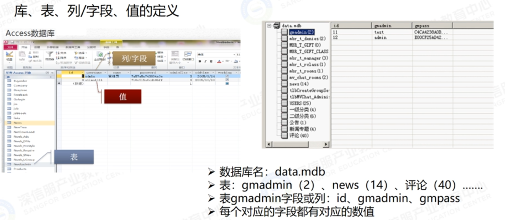
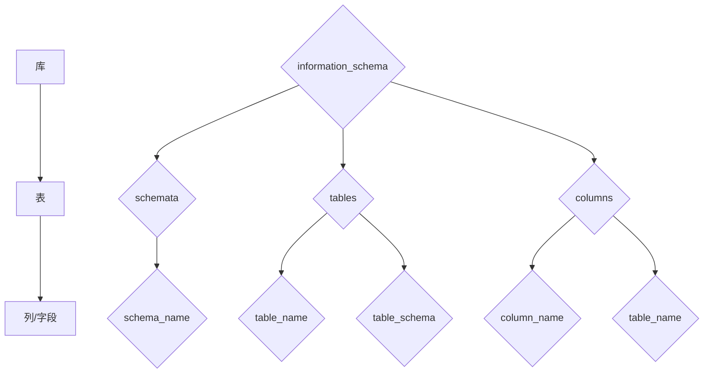

# 网络渗透基础

## Nmap

### 主机发现

​	**目标**：确定目标主机是否在线（Alive，处于开启状态）

​	**原理**：与ping命令类似，发送探测包到目标主机，如果收到回复，则说明目标主机是开启的

​	**探测方式**：

 * nmap 支持十多种不同的主机探测方式
   * ICMP ECHO /TIMESTAMO/ NETMASK 报文
   * TCP SYN /ACK 报文
   * SCTP INIT / COOKIE-ECHO 报文
   * ……

#### 相关命令

| 选项                           | 功能                                             |
| ------------------------------ | ------------------------------------------------ |
| -sP或者-sn                     | ping 扫描(不进行端口扫描)                        |
| -P0或-Pn                       | 不进行ping扫描                                   |
| -PS/-PA/-PU/-PY                | TCP SYN/ TCP ACK/ UDP/SCTP INIT Ping扫描         |
| -PE/-PP/-PM                    | ICMP echo/ ICMP timestamp/ ICMP netmask Ping扫描 |
| -R /-n                         | DNS反向解析域名/禁止DNS反向解析                  |
| -6                             | 扫描IPv6地址                                     |
| –dns-servers<serv1[,serv2],….> | 指定DNS服务器                                    |
| –system-dns                    | 指定使用系统的DNS服务器                          |
| –traceroute                    | 追踪每个路由节点                                 |
| –packet-trace                  | 追踪每个包                                       |

#### 例一：局域网内执行ping扫描

**目标**：扫描局域网192.168.40.1 - 192.168.40.254内那些IP的主机在线。

**命令**：nmap -sP 192.168.40.1/24

**说明**： 在局域网内，无论才用哪一种选项，Nmap都是通过ARP包来询问IP地址上的主机是否活动的，如果收到ARP回复包，那么说明主机在线

#### 例二：跨网段执行ping扫描

**目标**：扫描跨网段目标主机 是否在线

**命令**：nmap -sP 192.168.50.5

**说明**：扫描跨网段目标主机时，使用-sP或-sn选项，默认情况下Nmap会依次发送4种不同类型的数据包(ICMP echo request、TCP SYN packer to port 443、TCP ACL packet to port 80、 ICMP timestamp request)来探测目标主机是否在线，只要收到其中一个包的回复，就证明目标机在线。

### 端口扫描

目标：确定目标主机的TCP/UDP端口的开放情况

原理：发送TCP\UDP等类型的探测包到目标端口，根据收到的回复包判定端口是否开放

端口的六个状态

* open：开放
* closed：关闭
* filtered：被防火墙IDS/IPS屏蔽，无法确定其状态
* unfiltered：没有被屏蔽，但是否开放需要进一步确定
* open|filtered：端口是开放的或被屏蔽
* closed|filtered：端口是关闭的或被屏蔽

 #### 相关命令

| 选项            | 功能                             |
| --------------- | -------------------------------- |
| -p              | 指定扫描的                       |
| --exclude-port  | 指定拍出（不扫描）的目标端口     |
| -sT /-sS/-sA    | TCP CONNECT/tcp syn/tcp ack 扫描 |
| -sN / -sF / -sX | TCP NULL/ TCP FIN /TCP Xmas 扫描 |
| -sU             | UDP扫描                          |
| -sW / -sM       | TCP窗口/ TCP Maimom扫描          |
| --scanflags     | 自定义TCP扫描                    |
| -sO             | IP扫描                           |

#### TCP SYN扫描(-sS)原理

Nmap向目标端口发送TCP SYN报文,如果目标机返回TCP SYN+ACK报文,则说明目标端口处于开放状态,同时Nmap会紧接着向目标机发送TCP RST以重置此连接;如果目标机返回TCP RST+ACK报文,这说明目标端口处于关闭状态.

#### TCP connect扫描(-sT)原理

Nmap向目标端口发送TCP SYN报文,如果目标机返回TCP SYN+ACK报文,则说明目标端口处于开放状态,同时Nmap会紧接着向目标机依次发送TCP ACK、TCP RST +ACK完成上次捂手和重置此连接;如果目标机返回TCO RST+ACK报文,这说明目标端口处于关闭状态.

#### TCP ACK扫描(-sA)原理

Nmap向目标端口发送TCP ACK 报文,无论目标端口是否处于开放状态,目标机都会返回TCP RST报文.如果Nmap主机能收到此TCP RST报文,则说明目标端口未被防火墙屏蔽.
		TCP ACK扫描只能用于确定防火墙是否屏蔽某个端口,可以辅助TCP SYN的方式来判断目标主机防火墙的状况.

#### 隐蔽扫描(-sF/-sN/-sX)原理

Nmap向目标端口发送TCP FIN(-sF)/NULL(sN)/FIN+PSH+URG(-sX)报文,对于Linux系统的目标机,如果目标机未响应,则说明目标端口处于开放状态或被防火墙屏蔽;如果目标机返回TCP RST+ACK报文,则说明目标端口处于关闭状态.
		对于Windows系统的目标机,无论目标端口处于开放还是关闭状态,目标机都会返回TCP RST+ACK报文.
		因此,隐蔽扫描方式适合于Linux系统的目标机端口扫描.   

#### 例二：-p选项的应用——指定扫描的端口号

关于-p选项的说明:默认情况下,Nmap仅对用-p指定的TCP端口进行扫描,扫描的方式为-sS.如果既要扫描TCP端口,又要扫描UDP端口,则可以用 `T:` `U:`场数指定目标端口,并指定-sU(UDP扫描方式)和至少一种TCP扫描方式,如:
nmap -p T:139,U:53 -sS -sU 192.168.40.178

  ### 规避FW/IDS技术

目标:绕过目标防火墙、入侵检测系统等防护手段

| 选项          | 功能                      |
| ------------- | ------------------------- |
| -T            | 时序选项                  |
| -f            | 报文分段                  |
| --data-length | 指定发包长度              |
| --mtu         | 指定偏移量大小(8的倍数字) |
| -D            | 使用诱饵进行源地址欺骗    |
| -sI           | 空闲扫描(源地址欺骗)      |
| --source-port | 源端口欺骗                |
| --spoof-mac   | 源MAC地址欺骗             |

#### 例一:-T选项的应用——控制扫描速度

使用-T(0~5)可以启用时序选项,一般来说数字越大,速度越快,精度越低

* -T0:非常慢,用于IDS逃避
* -T1:缓慢,用于IDS逃避
* -T2:降低速度以降低对带宽的消耗,此选项一般不常用
* -T3:默认,根据目标的反应自动调整时间
* -T4:快速,常用的扫描方式,需要在很好的网络环境下使用
* -T5:极速扫描,以牺牲准确度来提升扫描速度

### NSE和Lua

除了常规的网络扫描,Nmap还可根据NSE(Nmap scripting Engine)的脚本进行大量渗透工作,这种脚本基于Lua语言编写
		脚本存放目录:/usr/share/nmap/scripts/

#### 常用选项

| 选项                              | 功能                                                         |
| --------------------------------- | ------------------------------------------------------------ |
| -sC                               | 等价于 --script=default,使用默认类别的脚本进行扫描           |
| --script=<Lua scripts>            | <Lua scripts> 使用某个或者某类脚本进行扫描,支持通配符描述    |
| --scripy-args=<n1=v1,[n2=v2,...]> | 为脚本提供默认参数                                           |
| --script-trace                    | 显示脚本执行过程中发送与接收的数据                           |
| --script-updatedb                 | 更新脚本数据库                                               |
| --script-help=<Lua scripts>       | 显示脚本的帮助信息,其中<Lua scripts>部分可以逗号分隔的文件或脚本类别 |

#### 例一:漏洞扫描脚本(--script vuln)

检测是否存在常见漏洞

### 扫描结果保存与输出

#### 三种格式的输出

* **normal**:标准模式(选项-oN)
* **xml文档**:(选项-oX)
* **grep文件**(选项-oG)
* 三种格式一次性保存(选项-oA)

## BurpSuite

### 主要功能模块

* **Target**:显示目标目录结构的一个功能
* **Proxy**:拦截HTTP/HTTPS的代理服务器,作为一个在浏览器和目标应用程序之间的中间人,允许拦截、查看、修改在两个方向上的原始数据流
* **Intruder**:一个定制的高度可配置的工具,对Web应用程序进行自动化攻击,如:枚举标识符、收集有用的数据以及使用fuzzing技术探测常规漏洞
* **Repeater**:一个靠手动操作来触发单独的HTTP请求,并分析应用程序响应的工具
* **Sequencer**:用来分析那些不可预知的应用程序会话令牌和重要数据项的随机性的工具
* **Decoder**:进行手动执行或对应用程序数据者智能解码编码的工具
* **Comparer**:通常是通过一些相关的请求和响应得到两项数据的一个可视化的“差异”

### Intruder模块

* **狙击手模式**(**Sniper**):单payload位置,单payload集合,简单替换,若有多个payload位置,则会在每一个位置上遍历一次payload集合
* **攻城锤模式**(**Battering** **ram**):多payload位置,单payload集合,在多个位置上使用相同的payload.
* **草叉模式**(**Pitchfork**):多payload位置,多payload集合,在每个payload位置上遍历对应的payload集合,攻击次数为最短的payload集合的元素个数
* **集束炸弹模式**(**Cluster** **bomb**):多payload位置,多payload集合,以多个payload集合的笛卡尔积作为攻击序列.

## Metasploit

### 名词解释

#### 渗透攻击

渗透攻击是指由攻击者或渗透测试者利用一个系统、应用或服务中的安全漏洞,所进行的攻击行为

#### 攻击载荷（payload）

攻击载荷是指用户希望对目标系统攻击成功之后去执行的代码

#### 溢出代码

简单的解释就是程序对输入数据没有执行有效的边界检测而导致错误，后果可能是造成程序崩溃或者是执行攻击者的命令。

#### 缓冲区溢出

攻击者向一个地址区输入这个区间存储不下的大量字符。在某些情况下，这些多余的字符可以作为“执行代码”来运行，因此足以使攻击者不受安全措施限制而获得计算机的控制权。

### 文件结构

路径: /usr/share/metasploit-framework/

* **config**:MSF环境配置信息,数据库配置信息
* **data**:后渗透模块的一些工具及payload,第三方小工具集合,用户字典等数据信息.
* **documentation**:用户说明文档及开发文档
* **external**:MSF的一些基础扩展模块
* **lib**:基础类和第三方模块类
* **modules**:MSF系统工具模块
* **plugins**:第三方插件借口
* **scripts**:MSF的常用后渗透模块,区别于data里的后渗透模块,不需要加post参数和绝对路径,可以直接运行
* **tools**:额外的小工具和第三方脚本
* **msfconsole**:MSF基本命令行,集成了各种功能
* **msfd**:MSF服务,非持久性服务
* **msfdb**:MSF数据库
* **msfupdate**:MSF更新模块,可以用来更新MSF模块
* **msfrpc**:MSF服务端,非持久性的rpc服务
* **msfrpcd**:持久性的MSF本地服务,可以给远程用户提供rpc服务以及其他的http服务,可以通过xml进行数据传输

### Metasploit模块

* **exploits**(渗透攻击/漏洞利用模块)
* **auxiliary**(辅助模块)
* **nops**(空指令模块)
* **encoders**(编码器模块)
* **post**(后渗透攻击模块)
* **evasion**(规避模块)

### Metasploit 命令

#### 终端下的常用命令

* **msfdb init**		//msf数据库初始化
* **msfdb delete**		//删除msf数据库并停止使用
* **msfdb start**        //启动msf数据库
* **msfdb stop**          //停止msf数据库
* **apt install metasploit franework**    //msf更新
* **msfvenom**          //多平台攻击载荷生成器
* **msf-nasm_shell**        //将汇编指令转换成为对应的16进制机器码
* **msfconsole**          //打开msf终端

#### 常用命令

* **search**  //查找
* **use**      //使用打开一个工具
* **show option** // 查看工具如何使用
* **set**        //配置攻击ip、端口等相关选项
* **info**    //查看工具详情帮助
* **exploit**    //溢出攻击
* **set payload**    //配置攻击木马

#### 连接成功之后常见命令

* **sessions-i**  //查看当前连接会话
* **shell**    //攻击之后进入对方系统命令行
* **upload**   // 文件上传
* **download**  // 文件下载
* **execute-f**  // 文件执行
* **getsystem**  // 提升为管理员权限
* **incognito**   // 模拟任意用户token操作


### Metasploit进行渗透测试的一般流程

1. 扫描目标系统,寻找可用漏洞
2. 选择并配置一个渗透攻击(漏洞利用)模块(exploits)x
3. 选择并配置一个攻击载荷模块(payloads)
4. 选择一种编码技术(encoders),用来绕过杀毒软件的查杀
5. 执行渗透攻击
6. 后渗透阶段的操作

## google hacking

### 逻辑运算符

| 运算符    | 含义                                         |
| --------- | -------------------------------------------- |
| +         | 强制搜索其后的一个单词                       |
| -         | 把某个字忽略                                 |
| ~         | 同义词                                       |
| .         | 单一的通配符                                 |
| *         | 通配符,可代表多个字母                        |
| “”        | 精确搜索                                     |
| `|`或`OR` | 只要符合多个关键字中的任意一个的结果予以显示 |

## 常见端口和入侵方式

| 端口        | 服务                        | 入侵方式                     |
| ----------- | --------------------------- | ---------------------------- |
| 21          | ftp/tftp/vsftpd文件传输协议 | 爆破/嗅探/溢出/后门          |
| 22          | ssh远程连接                 | 爆破/openssh漏洞             |
| 23          | Telne远程连接               | 爆破/嗅探/弱口令             |
| 25          | SMTP邮件服务                | 邮件伪造                     |
| 53          | DNS域名解析系统             | 域传送/劫持/缓存投毒/欺骗    |
| 67/68       | dhcp服务                    | 劫持欺骗                     |
| 110         | pop3                        | 爆破/嗅探                    |
| 139         | Samba服务                   | 爆破/未授权访问/远程命令执行 |
| 143         | lmap协议                    | 爆破                         |
| 161         | SNMP协议                    | 爆破/搜集目标内网信息        |
| 389         | Ldap目录访问协议            | 注入/未授权访问/弱口令       |
| 445         | smb                         | ms17-010/端口溢出            |
| 512/513/514 | linux Rexec服务             | 爆破/Rlogin登录              |
| 873         | Rsync服务                   | 文件上传 /未授权访问         |
| 1080        | socket                      | 爆破                         |
| 1352        | Lotus domino邮件服务        | 爆破/信息泄露                |
| 1433        | mssql                       | 爆破/注入/SA弱口令           |
| 1521        | oracle                      | 爆破/注入/TNS爆破/反弹shell  |
| 2049        | Nfs服务                     | 配置不当                     |
| 2181        | zookeeper服务               | 未授权访问                   |
| 2375        | docker remote api           | 未授权访问                   |
| 3306        | mysql                       | 爆破/注入                    |
| 3389        | Rdp远程桌面链接             | 爆破/shift后门               |
| 4848        | GlassFish控制台             | 爆破/认证绕过                |
| 5000        | sybase/DB2数据库            | 爆破/注入/提权               |
| 5432        | postgresql                  | 爆破/注入/缓冲区溢出         |
| 5632        | pcanywhere服务              | 抓密码/代码执行              |
| 5900        | vnc                         | 爆破/认证绕过                |
| 6379        | Redis数据库                 | 未授权访问/爆破              |
| 7001/7002   | weblogic                    | java反序列化/控制台弱口令    |
| 80/443      | http/https                  | web应用漏洞/心脏滴血         |
| 8069        | zabbix服务                  | 远程命令执行/注入            |
| 8161        | activemq                    | 弱口令/写文件                |
| 8080/8089   | influxDB                    | 未授权访问                   |
| 9000        | fastcgi                     | 远程命令执行                 |
| 9090        | Websphere控制台             | 爆破/java反序列化/弱口令     |
| 9200/9300   | elasticsearch               | 远程代码执行                 |
| 11211       | memcached                   | 未授权访问                   |
| 27017/27018 | mongodb                     | 未授权访问/爆破              |

# SQL注入漏洞原理与实践

sql注入(SQL injection)，也称SQL注码，是发生于应用程序与数据库层的安全漏洞。简而言之，是在输入的字符串之中注入SQL指令，在设计不良的程序当中忽略了字符检查，那么这些注入进去的恶意指令就会被数据库服务器误认为是正常的SQL指令去执行，因此遭到破坏或是入侵。

## 数据库基础

### 识别数据库

#### 默认端口号

* **Oracle**:1521
* **Mysql**:3306
* **SQL** server:1433
* **PostgreSQL**:5432
* **mongoDB**:27017
* **Redis**:6379
* **MemcacheDB**:11211

####  版本号识别

* **MSSSQL**		select @@version
* **MySQL**           select version() / select @@version
* **Oracle**            select banner form v$version
* PostgreSQL    select version()

#### **各数据库在字符串处理时的区别**

|            | MS SQL                                      | MySQL                                          | Access                                      | Oracle                 |
| ---------- | ------------------------------------------- | ---------------------------------------------- | ------------------------------------------- | ---------------------- |
| 长度       | len(‘abc’)=3                                | length(‘abc’)=3                                | len(‘abc’)=3                                | length(‘abc’)=3        |
| 截取左右   | left(‘abc’,2)=‘ab’<br />right(‘abc’,2)=‘bc’ | left(‘abc’,2)=‘ab’<br />right(‘abc’,2)=‘bc’    | left(‘abc’,2)=‘ab’<br />right(‘abc’,2)=‘bc’ | 用substr代替           |
| 截取中间   | substring(‘abc’,2,1)=‘b’                    | substring(‘abc’,2,1)=‘b’<br />mid(‘abc,2’)=‘b’ | mid(‘abc’,2,1)=‘b’                          | substri(‘abc’,2.1)=‘b’ |
| 字符串连接 | ‘’+‘’                                       | concat(“”.””)                                  | “”&“”                                       | ‘’\|\|‘’               |

#### 个数据库与网页编程语言的搭配

**常见的搭配**:

ASP和.NET:Microsoft SQL Server

PHP:MySQL、PostgreSQL

Java:Oracle、MySQL

### SQL语法基础

#### 库、表、列/字段、值的定义



#### 与关系型数据库交互的标准SQL命令有

CREATE、SELECT、INSERT、UODATE、DELETE和DROP

**分为三组**：

1. 数据定义(Create、Drop）
2. 数据操控(Select、Insert、Update、Delete)
3. 数据控制(Grant、Revoke)

| 命令   | 描述                                 |
| ------ | ------------------------------------ |
| CREATE | 创建新的表、视图或其他数据库中的对象 |
| ALTER  | 修改现存数据库对象，比如一张表       |
| DROP   | 删除表、视图或数据库中的其他对象     |
| SELECT | 从一张或者多张表中检索特定的数据     |
| INSERT | 创建一条新纪录                       |
| UPDATE | 修改记录                             |
| DELETE | 删除记录                             |
| GRANT  | 赋予用户特权                         |
| REVOKE | 收回赋予用户的特权                   |

#### SQL基本操作：CUD

```sql
C = Create 创建
	CREATE DATABASE	testdb
	CREATE TABLE table_name(column_name column_type);
U = Update 更新
	UPDATE table_nmae SET field1=new-value1,field2=new-value2[WHERE Clause]
D = Delete 删除
	DELETE FROM table_name[WHERE Clause] 
```

#### SQL高级操作：排序、分组、限定条数

```sql
排序 order by
	SELECT * FROM test_table ORDER BY userid;
分组 group by
	SELECT name,COUNT(*) FROM test_table GROUP BY name;
限定条数 limit
	SELECT * FROM test_table limit 0,10;
	SELECT * FROM test_table limit 1,5;
联合查询 union select
	SELECT * FROM test_table UNION SELECT 1,2,3;
```

#### 结合其他函数

##### union select 结合系统函数爆数据库信息

MySQL 5.5以上版本自带 information_schema数据库，其中保存着关于MySQL服务器所维护的所有其他数据库的信息，如数据库名、数据库的表、表栏的数据类型与访问权限等。



##### 结合load_file()读取服务器文件内容

函数LOAD_FILE(file_name):读取文件并将文件内容按照字符串的格式返回。

前提条件：

* 文件的位置必须在服务器上，必须为文件指定路径全名，而且必须拥有FILE特许权（MySQL配置文件中，secure_file_priv不能为NULL）
  * and (select count(*) from mysql.user)>0/* 如果结果返回正常，说明具有读写权限
  * and (select count(*) from mysql.user)>0/* 返回错误，应该是管理员给数据库帐户降权

* 文件必须可读取，文件容量必须小于max_allower_packet字节
* 若文件不存在，或因不满足上述条件而不能被读取，则函数返回值为NULL

load_file()用在MySQL中可以在UNOIN中充当一个字段，读取Web服务器的文件。

## SQL注入

### SQL注入带来的危害

* 绕过登录验证：使用万能密码登录网站后台等

* 获取敏感数据：获取网站管理员账号、密码等

* 文件系统操作：列目录，读取、写入文件等

* 注册表操作：读取、写入、删除注册表等

* 执行系统命令：远程执行命令

### SQL注入漏洞形成的原因

#### 动态字符串构建引起

* 不正确的处理转义字符（宽字节注入）
* 不正确的处理错误（报错泄露信息）
* 不正确的处理联合查询
* 不正确的处理多次提交（二次注入）

#### 后台存在的问题

* 后台无过滤或者编码用户数据
* 数据库可以拼接用户传递的恶意代码

##### 错误处理不当

* 详细的内部错误消息显示给用户
* 错误信息可以直接给攻击者提供下一步帮助

#### 不安全的数据库配置

* **默认账户**：
  * SQL Serber“sa”作为数据库系统管理员账户；
  * MySQL使用“root”和“anonymous”用户账户；
  * Oracle则在创建数据库时通常默认会创建SYS、SYSTEMS DBSNMP和OUTLN账户。
* **权限**：
  * 问题： 系统和数据库管理员在安装数据库服务器是允许以roots SYSTEM或Administrator特权系统用户账户身份执行操作。
  * 正确方法：应该始终以普通用户身份运行服务器上的服务，降低用户权限，将用户权限只限于本服务。

###  SQL万能密码

```sql
原验证登陆语句:
	SELECT * FROM admin WHERE Username= '".$username."' AND Password= '".md5($password)."'
输入 1' or 1=1 or '1'='1万能密码语句变为:
	SELECT * FROM admin WHERE Username='1' OR 1=1 OR '1'='1' AND Password='1' or '1'=1'

```

### <a name='可能存在注入的位置'>可能存在注入的位置</a>

1. 题目环境简单，直接很明显的有注入点·，如一个查询框、一个登录注册框或其它提示等。

2. 题目环境复杂，由较另页宜组成，就应该思考与数据库产生交互的地万，以从网页的功能入手。可能会有留言显示、密码修改等。

3. 其它，比如Cookie、User-Agentg等http头部参数

#### 判断一个HTTP请求是否存在SQL注入的方式

* **经典**：and 1=1 | and 2 > 1|or 1=1|or 1<1

* **数据库函数**：sleep(4)=1 | length(user())>3

* **特殊符号**：单引号`‘`双引号`“`

* **sqlmap**测试:

  ​	指定url和参数，通过调节測试等级，显示等级等作来测试成功率

  * sqlmap -u url
  * sqlmqp -u url --date"a=1&b=2"
  * sqlmap -u url --level 2
  * sqlmap -u url -v2

###   按照注入技术分类

#### 基于布尔的盲注

（if = > < ^ or and || && ascii/ord limit lieft substr/mid）

​	可以根据返回页面判断条件真假的注入

#### 基于时间的盲注

（sleep、benchmark(重复执行)、GET_LOCK（加锁），其它能引起延时的函数）

​	不能根据页面返回内容判断任何信息，用条件语句查看时间延迟语句是否执行来判断

#### 基于报错的注入

（floor ExtractValue  UpdateXml  exp）

​	即页面会返回错误信息，或者吧注入的语句的结果直接返回在页面中

#### 堆叠查询注入

（ 各种执行函 drop create show handler desc）

​	同时执行多条语句的注入

#### 联合查询注入

（union）

#### 文件读写

（into outfile  load_file ）

### 手工注入过程

1. [判断是否存在注入点](# 可能存在注入的位置)
2. 判断字段长度；
3. 判断字段回显位置；
4. 判断数据库信息；
5. 查找数据库名；
6. 查找数据库表；
7. 查找数据库表中所有字段以及字段值；
8. 猜解账号密码；
9. 登录管理员后台。

### 绕过题目过滤

* **大小写** union uNion

* **双写** uniounionn

* **编码**(如URLEncode编码,ASCII,HEX,unicode编码绕过)

  ​	0x666c6167=flagm

  ​	(chr(102)chr(108)chr(97)chr(103))=flag

   `&#102;&#108;&#97;&#103;`=flag

* **注释苻**/* */ **括号分割**( ) 

* **空字符** %20 %09 %000a %0b %0c %0d %a0 %00

  ​	select password from ab where id=5

  ​	`select/* */password/* */from/* */ab/* */where/**/id=5/`

  ​	select(password)from(ab)where(id=5）

* **单引号**/**双引号**

* **转义符** \ **宽字节注入**

  `select password from ab where id ='$id' id=1\or 1=1`

  select password from ab where id='id=1 or 1=1'
  
### 几个常用函数

1. **version()**——MySQL版本
2. **user()**——数据库用户名
3. **database()**——数据库名
4. **@@datadir**——数据库路径
5. **@@version_compile_os**——操作系统版本

### **使用updatexml(目标xml文档，xml路径，更新的内容)**

第二个参数 xml路径 是可操作的地方，xml文档中路径是用 /xxx/xxx/xxx/…这种格式，如果我们写入其他格式，就会报错，并且会返回我们写入的非法格式内容，而这个非法的内容就是我们想要查询的内容。
		所以以~开头的内容不是xml格式的语法，报错，但是会显示无法识别的内容是什么，这样就达到了目的。所以可以构造函数

```mysql
select username from security.users where id=1 and updatexml('anything',concat('~',(select database())),'anything');
```

​		有一点需要注意，update()能查询字符串的最大长度为32，就是说如果我们想要的结果超过32，就需要用substring()函数截取，一次查看32位


### **利用exp()函数造成double数值类型超出范围进行报错注入的Payload形式如下：**

```mysql
uname=admin" union select (exp(~(select * from (select database())a))),2 #
```

Explain：

（1）MySQL exp(x)函数 返回e(自然对数的底)的x次方的值，但是这个数学函数有一个问题，那就是当传递一个大于709的值时，函数exp()就会引起一个溢出错误。

（2）~表示取反操作，将0按位取反就会返回“18446744073709551615”。再加上函数成功执行后返回0的缘故，我们将成功执行的函数取反就会得到最大的无符号BIGINT值。

（3）我们通过子查询与按位求反，造成一个“DOUBLE value is out of range”错误，并借由此注出数据。

### sqlmap 

#### sqlmap检测注入漏洞的流程

1. 网站连通性检测：检测目标的链接状态。
2. WAF探测：检测网站是否受WAF保护
3. 网页稳定性检测：检测网页是否稳定。
4. 参数动态性检测：检测参数是否具有动态性。
5. 启发式注入检测：探测该参数点是否是动态的、是否为可能的注入点 

####  常见用法1： -u参数（直接输入目标URL）

* 命令实例： sqlmap -u “http://www.test.com/index.php?id=1”（加--batch可以让程序自己选择）

* 验证过程

  1. 判断可注入的参数
  2. 判断可以用哪种SQL注入技术来注入
  3. 识别出所有存在的注入类型
  4. 尝试去判定数据库版本、开发语言、操作系统版本

  ```shell
  sqlmap -u url --batch
  sqlmap -u url -dbs（--current-db） // 爆库
  sqlmap -u url -D "数据库名" --tables // 爆表
  sqlmap -u url -D "数据库名" -T "表名" --colunms // 爆字段/列
  sqlmap -u url -D "数据库名" -T "表名" -C "列名" --dump // 爆数据 
  
  sqlmap -u url --os-shell // 可以直接尝试此方法直接获取shell
  ```

####  常见用法2： -r参数（从文本文件中获取http请求）

* 命令实例：sqlmap -r **/usr/a.txt**（例如用bp抓到request.raw）

* 说明：使用该命令时须指明a.txt（保存着http请求包）文件所在的绝对路径

* 验证过程：与-u参数类似

  ```shell
  sqlmap -r request.raw --batch
  sqlmap -r request.raw -level 5 -risk 3 -dbs -dbms mysql --batch
  sqlmap -r request.raw -level 5 -risk 3 -D "数据库名" --tables
  sqlmap -r request.raw -level 5 -risk 3 -D "数据库名" -T "表名" --colunms
  sqlmap -r request.raw -level 5 -risk 3 -D "数据库名" -T "表名" -C "列名" --dump
  ```

#### 常见用法3：-m （从文件中取出保存的url进行检测）

* 命令实例：sqlmap -m **/usr/a.txt**
* 说明：使用该命令时须指明a.txt（保存着http请求包）文件所在的绝对路径
* 验证过程：与-u参数类似

#### 常用参数解释

* **-r** ：指定参数注入 sqlmap.py -r post.txt -p 注入参数；
* **-u**：get注入；
* **--level=LEVEL**：执行测试的等级（1-5，默认为1）,使用–level 参数且数值>=2的时候也会检查cookie里面的参数，当>=3的时候将检查User-agent和Referer
* **--risk=RISK**： 执行测试的风险（0-3，默认为1）,默认是1会测试大部分的测试语句，2会增加基于事件的测试语句，3会增加OR语句的SQL注入测试
* **-v**：ERBOSE信息级别: 0-6 （缺省1），其值具体含义：“0”只显示python错误以及严重的信息；1同时显示基本信息和警告信息（默认）；“2”同时显示debug信息；“3”同时显示注入的payload；“4”同时显示HTTP请求；“5”同时显示HTTP响应头；“6”同时显示HTTP响应页面；如果想看到sqlmap发送的测试payload最好的等级就是3。
* **-p**：-p 后面接参数，针对单个参数注入
* **-threads**：线程数，如果你想让sqlmap跑的更快，可以更改这个线程 数的值，默认值为10；
* **--batch**：智能判断测试 ，跳过人工选择，自动进行选择；
* **--mobile**：模拟测试手机环境站点，更改数据包Agent头进行测试；
* **-m**：同时测试文本文档中的多个URL，一般接-batch=smart参数；

#### 注入获取数据命令：

* **-dbs**：  //默认情况系sqlmap会自动的探测web应用后端的数据库类型：MySQL、Oracle、PostgreSQL、MicrosoftSQL Server、Microsoft Access、SQLite、Firebird、Sybase、SAPMaxDB、DB2；
* **--current-user**：大多数数据库中可检测到数据库管理系统当前用户；
* **--current-db**：当前连接数据库名；
* **--is-dba**：判断当前的用户是否为管理员账户；
* **--users**：列出数据库所有所有用户；
* **--file-read /etc/password**：读文件内容
* **--tamper "不同数据库、waf规则对应脚本文件.py"**：sqlmap过waf


# 拿到一个待检测的站 或给你一个网站 ，你觉得应该先做什么

## 一、信息收集

1. 获取域名的 whois 信息 获取注册者邮箱姓名电话等。
2. 通过站长之家、明小子、 k8 、站长之家等查询服务器旁站以及子域名站点，因为主站一般比较难，所以先看看旁站有没有通用性的 cms 或者其他漏洞。
3. 通过 DNS 域传送漏洞、备份号查询、 SSl 证书、 APP 、微信公众号、暴力破解、 DNS历史记录、 K8 C 段查询、 Jsfinder 、 360 或华为威胁情报、证书序列号获取企业二级域名与 ip 。
4. 通过 Nmap 、 Wappalyzer 、御剑等查看服务器操作系统版本， web 中间件，看看是否存在已知的漏洞，比如 IIS APACHE,NGINX 的解析漏洞
5. 通过 7KB 、破壳扫描网站目录结构，看看是否可以遍历目录，或者敏感文件泄漏，比如
   php 探针（ php info.php ）、管理员备份文件。
6. google hack进一步探测网站的信息，后台，敏感文件
7. 、敏感信息收集，如 github 源码、用 7kb 、破壳扫源代码泄露（ （.hg 、 .git 、 cvs 、 svn 、 .DS_store源代码泄露）、 google hack 、接口信息泄露、社工信息泄露、邮箱地址信息收集、网盘搜索、钟馗之眼、天眼查、威胁情报、微步在线等
8. 通过 Wappalyzer 、御剑工具对网站指纹识别（包括， cms cdn ，证书等 dns 记录

## 二、漏洞扫描

1. 用 AWVS 、 APPSCAN 、长亭科技的 Xray 等扫描器检测 Web 漏洞，如 XSS,XSRF,sql注入，代码执行，命令执行，越权访问，目录读取，任意文件读取，下载，文件包含， 远程命令执行，弱口令，上传，编辑器漏洞，暴力破解等
2. 用 namp 、天镜、 Nessus 、极光等扫描系统 ip ，对扫描出来的高危 漏洞进行测试，如
   ms08 067 、 ms17 010 、 ms12 020 、 ms15 035 、 ms19 0708 、永恒之蓝 2 代、 cve 2017 7494samba ）、 cve 2014 6271( 破壳 、 php cgi 等相关漏洞验证。
3. **漏洞利用**  利用以上的方式拿到webshell ，或者其他权限
4. **权限提升** 提权服务器，比如windows 下 mysql 的 udf 提权， serv u 提权， windows 低版本的漏洞，如 iis6,pr, 巴西烤肉， linux 脏牛漏洞， linux 内核版本漏洞提权， linux 下的 mysql system 提权以及 oracle 低权限提权
5. **日志清理** 操作系统、中间件、数据库等日志进行清除
6. **总结报告及修复方案**


   


